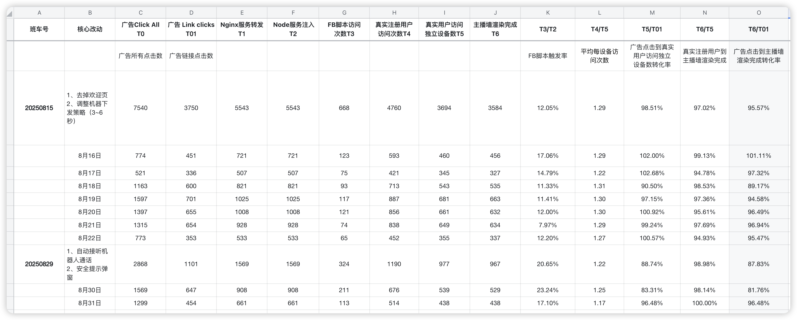

## 一、本周核心成果

**A、本周上线，待数据验证的项目**

| **项目/行动**        | **本周关键进展与状态**                                  | **核心价值 & 衡量指标**                                      | **后续计划**                                                 |
| -------------------- | ------------------------------------------------------- | ------------------------------------------------------------ | ------------------------------------------------------------ |
| 免费呼叫自动接听优化 | 已于【周五】上线，将“手动接听”模式调整为“3秒后自动接听” | 目标：提升用户接通比例衡量指标:用户接通率（T5/T4）风险指标：主动挂断率 | 下周三前，完成首轮数据分析，评估对核心指标和风险指标的影响，并产出结论 |
| 图片资源动态裁剪     | 已于【周五】上线                                        | 目标：提升首屏渲染速度衡量指标：首屏加载时间（FCP）最大内容绘制时间（LCP） | 持续观察线上性能数据，确保无性能劣化问题                     |
| H5防举报功能         | 已于【周五】上线                                        | 目标：减少因举报导致的下包风险衡量指标：举报率               | 这个由客户端去统计了，后续不再进行跟进                       |
| 安全提示弹窗         | 已于【周五】上线                                        | 价值：明确用户责任、规避广告渠道封号和业务中断风险辅助判断机器人行为，多少人点击同意按钮 |                                                              |

**B、规划/开发中的项目**

| **项目/行动**               | **本周关键进展与状态**                                 | **核心价值 & 衡量指标**                                      | **后续计划**                                                 |
| --------------------------- | ------------------------------------------------------ | ------------------------------------------------------------ | ------------------------------------------------------------ |
| 账号注登以及任务系统@郭华课 | 需求已和后端沟通确认，并完成需求文档                   | 目标：提升用户日活促进付费转化衡量指标：DAU任务完成率付费转化率 | 后端预计下周三完成开发，设计预计下周二完成设计，前端将同步开始开发工作 |
| H5游戏大厅@郭华课           | 风险识别：关键充值事件监听与客户端不同，还需要技术验证 | 目标：丰富产品内容、提升用户活跃和使用时长探索新的变现模式衡量指标：游戏tab点击率人均游戏时长游戏内付费转化率游戏内付费金额（ARPPU) | 下周三前搭建最小化测试环境，验证第三方游戏大厅的充值事件能否被PWA监听 |

## 二、核心数据

**2.1 Node渲染漏斗**

**结论：**

- **问题发现：**本周漏斗8月30日出现转化率从上一版本（20250815）的95.57%跌至81.76%，初步怀疑是新上广告存在的承接存在波动
- **行动调整：**持续关注未来几日的数据表现，看波动是否会再次出现

**2.2 呼叫接听漏斗**

**结论1：**新的潜在流失点，头部损耗

- 数据表现：在20250829班车中，从“主播墙渲染完成（T0)”到“客户端发起呼叫（T1）”环节，出现约32%的流失
- **分析：**
  - 本次改动修改了机器人呼叫触发时机，需要点击同意安全弹窗按钮之后才会触发
  - 虽然整体转化率提升，但不能忽视漏斗流失了近1/3的用户，需要排查原因
- **下一步计划：**
  - 分析安全提示弹窗数据，展示率、点击率
  - 分析丢失用户状态或者行为是否正常，是否存在审核用户？

**结论2：**优化呼叫触发机制，呼叫成功率新高

- 数据表现：
  - “呼叫请求成功率 (T2/T1)” 从上个版本（20250815） 76.18% 提升至本周的 90.14% 
- 分析：
  - 提升的核心原因在于，将呼叫触发点从【进入主播墙直接触发】调整为【用户点击同意安全弹窗后触发】

**结论3：**呼叫送达率瓶颈攻克，呼叫送达链路已畅通无阻

- **数据表现：**
  - “呼叫送达率（T3/T2）”从上个版本（20250815）的64.48%提升至本周的99.66%
- **分析：**
  - 数据验证了上周的判断，服务端与客户端的“时序冲突”确实是呼叫丢失的根本原因
  - 将socket监听事件提前初始化的解决方案不仅有效， 而且几乎100%解决了该问题

**结论4：**“自动接听”策略有效果，大幅提升接听转化率

- **数据表现：**
  - 用户接听率（T5/T4）从上个版本（20250815）45.17%提升至94.08%
  - 最终的全链路转化率（T5/T0）也因此从21.93%提升到56.98%
- **分析：**
  - 策略验证：3秒后自动接听的强制策略，证明上周“用户犹豫是主要原因”的判断成立，把用户推进了通话环节。
- **下一步计划：**
  - 重点关注下一层漏斗
  - 补充留存率打点数据

**2.3 通话漏斗**

**结论：**通话漏斗以20250829版本做为新的基线，重点优化前期漏斗，减少用户流失，从而提升付费人数和付费率

**数据表现：**

- T0 -> T2（开始通话 -> 促销弹窗）流失约21%的用户。
- T2 -> T3（促销弹窗 -> 充值弹窗）流失约16%的用户。

**下一步计划：**

- 先补充用户成功通话数（主动挂断、超时挂断占比、网络质量等数据）
- 持续观察数据变化，先确认问题，再考虑优化计划

**2.4 核心链路数据**

**结论：**20250829班车新改动（自动接听通话、安全弹窗）有效果，核心转化指标（成交率、促销付费率、ROI）明显提升，但是单次点击成本持续攀升成为实现ROI>1比较大的阻力

- 转化效率提升：成交率从上一版本（20250815）的23.4%提升至45.61%，促销付费率也从0.81%提升至2.66%
- 获取成本问题：本周平均点击成本（$0.64）相比上一版本（$0.4）上涨了60%

**2.5 每3秒停留时长**

**结论：**

- 以20250829做为基线，因为以前当用户接听后则不再统计
- 前3秒转化率只有81.39%，和呼叫接口漏斗的头部损耗相关联，接下来重点排查该流失原因

**2.6 首启P90数据**

**结论：**

- 基线数据：PWA首启P90总耗时为4.53秒
- 原因分析：
  - 主要性能瓶颈：T1（JS加载）耗时在2.00秒至2.99秒之间，是当前最耗时的阶段
  - 主要监控缺陷：服务器日志缺乏毫秒级精度，导致无法精确追踪T1的耗时，需要优先解决

**2.7 支付方式iframe时间**

**结论：**

- **性能瓶颈分析：**由于该iframe加载的是第三方支付网站，加载速度和稳定性有对方服务决定，我们进一步优化的空间有限
- **20%未完成原因分析：**
  - 用户主动行为： 用户在支付页面完全加载前改变主意，主动关闭了支付窗口
  - 外部环境因素：用户网络环境差

**先暂定80%左右成功率为现阶段的基线，再持续关注**

##  三、反思与改进

| **类别**                                                     | **问题**                                                     | **反思**                                                     | **改进**                                                     |
| ------------------------------------------------------------ | ------------------------------------------------------------ | ------------------------------------------------------------ | ------------------------------------------------------------ |
| 产品思维                                                     | 对单一问题或指标过度关注，导致对用户需求、业务目标等整体把握不足，缺乏产品敏感度 | 根本原因在于思维模式倾向于执行者而非负责人，过度关注如何实现，忽略为什么做、为谁做。 | 多看、多听、多思考吧。慢慢建立产品决策框架                   |
| 数据驱动                                                     | 基于错误的FB指标（Clicks All）做漏斗分析，导致对核心转化率产生严重误判。 | 对关键业务指标的定义和理解不够严谨，团队内部（投放、产品、数据）没有建立统一 | 全链路各环节的唯一统计口径                                   |
| 时间管理                                                     | 1、很忙但是没结果2、很忙但是没效率                           | 追根到底还是自己目标管理、复盘能力没做好。                   | [思维导图 > 第三场分享：时间管理](https://la1a59fdywl.feishu.cn/docx/MqcddzzxDolFfaxwBjocWCwKnid?openbrd=1&doc_app_id=501&blockId=doxcn9gwt7Dyd7NfFUdYouxbWtn&blockType=whiteboard&blockToken=N8vvw69oAhgtbhbjCLocXTppnJg#doxcn9gwt7Dyd7NfFUdYouxbWtn) |
| 团队管理                                                     | 团队协同效率虽有提高，核心问题还是目标感不够                 | 我在这个协同效率问题上有责任，也体现出不足，所以开启第一场培训计划：目标管理[思维导图 > 第一场分享会：目标管理（SMART)](https://la1a59fdywl.feishu.cn/docx/OAtBdDBj3oocCVxsvw6cOjS7nME?openbrd=1&doc_app_id=501&blockId=doxcn1rx65oQRvH30Dl9P7tJ7De&blockType=whiteboard&blockToken=QNEKwPuJ6hI06rbhRXGcmFhDn8d#doxcn1rx65oQRvH30Dl9P7tJ7De)[思维导图 > 第二场分享会：目标管理（补充）](https://la1a59fdywl.feishu.cn/docx/PMi0doQJwowBesxj91acqBtSnww?openbrd=1&doc_app_id=501&blockId=doxcnuitaSjJpacC0bnEQfHTXr8&blockType=whiteboard&blockToken=W4S1w0W0JhNy6mbsQ5ccwHoTnRc#doxcnuitaSjJpacC0bnEQfHTXr8)[思维导图 > 第三场分享：时间管理](https://la1a59fdywl.feishu.cn/docx/MqcddzzxDolFfaxwBjocWCwKnid?openbrd=1&doc_app_id=501&blockId=doxcn9gwt7Dyd7NfFUdYouxbWtn&blockType=whiteboard&blockToken=N8vvw69oAhgtbhbjCLocXTppnJg#doxcn9gwt7Dyd7NfFUdYouxbWtn) | 定靶心：用SMART原则代替“模糊感觉”（本周三开始培训）[思维导图 > 第一场分享：目标管理（SMART)](https://la1a59fdywl.feishu.cn/docx/OAtBdDBj3oocCVxsvw6cOjS7nME?openbrd=1&doc_app_id=501&blockId=doxcn1rx65oQRvH30Dl9P7tJ7De&blockType=whiteboard&blockToken=QNEKwPuJ6hI06rbhRXGcmFhDn8d#doxcn1rx65oQRvH30Dl9P7tJ7De) |
| 对人心：用“目标对齐”代替“单打独斗”（每日早会对齐，如首启进度，下阶段计划） |                                                              |                                                              |                                                              |
| 稳执行：PDCA循环代替“思前想后”（第二场补充黄金圈+PDCA）      |                                                              |                                                              |                                                              |

## 四、风险

- 一个执行不够，还没招到人。

# 相关链接

[PWA思维导图 > PWA](https://la1a59fdywl.feishu.cn/docx/XlppdL74boxRjmx6dpTcfAMineg?openbrd=1&doc_app_id=501&blockId=doxcnYSSdTB6AMG18BVrn5XAu2d&blockType=whiteboard&blockToken=GlGRwEIFJhfbyVbCmOjcJxXcn5A#doxcnYSSdTB6AMG18BVrn5XAu2d)

[思维导图 > PWA第二阶段计划](https://la1a59fdywl.feishu.cn/docx/IvxIdLPPZo8qp3x1FuJclVWFnxh?openbrd=1&doc_app_id=501&blockId=doxcnmFEsfTsvekW8HkmCfcQr3f&blockType=whiteboard&blockToken=RkzowyPVuhniKkbHunKcnRbIndc#doxcnmFEsfTsvekW8HkmCfcQr3f)

[PWA版本管理](https://la1a59fdywl.feishu.cn/wiki/HItNw0KUfiJwvNkgkeecAWrsnme?from=from_copylink)（班车制度）

[PWA数据](https://la1a59fdywl.feishu.cn/sheets/BYu9sRmvGh8aE8tncb8chVUTnIg?from=from_copylink&sheet=RN2VYk)(业务数据）

[思维导图 > 第一场培训：目标管理（SMART)](https://la1a59fdywl.feishu.cn/docx/OAtBdDBj3oocCVxsvw6cOjS7nME?openbrd=1&doc_app_id=501&blockId=doxcn1rx65oQRvH30Dl9P7tJ7De&blockType=whiteboard&blockToken=QNEKwPuJ6hI06rbhRXGcmFhDn8d#doxcn1rx65oQRvH30Dl9P7tJ7De)

[思维导图 > 第二场分享会：目标管理（补充）](https://la1a59fdywl.feishu.cn/docx/PMi0doQJwowBesxj91acqBtSnww?openbrd=1&doc_app_id=501&blockId=doxcnuitaSjJpacC0bnEQfHTXr8&blockType=whiteboard&blockToken=W4S1w0W0JhNy6mbsQ5ccwHoTnRc#doxcnuitaSjJpacC0bnEQfHTXr8)

[思维导图 > 第三场分享：时间管理](https://la1a59fdywl.feishu.cn/docx/MqcddzzxDolFfaxwBjocWCwKnid?openbrd=1&doc_app_id=501&blockId=doxcn9gwt7Dyd7NfFUdYouxbWtn&blockType=whiteboard&blockToken=N8vvw69oAhgtbhbjCLocXTppnJg#doxcn9gwt7Dyd7NfFUdYouxbWtn)

[PWA首启优化复盘](https://la1a59fdywl.feishu.cn/docx/NsmfdbXW4o8gNsxSeb0c6dBEnMf?from=from_copylink)