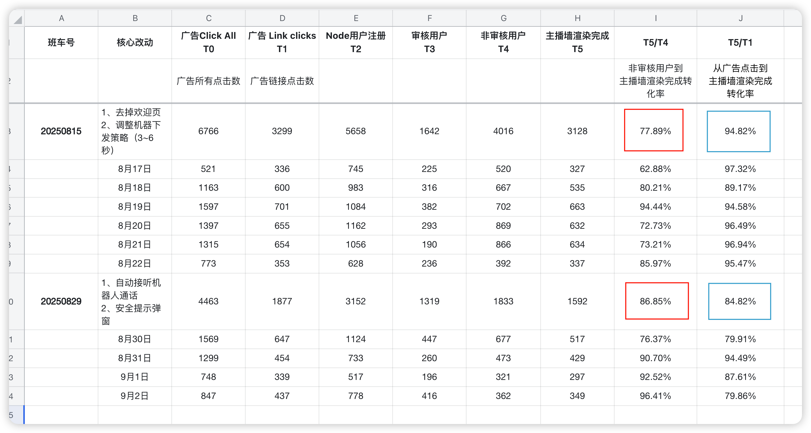
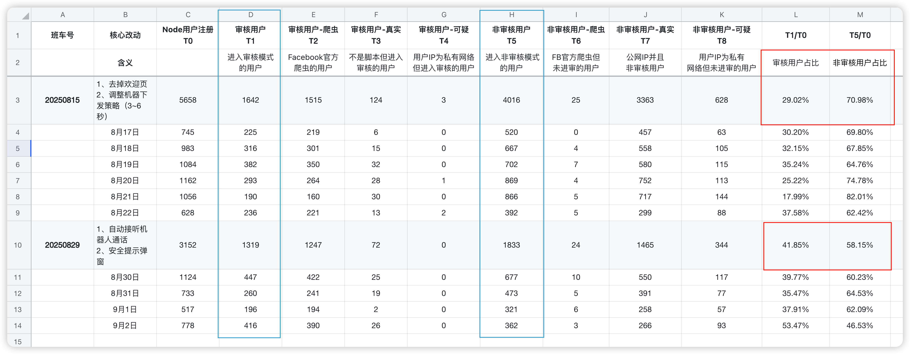
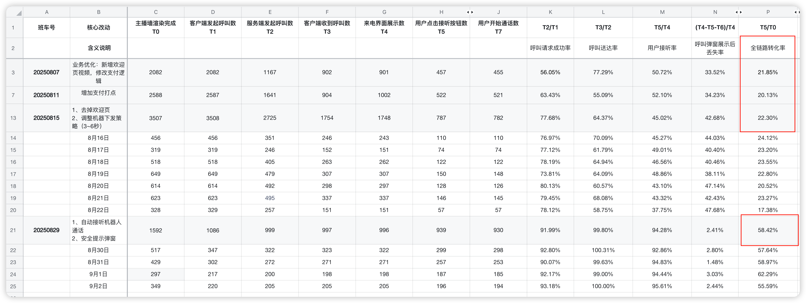
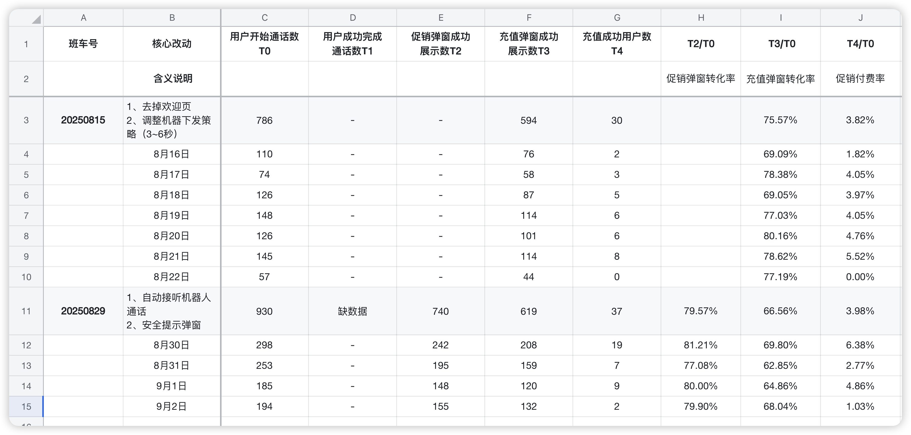
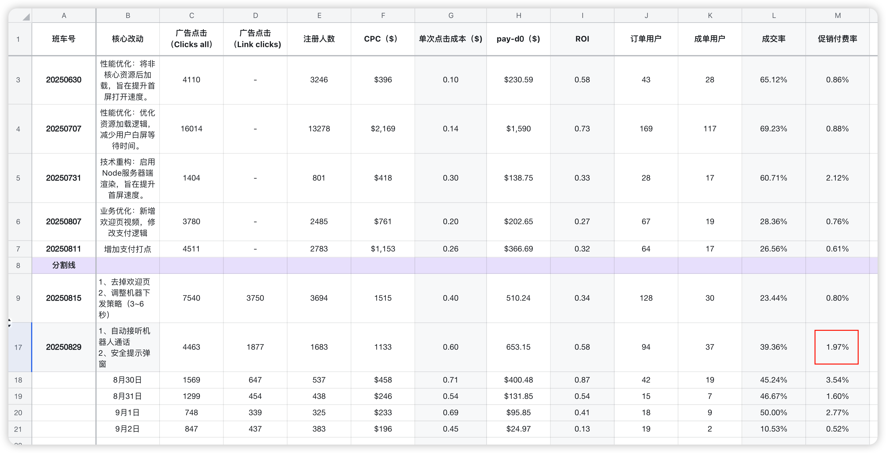
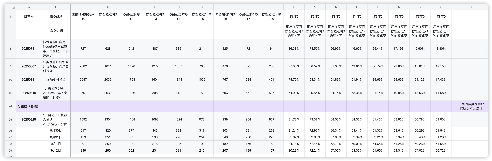
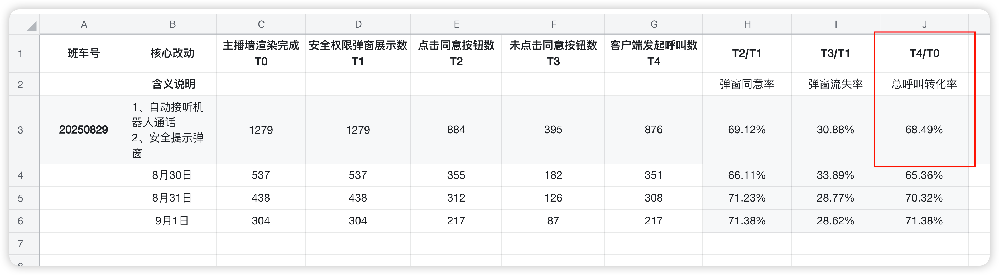
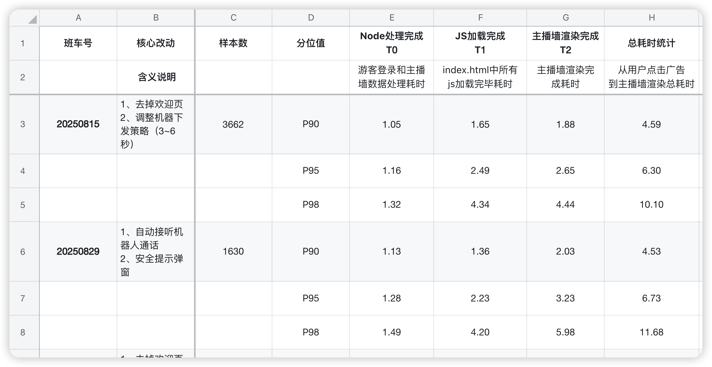

## 一、本周核心成果

**A、本周上线，待数据验证的项目**

| **项目/行动**            | **本周关键进展与状态**                                       | **核心价值 & 衡量指标**                                      | **后续计划**                                   |
| ------------------------ | ------------------------------------------------------------ | ------------------------------------------------------------ | ---------------------------------------------- |
| H5游戏大厅及多项体验优化 | 开发完成，待发布。包含修改如下：H5游戏大厅入口移至Tab栏（已处理多端兼容性问题）Stories功能移至主播墙，并优化封面新人促销弹窗视频源优化主播详情页体验优化修复新人促销充值消费后，下一档优惠未出现Bug | 目标：提升内容吸引力和用户体验修复付费bug衡量指标：游戏tab点击率新人促销付费率用户留存率 | 计划下周一和解决苹果登录问题统一发布上线       |
| Apple登录流程Bug         | 问题已定位苹果回调被Node服务拦截前端未处理回调               | 保证核心登录功能稳定，避免用户流失以及任务系统影响           | 计划：下周一作为最高优先级修复，并立即发布上线 |

**B、规划/开发中的项目**

| **项目/行动** | **本周关键进展与状态**                                       | **核心价值 & 衡量指标**                                      | **后续计划**                                                 |
| ------------- | ------------------------------------------------------------ | ------------------------------------------------------------ | ------------------------------------------------------------ |
| 任务系统      | 开发延期，UI设计完成。因后端临时插入其他高优需求，本项目后端开发工作延期，UI设计稿已于本周三完成 | 目标：提升用户日活促进付费转化衡量指标：DAU任务完成率付费转化率 | 计划：已排入下周开发计划，预计下周五完成开发并发布。         |
| App主题色优化 | 规划中                                                       | 目标：提升App整体视觉体验                                    | 计划：下周三完成UI设计，开发任务待修复苹果登录问题后再根据任务系统进度来判定 |
| 新人入职      | 准备中新人“刘钟康”将于下周三入职                             | 目标：补充团队人力，支持后续项目开发                         | 计划：下周三开始进行入职指导和培训工作                       |

## 二、核心数据

**2.1 Node渲染漏斗**

**核心发现：**新版本整体转化率从94.82%下降至84.82%

**原因分析：**

- 进入“审核模式”的用户占比从29.02%提升至41.85%，进入“非审核模式”占比从70.98%下降至58.15%，这是导致整体转化率下降的直接原因。

**后续计划：**

- 目前无法从根本上解决FB爬虫问题，接下来工作重心重点转向剩余的84.82%的用户。

**审核用户占比分析：**

**2.2 呼叫接听漏斗**

**数据表现：**

- 本周因投放消耗不出去，未产生足够的数据样本进行有效的漏斗分析。

**分析：**

- 上周验证的“自动接听”策略已证明在提升接听转化率、呼叫送达率上从短期看是有效的。

**下一步计划：**

- 待恢复投放后，将第一时间跟进并分析呼叫接听漏斗的转化数据。

**2.3 通话漏斗**

**本周结论：**通话质量数据待补充，漏斗分析暂停

**数据表现：**

- 本周核心指标“用户成功完成通话数 (T1)”及其相关细分数据（如主动挂断、网络问题占比等）仍处于缺失状态，与上周情况一致。

**分析：**

- 缺少T1数据，无法对上周定位的关键流失环节“T0->T2"（开始通话 -> 促销弹窗展示）进行分析。

**下一步计划：**

- 跟投放沟通后还是广告不好过审，主要是两方面原因
  - 风控过审难
  - 过审后消耗也难（有一个包开了二十几条CAM，最后落下来也就花了30刀）
- 继续推动尽快恢复投放

**2.4 核心链路数据**

**本周结论：**还是不够稳定，ROI呈明显下滑趋势

数据表现：

- 新版本（20250829）上线后，ROI 表现逐日下滑，从首日的 0.87 快速下跌至第四日的 0.13
- 成交率同样从9月2日从前三日平均的 47% 骤降至 10.53%

分析：

- 新版本的优秀表现可能仅限于上线初期的少量高质量用户，其转化模型还是没有持续性

下一步计划：

- 还是保持现有投放规模，小预算测试，只有ROI稳定在0.8以上，再考虑追逐步放量。

**2.5 每3秒停留时长**

**结论：**

已定位并发现每日占比约30%的稳定流量，在页面和弹窗加载完成后，无任何交互便直接流失。这种固定的行为模式高度疑似机器人或无效流量，而非真实用户。

**下一步计划：**

- 数据交叉验证： 对比“未点击同意”和“停留<6秒”的用户，验证其重合度，为“机器人行为”提供更强的数据证据。

**2.6 首启P90数据**

**结论：**本周PWA首启P90总耗时为 4.53秒，与上周基线持平。

##  三、反思与改进

| **类别**                                                     | **问题**                                                     | **反思**                                                     | **改进**                                                     |
| ------------------------------------------------------------ | ------------------------------------------------------------ | ------------------------------------------------------------ | ------------------------------------------------------------ |
| 产品思维                                                     | 对单一问题或指标过度关注，导致对用户需求、业务目标等整体把握不足，缺乏产品敏感度 | 根本原因在于思维模式倾向于执行者而非负责人，过度关注如何实现，忽略为什么做、为谁做。 | 多看、多听、多思考吧。慢慢建立产品决策框架                   |
| 数据驱动                                                     | 基于错误的FB指标（Clicks All）做漏斗分析，导致对核心转化率产生严重误判。 | 对关键业务指标的定义和理解不够严谨，团队内部（投放、产品、数据）没有建立统一 | 全链路各环节的唯一统计口径                                   |
| 时间管理                                                     | 1、很忙但是没结果2、很忙但是没效率                           | 追根到底还是自己目标管理、复盘能力没做好。                   | [思维导图 > 第三场分享：时间管理](https://la1a59fdywl.feishu.cn/docx/MqcddzzxDolFfaxwBjocWCwKnid?openbrd=1&doc_app_id=501&blockId=doxcn9gwt7Dyd7NfFUdYouxbWtn&blockType=whiteboard&blockToken=N8vvw69oAhgtbhbjCLocXTppnJg#doxcn9gwt7Dyd7NfFUdYouxbWtn) |
| 团队管理                                                     | 团队协同效率虽有提高，核心问题还是目标感不够                 | 我在这个协同效率问题上有责任，也体现出不足，所以开启第一场培训计划：目标管理[思维导图 > 第一场分享会：目标管理（SMART)](https://la1a59fdywl.feishu.cn/docx/OAtBdDBj3oocCVxsvw6cOjS7nME?openbrd=1&doc_app_id=501&blockId=doxcn1rx65oQRvH30Dl9P7tJ7De&blockType=whiteboard&blockToken=QNEKwPuJ6hI06rbhRXGcmFhDn8d#doxcn1rx65oQRvH30Dl9P7tJ7De)[思维导图 > 第二场分享会：目标管理（补充）](https://la1a59fdywl.feishu.cn/docx/PMi0doQJwowBesxj91acqBtSnww?openbrd=1&doc_app_id=501&blockId=doxcnuitaSjJpacC0bnEQfHTXr8&blockType=whiteboard&blockToken=W4S1w0W0JhNy6mbsQ5ccwHoTnRc#doxcnuitaSjJpacC0bnEQfHTXr8)[思维导图 > 第三场分享：时间管理](https://la1a59fdywl.feishu.cn/docx/MqcddzzxDolFfaxwBjocWCwKnid?openbrd=1&doc_app_id=501&blockId=doxcn9gwt7Dyd7NfFUdYouxbWtn&blockType=whiteboard&blockToken=N8vvw69oAhgtbhbjCLocXTppnJg#doxcn9gwt7Dyd7NfFUdYouxbWtn) | 定靶心：用SMART原则代替“模糊感觉”（本周三开始培训）[思维导图 > 第一场分享：目标管理（SMART)](https://la1a59fdywl.feishu.cn/docx/OAtBdDBj3oocCVxsvw6cOjS7nME?openbrd=1&doc_app_id=501&blockId=doxcn1rx65oQRvH30Dl9P7tJ7De&blockType=whiteboard&blockToken=QNEKwPuJ6hI06rbhRXGcmFhDn8d#doxcn1rx65oQRvH30Dl9P7tJ7De) |
| 对人心：用“目标对齐”代替“单打独斗”（每日早会对齐，如首启进度，下阶段计划） |                                                              |                                                              |                                                              |
| 稳执行：PDCA循环代替“思前想后”（第二场补充黄金圈+PDCA）      |                                                              |                                                              |                                                              |

# 相关链接

[PWA思维导图 > PWA](https://la1a59fdywl.feishu.cn/docx/XlppdL74boxRjmx6dpTcfAMineg?openbrd=1&doc_app_id=501&blockId=doxcnYSSdTB6AMG18BVrn5XAu2d&blockType=whiteboard&blockToken=GlGRwEIFJhfbyVbCmOjcJxXcn5A#doxcnYSSdTB6AMG18BVrn5XAu2d)

[思维导图 > PWA第二阶段计划](https://la1a59fdywl.feishu.cn/docx/IvxIdLPPZo8qp3x1FuJclVWFnxh?openbrd=1&doc_app_id=501&blockId=doxcnmFEsfTsvekW8HkmCfcQr3f&blockType=whiteboard&blockToken=RkzowyPVuhniKkbHunKcnRbIndc#doxcnmFEsfTsvekW8HkmCfcQr3f)

[PWA版本管理](https://la1a59fdywl.feishu.cn/wiki/HItNw0KUfiJwvNkgkeecAWrsnme?from=from_copylink)（班车制度）

[PWA数据](https://la1a59fdywl.feishu.cn/sheets/BYu9sRmvGh8aE8tncb8chVUTnIg?from=from_copylink&sheet=RN2VYk)(业务数据）

[思维导图 > 第一场培训：目标管理（SMART)](https://la1a59fdywl.feishu.cn/docx/OAtBdDBj3oocCVxsvw6cOjS7nME?openbrd=1&doc_app_id=501&blockId=doxcn1rx65oQRvH30Dl9P7tJ7De&blockType=whiteboard&blockToken=QNEKwPuJ6hI06rbhRXGcmFhDn8d#doxcn1rx65oQRvH30Dl9P7tJ7De)

[思维导图 > 第二场分享会：目标管理（补充）](https://la1a59fdywl.feishu.cn/docx/PMi0doQJwowBesxj91acqBtSnww?openbrd=1&doc_app_id=501&blockId=doxcnuitaSjJpacC0bnEQfHTXr8&blockType=whiteboard&blockToken=W4S1w0W0JhNy6mbsQ5ccwHoTnRc#doxcnuitaSjJpacC0bnEQfHTXr8)

[思维导图 > 第三场分享：时间管理](https://la1a59fdywl.feishu.cn/docx/MqcddzzxDolFfaxwBjocWCwKnid?openbrd=1&doc_app_id=501&blockId=doxcn9gwt7Dyd7NfFUdYouxbWtn&blockType=whiteboard&blockToken=N8vvw69oAhgtbhbjCLocXTppnJg#doxcn9gwt7Dyd7NfFUdYouxbWtn)

[PWA首启优化复盘](https://la1a59fdywl.feishu.cn/docx/NsmfdbXW4o8gNsxSeb0c6dBEnMf?from=from_copylink)