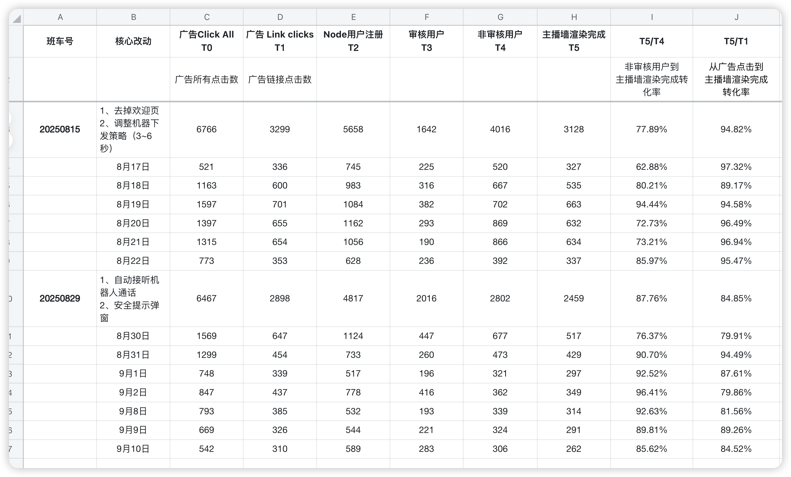
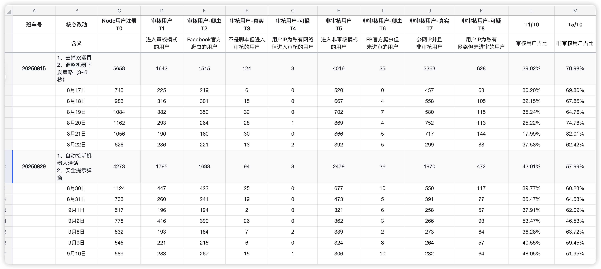
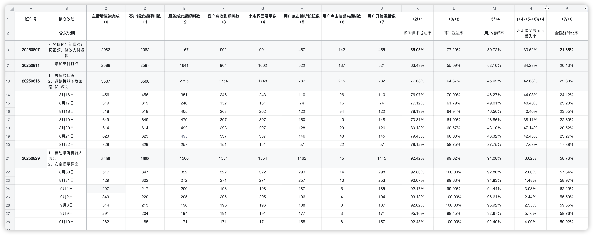
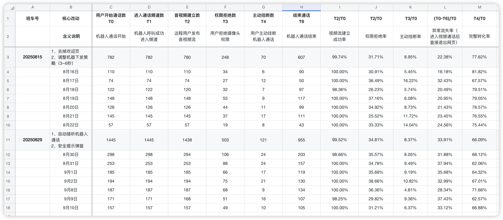
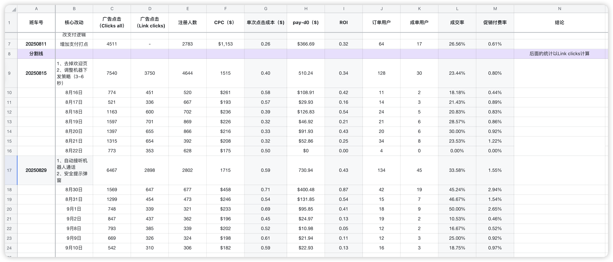
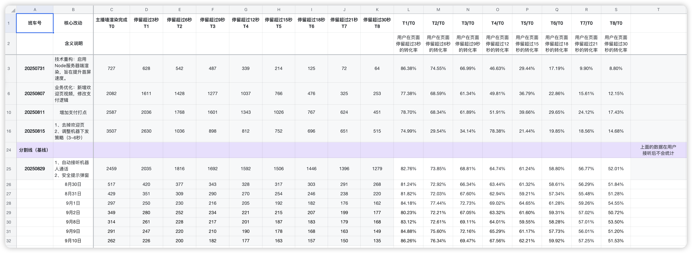
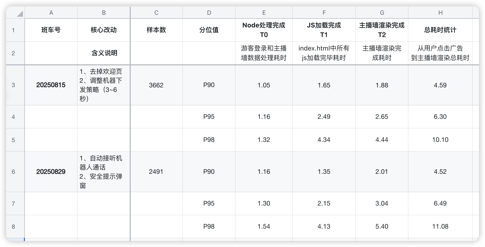

## 一、本周核心成果

**A、本周上线，待数据验证的项目**

| **项目/行动**               | **本周关键进展与状态**                                       | **核心价值 & 衡量指标**                                      | **后续计划**                                                 |
| --------------------------- | ------------------------------------------------------------ | ------------------------------------------------------------ | ------------------------------------------------------------ |
| 修复苹果/谷歌登录及相关问题 | 周三上线：修复了苹果ID无法登录的问题周五上线：修复了谷歌ID无法登录以及苹果登录后影响通话的问题目前核心登录功能已恢复正常 | **目标：**核心登录功能稳定，为接下来的任务系统做铺垫**衡量指标：**登录成功率 | **风险关注：**谷歌登录目前因应用审核中，存在100个账号的使用限制（审核周期预计4-6周）。等任务系统上线后需关注谷歌绑定的用户数量 |
| H5游戏大厅上线及多项优化    | 周三已发布上线主要内容包括游戏大厅功能正式上线修复主播详情页用户头像不一致的bug修复新人促销无法出现下一档位的bug | **目标：**提升内容吸引力、修复促销弹窗bug**衡量指标：**游戏tab点击率新人促销付费率用户留存率 | 下周开始进行数据验证，观察各项核心指标变化                   |
| 新人促销体验优化            | 本周五已发布上线具体优化：新人促销弹窗UI改版，并弱化了关闭按钮视频源改为采用视频墙中价格最高的主播视频，以提升吸引力 | **目标：**提升新人付费转化率**衡量指标：**新人促销弹窗点击率新人付费转化率 | 下周重点关注新人付费数据的变化                               |

**B、规划/开发中的项目**

| **项目/行动** | **本周关键进展与状态**                                     | **核心价值 & 衡量指标**                                      | **后续计划**                                                 |
| ------------- | ---------------------------------------------------------- | ------------------------------------------------------------ | ------------------------------------------------------------ |
| 任务系统      | 后端开发延期，本周仍未完成开发前端处理等待后端接口状态     | **目标：**提升用户日活促进付费转化**衡量指标：**DAU任务完成率付费转化率 | 后端计划下周一完成开发前端完成对接及服务器压测后，预计最快下周五发布上线 |
| App主题色优化 | UI设计进行中，尚未完成                                     | **目标：**提升App整体视觉体验                                | UI预计下周二完成设计，开发排期需等待任务系统上线后确定       |
| 新人入职      | 原计划入职的新人“刘钟康”未按时入职。团队人力暂未得到补充。 | **目标：**补充团队人力，支持后续项目开发                     | 与HR沟通，重新启动招聘流程。                                 |

## 二、核心数据

**2.1 Node渲染漏斗**

**核心现状：**

- 本周情况与上周类似，审核用户占比过高（42.01%）

**后续计划：**

- 策略不变，继续聚焦真实用户

**审核用户占比分析：**

**2.2 呼叫接听漏斗**

**数据表现：**本周恢复了三天的广告投放，发现“自动接听机器人”策略是有效果的

- 最终呼叫转化率（T7/T0）稳定在58.76%
- 作为对比，其他基线策略的转化率仅为20-22%左右

**分析：**从漏斗上看，该策略的成功主要归因于两点

- 呼叫请求成功率（T1->T2  客户端发起呼叫数->服务端发起呼叫数）达到92.42%
- 呼叫送达率（T2->T3 服务端发起呼叫数->客户端收到呼叫数）达到99.62%

**下一步计划：**

- 接下来的重点应转向通话开始后的用户行为

**2.3 通话漏斗**

**核心发现：**

- “自动接听机器人”策略虽然极大提升呼叫接通率，但对后续的用户转化产生了一些负面影响。

**数据表现：**

- 完整转化率降低：“自动接听机器人”策略最终完整转化率仅为66.09%，远低于基线策略77.62%，相差11个百分点
- 异常流失率是主因：有33.91%的用户在进入视频通话后直接退出网页，基线仅为22.4%

**原因分析：**

- 从数据表现来看，虽然用户被“强制”接听率电话，但这种体验可能过于突然或者具有侵入性，用户可能会感到困惑、不安全或者被打扰，从而立刻关闭页面，这解释了为什么“异常流失率”会成为最主要的流失环节

**下一步计划：**

- 当前的策略是先接通再说，现在必须转变为如何让用户平滑的进入通话，重心可以立即转向优化自动接听前后的用户引导和交互体验

**2.4 核心链路数据**

**本周结论：**还是不够稳定，ROI呈明显下滑趋势

**数据表现：**

- 新版本（20250829）上线后，ROI 表现逐日下滑，从首日的 0.87 快速下跌至第四日的 0.13
- 成交率同样从9月2日从前三日平均的 47% 骤降至 10.53%

**分析：**

- 新版本的优秀表现可能仅限于上线初期的少量高质量用户，其转化模型还是没有持续性

**下一步计划：**

- 还是保持现有投放规模，小预算测试，只有ROI稳定在0.8以上，再考虑追逐步放量。

**2.5 每3秒停留时长**

**现状确认：**

- 与上周一致，用户在通话前6秒的流失是机器人行为，

**问题定性：**

- 通过数据交叉验证，对比“未点击同意”和“停留<6秒”的用户，基本重合，而且都是无任何行为就走掉了。

**2.6 首启P90数据**

**结论：**本周PWA首启P90总耗时为 4.52秒，与上周基线持平。

##  三、反思与改进

| **类别**                                                     | **问题**                                                     | **反思**                                                     | **改进**                                                     |
| ------------------------------------------------------------ | ------------------------------------------------------------ | ------------------------------------------------------------ | ------------------------------------------------------------ |
| 产品思维                                                     | 对单一问题或指标过度关注，导致对用户需求、业务目标等整体把握不足，缺乏产品敏感度 | 根本原因在于思维模式倾向于执行者而非负责人，过度关注如何实现，忽略为什么做、为谁做。 | 多看、多听、多思考吧。慢慢建立产品决策框架                   |
| 数据驱动                                                     | 基于错误的FB指标（Clicks All）做漏斗分析，导致对核心转化率产生严重误判。 | 对关键业务指标的定义和理解不够严谨，团队内部（投放、产品、数据）没有建立统一 | 全链路各环节的唯一统计口径                                   |
| 时间管理                                                     | 1、很忙但是没结果2、很忙但是没效率                           | 追根到底还是自己目标管理、复盘能力没做好。                   | [思维导图 > 第三场分享：时间管理](https://la1a59fdywl.feishu.cn/docx/MqcddzzxDolFfaxwBjocWCwKnid?openbrd=1&doc_app_id=501&blockId=doxcn9gwt7Dyd7NfFUdYouxbWtn&blockType=whiteboard&blockToken=N8vvw69oAhgtbhbjCLocXTppnJg#doxcn9gwt7Dyd7NfFUdYouxbWtn) |
| 团队管理                                                     | 团队协同效率虽有提高，核心问题还是目标感不够                 | 我在这个协同效率问题上有责任，也体现出不足，所以开启第一场培训计划：目标管理[思维导图 > 第一场分享会：目标管理（SMART)](https://la1a59fdywl.feishu.cn/docx/OAtBdDBj3oocCVxsvw6cOjS7nME?openbrd=1&doc_app_id=501&blockId=doxcn1rx65oQRvH30Dl9P7tJ7De&blockType=whiteboard&blockToken=QNEKwPuJ6hI06rbhRXGcmFhDn8d#doxcn1rx65oQRvH30Dl9P7tJ7De)[思维导图 > 第二场分享会：目标管理（补充）](https://la1a59fdywl.feishu.cn/docx/PMi0doQJwowBesxj91acqBtSnww?openbrd=1&doc_app_id=501&blockId=doxcnuitaSjJpacC0bnEQfHTXr8&blockType=whiteboard&blockToken=W4S1w0W0JhNy6mbsQ5ccwHoTnRc#doxcnuitaSjJpacC0bnEQfHTXr8)[思维导图 > 第三场分享：时间管理](https://la1a59fdywl.feishu.cn/docx/MqcddzzxDolFfaxwBjocWCwKnid?openbrd=1&doc_app_id=501&blockId=doxcn9gwt7Dyd7NfFUdYouxbWtn&blockType=whiteboard&blockToken=N8vvw69oAhgtbhbjCLocXTppnJg#doxcn9gwt7Dyd7NfFUdYouxbWtn) | 定靶心：用SMART原则代替“模糊感觉”（本周三开始培训）[思维导图 > 第一场分享：目标管理（SMART)](https://la1a59fdywl.feishu.cn/docx/OAtBdDBj3oocCVxsvw6cOjS7nME?openbrd=1&doc_app_id=501&blockId=doxcn1rx65oQRvH30Dl9P7tJ7De&blockType=whiteboard&blockToken=QNEKwPuJ6hI06rbhRXGcmFhDn8d#doxcn1rx65oQRvH30Dl9P7tJ7De) |
| 对人心：用“目标对齐”代替“单打独斗”（每日早会对齐，如首启进度，下阶段计划） |                                                              |                                                              |                                                              |
| 稳执行：PDCA循环代替“思前想后”（第二场补充黄金圈+PDCA）      |                                                              |                                                              |                                                              |

# 相关链接

[PWA思维导图 > PWA](https://la1a59fdywl.feishu.cn/docx/XlppdL74boxRjmx6dpTcfAMineg?openbrd=1&doc_app_id=501&blockId=doxcnYSSdTB6AMG18BVrn5XAu2d&blockType=whiteboard&blockToken=GlGRwEIFJhfbyVbCmOjcJxXcn5A#doxcnYSSdTB6AMG18BVrn5XAu2d)

[思维导图 > PWA第二阶段计划](https://la1a59fdywl.feishu.cn/docx/IvxIdLPPZo8qp3x1FuJclVWFnxh?openbrd=1&doc_app_id=501&blockId=doxcnmFEsfTsvekW8HkmCfcQr3f&blockType=whiteboard&blockToken=RkzowyPVuhniKkbHunKcnRbIndc#doxcnmFEsfTsvekW8HkmCfcQr3f)

[PWA版本管理](https://la1a59fdywl.feishu.cn/wiki/HItNw0KUfiJwvNkgkeecAWrsnme?from=from_copylink)（班车制度）

[PWA数据](https://la1a59fdywl.feishu.cn/sheets/BYu9sRmvGh8aE8tncb8chVUTnIg?from=from_copylink&sheet=RN2VYk)(业务数据）

[思维导图 > 第一场培训：目标管理（SMART)](https://la1a59fdywl.feishu.cn/docx/OAtBdDBj3oocCVxsvw6cOjS7nME?openbrd=1&doc_app_id=501&blockId=doxcn1rx65oQRvH30Dl9P7tJ7De&blockType=whiteboard&blockToken=QNEKwPuJ6hI06rbhRXGcmFhDn8d#doxcn1rx65oQRvH30Dl9P7tJ7De)

[思维导图 > 第二场分享会：目标管理（补充）](https://la1a59fdywl.feishu.cn/docx/PMi0doQJwowBesxj91acqBtSnww?openbrd=1&doc_app_id=501&blockId=doxcnuitaSjJpacC0bnEQfHTXr8&blockType=whiteboard&blockToken=W4S1w0W0JhNy6mbsQ5ccwHoTnRc#doxcnuitaSjJpacC0bnEQfHTXr8)

[思维导图 > 第三场分享：时间管理](https://la1a59fdywl.feishu.cn/docx/MqcddzzxDolFfaxwBjocWCwKnid?openbrd=1&doc_app_id=501&blockId=doxcn9gwt7Dyd7NfFUdYouxbWtn&blockType=whiteboard&blockToken=N8vvw69oAhgtbhbjCLocXTppnJg#doxcn9gwt7Dyd7NfFUdYouxbWtn)

[PWA首启优化复盘](https://la1a59fdywl.feishu.cn/docx/NsmfdbXW4o8gNsxSeb0c6dBEnMf?from=from_copylink)