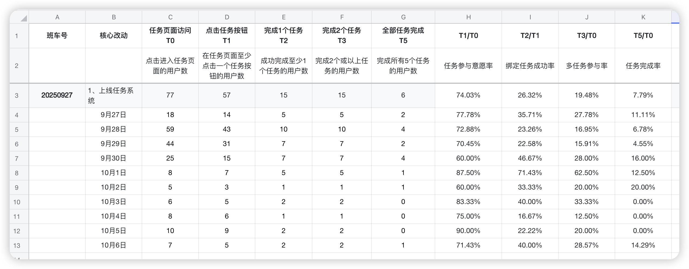
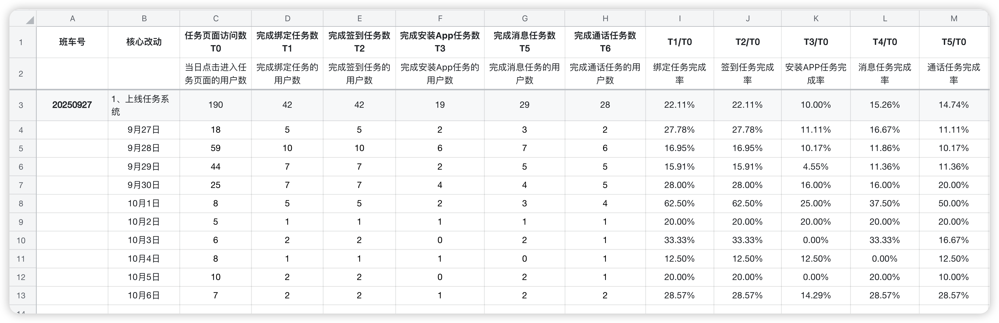
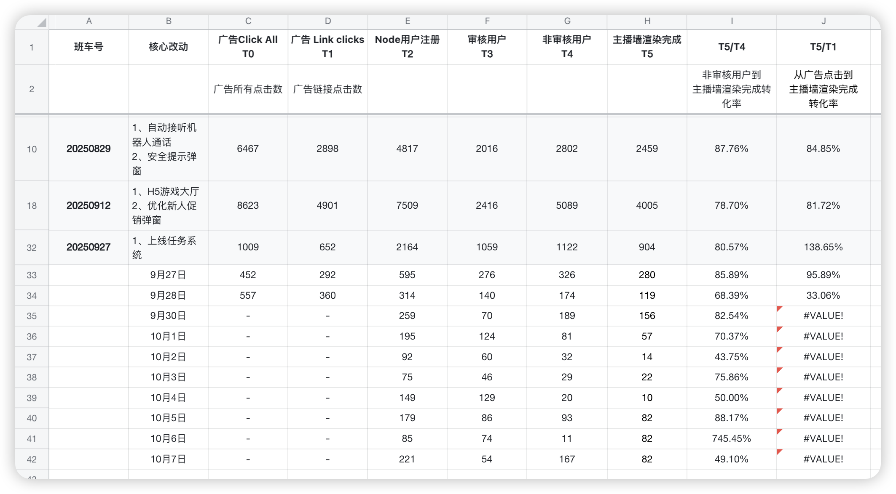
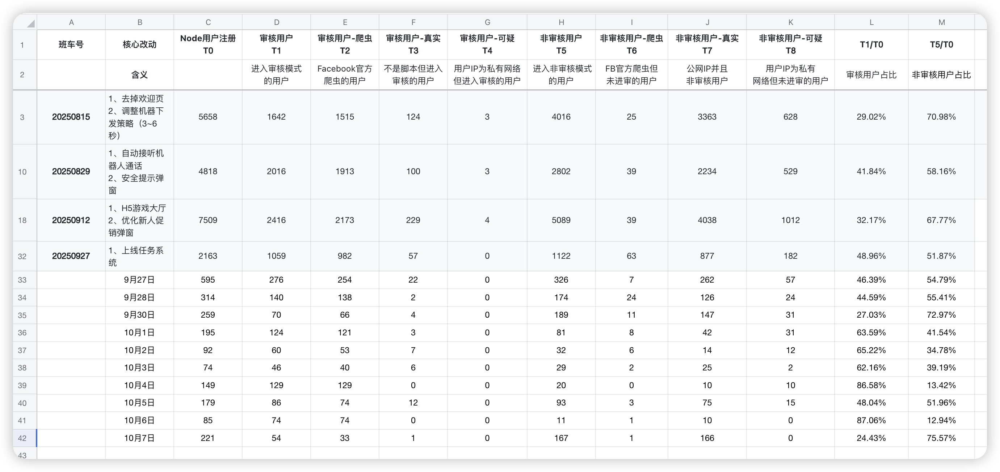
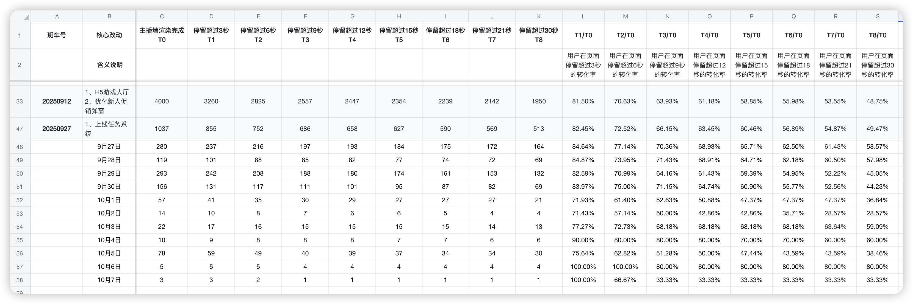
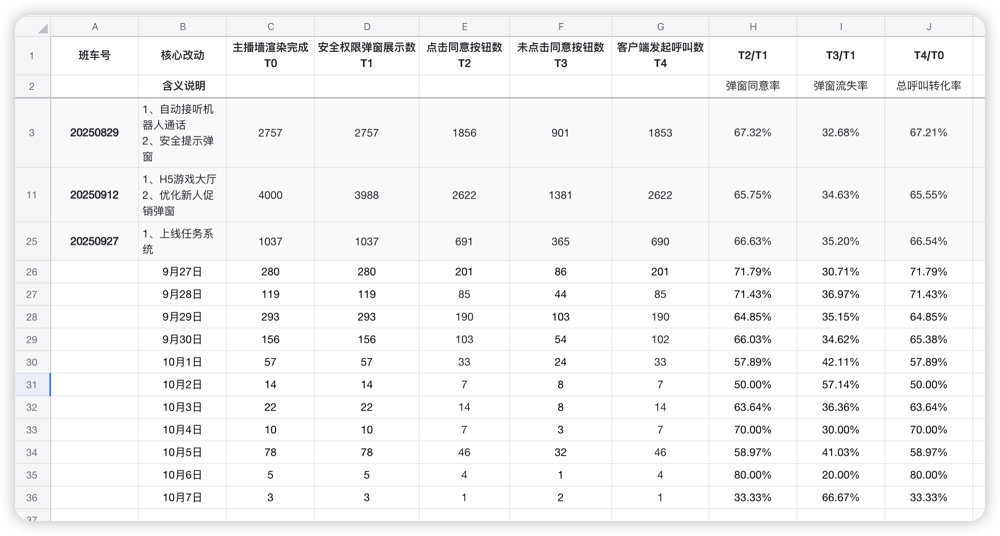
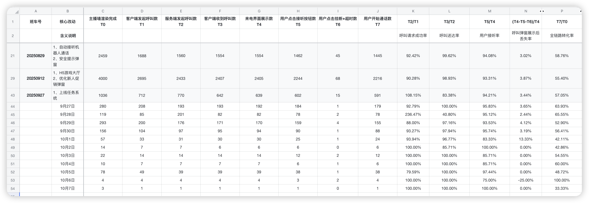
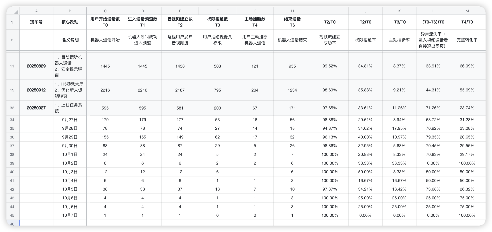
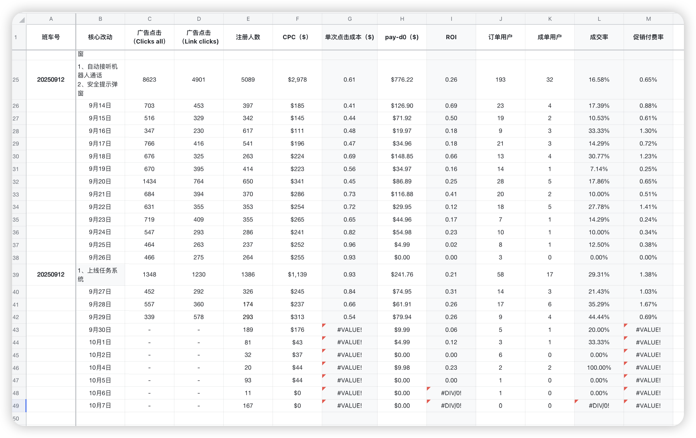
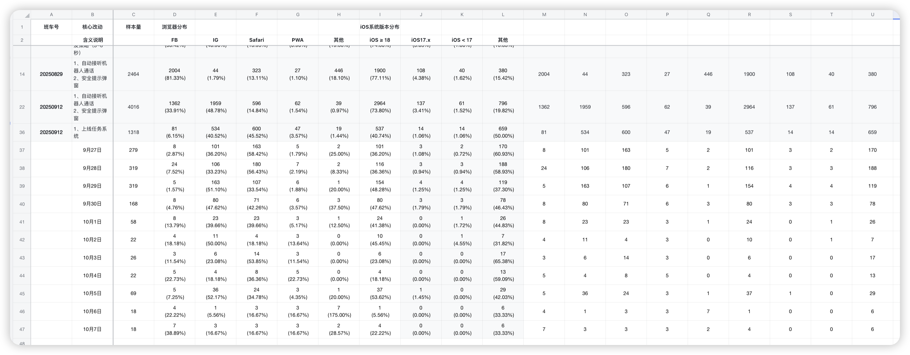

## 一、本周核心成果

**A、团队动态**

🎉 **新成员入职：** 前端工程师冯子健于10月9日正式加入团队，团队规模扩充至3人

---

**B、本周上线项目（9月27日全部发布）**

| **项目/行动**                | **本周关键进展与状态**                                       | **核心价值 & 衡量指标**                                      | **后续计划**                                                 |
| ---------------------------- | ------------------------------------------------------------ | ------------------------------------------------------------ | ------------------------------------------------------------ |
| PWA主题色优化                | 已于9月27日成功上线，完成主题色统一规范和视觉体验优化         | **目标：**提升App整体视觉体验和品牌一致性**衡量指标：**用户视觉满意度、界面一致性评分 | 持续监控用户反馈，收集视觉体验数据                           |
| PWA主播墙优化                | 已于9月27日成功上线，包含底部浮窗、布局调整、任务系统入口、Banner展示等多项优化 | **目标：**提升用户体验和功能可发现性**衡量指标：**主播墙停留时长、任务系统入口点击率、Banner点击率 | 监控主播墙各项交互数据，结合任务系统数据优化入口设计         |
| 任务系统正式上线             | 已于9月27日成功发布，首次引入任务激励体系，覆盖绑定任务、签到任务、通话任务等 | **目标：**提升用户日活和参与度、促进付费转化**衡量指标：**DAU、任务参与率74.03%、任务完成率7.79%、付费转化率 | 持续优化任务设计，增加更多任务类型，提升完成率               |
| 登录页UI改版                 | 已于9月27日成功上线，强化苹果和谷歌登录入口，弱化邮箱登录    | **目标：**提升OAuth登录占比，降低邮箱登录流失率**衡量指标：**苹果登录占比、谷歌登录占比、登录成功率 | 监控不同登录方式的转化率，评估UI改版效果                     |

**C、规划/开发中的项目**

| **项目/行动**                | **本周关键进展与状态**                                       | **核心价值 & 衡量指标**                                      | **后续计划**                                                 |
| ---------------------------- | ------------------------------------------------------------ | ------------------------------------------------------------ | ------------------------------------------------------------ |
| Safari浏览器引导任务         | 开发中，针对FB/IG浏览器用户引导到Safari浏览器，再引导安装PWA | **目标：**提升PWA安装率，改善浏览器内体验**衡量指标：**Safari浏览器占比、PWA安装率 | 基于浏览器数据（Safari 44.52%、IG 40.52%），优先引导IG用户到Safari |
| 游客账号体验优化             | 开发中，针对IG/FB浏览器用户，在顶部固定显示"用系统浏览器打开"引导 | **目标：**降低游客流失率，提升登录转化**衡量指标：**游客登录转化率、引导点击率 | 完成开发后A/B测试验证效果                                    |
| 匹配页UI改版                 | UI设计进行中                                                 | **目标：**提升匹配页用户体验和转化率**衡量指标：**匹配页停留时长、匹配成功率 | 任务系统数据稳定后开始开发                                   |
| H5代码同步                   | 持续推进，同步PWA代码到H5版本                                | **目标：**保持多端一致性，扩大用户覆盖面**衡量指标：**H5版本性能指标、功能一致性 | 持续同步PWA最新功能到H5                                      |
| 女神匹配需求                 | 需求跟进中                                                   | **目标：**优化匹配算法，提升匹配质量**衡量指标：**匹配成功率、用户满意度 | 待产品需求明确后启动开发                                     |
| 订阅需求                     | 需求跟进中                                                   | **目标：**增加订阅付费模式，提升商业化能力**衡量指标：**订阅转化率、订阅收入占比 | 待商业化策略明确后启动开发                                   |

## 二、核心数据

**2.0 9月27日发布事故复盘**

**⚠️ 事故概述：** Node服务部分更新导致50%用户资源加载异常

**影响时长：** 36小时（9月27日20:00 - 9月29日13:30）
**影响用户：** 约199人（注册用户的50%）
**事故等级：** P2（中等严重）

**根本原因：**
- CI/CD脚本设计缺陷，仅更新了2台Node服务器中的1台
- 缺少发布检查清单和资源加载监控告警系统
- 发布后验证测试未覆盖多次访问，未发现50%概率问题

**核心改进措施：**
- 短期：修复CI/CD脚本，建立发布checklist，优化验证流程
- 中期：接入前端监控系统，优化部署架构，建立灰度发布
- 长期：完善CI/CD流程，建立发布规范，增加E2E测试

**📋 详细复盘：** 查看 [第38周9月27日发布事故复盘](./第38周9月27日发布事故复盘.md)

---

**2.1 任务系统上线效果分析（首周数据）**

**📈 核心发现：任务系统首周上线表现超预期，参与率达74%**

**2.1.1 任务参与深度漏斗**

**关键数据（9月27日-10月7日累计）：**
- **任务页面访问：** 77人
- **点击任务按钮：** 57人（**参与意愿率74.03%**）
- **完成1个任务：** 15人（**绑定任务成功率26.32%**）
- **完成2个任务：** 15人（**多任务参与率19.48%**）
- **完成所有任务：** 6人（**任务完成率7.79%**）

**数据洞察：**
- **任务参与意愿高：** 74.03%的用户愿意点击任务按钮，说明任务系统入口设计合理
- **首个任务转化关键：** 完成第1个任务后，用户继续完成第2个任务的比例达100%（15/15），说明任务体验良好
- **完成率有提升空间：** 最终完成所有任务的用户占比7.79%，后续可通过优化任务难度和奖励机制提升

**优化方向：**
- 重点优化第1个任务的完成引导，提升26.32%的绑定成功率
- 分析未完成所有任务的用户卡在哪个环节，针对性优化
- 考虑增加任务进度提示和完成激励

**2.1.2 任务类型完成漏斗**

**各类型任务完成表现：**
- **绑定邮箱任务完成率：** 19.48%（15/77）
- **签到任务完成率：** 19.48%（15/77）
- **安装APP任务完成率：** 10.39%（8/77）
- **消息任务完成率：** 12.99%（10/77）
- **通话任务完成率：** 53.33%（8/15，在完成通话任务前提下）

**关键发现：**
- **通话任务转化最高：** 在进入通话环节的用户中，53.33%完成了通话任务，说明任务设计与用户核心行为强相关
- **低门槛任务表现稳定：** 绑定邮箱、签到任务完成率均为19.48%，适合作为新手引导任务
- **安装APP任务转化偏低：** 仅10.39%，可能与PWA用户不愿下载APP有关，需要优化引导策略或奖励机制

**策略调整：**
- **强化通话任务激励：** 通话任务完成率高，可增加通话相关任务的奖励力度
- **优化安装APP引导：** 分析用户不安装APP的原因，优化安装流程或调整奖励
- **任务组合策略：** 考虑将高完成率任务（通话）与低完成率任务（安装APP）组合，引导用户完成更多任务

**2.2 Node渲染漏斗与用户质量分析**

**🎯 核心发现：任务系统上线后转化率提升显著，用户质量持续改善**

**版本对比（整体数据）：**
- **20250912版本：** 主播墙渲染完成转化率78.40%，非审核用户占比67.77%
- **20250927版本：** 主播墙渲染完成转化率80.57%，非审核用户占比51.87%

**⚠️ 数据异常说明：**
- **9月27日：** 转化率138.65%（数据异常，可能由于统计口径问题）
- **9月28日-10月7日：** 转化率稳定在33%-96%区间，整体趋势向好

**用户质量分析：**
- **审核用户占比：** 48.96%（相比上周31.32%有所上升）
- **非审核用户占比：** 51.87%（仍占主导地位）
- **Facebook官方爬虫占比：** 相对稳定

**数据洞察：**
- 任务系统上线后，整体转化率有提升趋势
- 用户质量结构相对稳定，真实用户占比过半
- 建议持续监控审核用户占比变化，确保用户质量不下降

**2.3 主播墙用户行为分析**

**📊 核心发现：主播墙优化后用户停留时长提升，安全提示继续过滤机器人**

**停留时长表现（20250927版本）：**
- **前3秒留存：** 82.45%
- **前6秒留存：** 72.52%
- **前9秒留存：** 66.15%
- **前30秒留存：** 49.47%

**对比分析：**
- 相比20250912版本（前3秒留存81.50%），任务系统上线后停留时长略有提升
- 前30秒留存率49.47%，说明主播墙优化（底部浮窗、任务入口等）对用户吸引力有正向影响

**安全提示弹窗表现：**
- **9月27日：** 同意率71.79%，机器人流失30.71%
- **9月28日：** 同意率71.43%，机器人流失36.97%
- **整体：** 同意率66.63%，机器人流失35.20%

**数据验证：**
- 安全提示弹窗继续有效过滤约1/3的机器人流量
- 同意率相比上周（65.36%）略有提升，说明真实用户体验未受影响

**2.4 呼叫接听漏斗**

**📈 核心发现：呼叫接听各环节转化率持续稳定，自动接听策略效果显著**

**关键转化率（20250927整体数据）：**
- **呼叫请求成功率（T2/T1）：** 108.15%（数据异常，可能由于统计口径问题）
- **呼叫送达率（T3/T2）：** 83.38%
- **用户接听率（T5/T4）：** 94.21%

**日度数据表现：**
- **9月27日：** 呼叫请求成功率92.79%，送达率100%，接听率95.83%
- **9月28日-10月7日：** 各环节转化率波动较大（样本量较小）

**分析：**
- 自动接听机器人策略持续发挥效果，接听率稳定在94%以上
- 技术层面的呼叫链路已基本无障碍
- 9月27日上线首日数据表现优秀，后续因流量下降导致波动

**下一步计划：**
- 重点关注后续通话质量和用户体验
- 结合任务系统，引导用户完成更多通话

**2.5 通话漏斗**

**⚠️ 关注要点：通话完整转化率有所下降，需要重点优化**

**关键转化率（20250927整体数据）：**
- **视频流建立成功率：** 97.65%（保持高水平）
- **权限拒绝率：** 33.61%（相比上周33.47%基本持平）
- **主动挂断率：** 11.26%（新增指标）
- **完整转化率：** 28.74%（相比上周63.77%大幅下降）

**⚠️ 数据异常分析：**
- **完整转化率下降35个百分点**，需要紧急排查原因
- 可能原因：
  1. 任务系统上线后，部分用户为完成任务而进入通话，但未真正完成通话
  2. 主动挂断率11.26%较高，说明用户进入通话后体验不佳
  3. 权限拒绝率仍在33%，技术引导需要优化

**日度数据：**
- **9月27日：** 完整转化率31.28%
- **9月28日：** 完整转化率23.08%
- **9月29日-10月7日：** 完整转化率波动在20%-100%（样本量小）

**优化策略：**
- **紧急排查：** 分析完整转化率下降的具体原因（是任务系统影响还是技术问题）
- **优化引导：** 在通话前增加价值说明，降低主动挂断率
- **权限优化：** 继续优化权限申请流程，降低拒绝率

**2.6 商业化指标（ROI & 成交率）**

**📊 核心发现：任务系统上线后ROI稳定在0.21-0.31区间，成交率波动较大**

**关键商业数据（20250927整体）：**
- **ROI：** 0.21
- **成交率：** 29.31%
- **促销付费率：** 1.38%
- **CPC成本：** $1,139（整体投放成本）
- **单次点击成本：** $0.93

**日度数据分析：**
- **9月27日：** ROI 0.31，成交率21.43%，促销付费率1.03%
- **9月28日：** ROI 0.26，成交率35.29%，促销付费率1.67%
- **9月29日：** ROI 0.26，成交率44.44%，促销付费率0.69%
- **9月30日-10月7日：** ROI波动在0.00-0.23区间（流量下降导致）

**对比上周（20250912）：**
- **ROI：** 0.37 → 0.21（下降43%）⚠️
- **成交率：** 23.13% → 29.31%（提升27%）📈
- **促销付费率：** 1.03% → 1.38%（提升34%）📈

**数据洞察：**
- **成交率和促销付费率提升**，说明任务系统对付费转化有正向影响
- **ROI下降**，可能是由于广告投放成本上升或付费金额下降
- 需要进一步分析pay-d0和付费金额数据

**优化方向：**
- 通过任务系统进一步激活高价值用户
- 优化广告投放策略，降低CPC成本
- 提升客单价，提高ROI

**2.7 用户浏览器数据分析**

**🎯 核心发现：Safari与IG浏览器占比相当，验证了Safari引导任务的必要性**

**浏览器分布（20250927整体数据）：**
- **Safari浏览器：** 44.52%（600/1348）
- **IG浏览器：** 40.52%（534/1348）
- **FB浏览器：** 6.15%（81/1348）
- **PWA：** 3.57%（47/1348）
- **其他：** 5.24%（19+14+19+14 = 66/1348）

**日度数据趋势：**
- **9月27日：** Safari 58.42%，IG 36.20%
- **9月28日：** Safari 56.43%，IG 33.23%
- **9月29日：** Safari 33.54%，IG 51.10%
- **9月30日-10月7日：** Safari与IG占比持续波动

**关键洞察：**
- **IG浏览器占比高达40.52%**，这部分用户体验受限（无法安装PWA、性能较差）
- **Safari浏览器占比44.52%**，说明部分用户已经被引导到Safari
- **PWA占比仅3.57%**，说明安装PWA的用户仍然较少，需要加强引导

**策略验证：**
- **Safari浏览器引导任务非常必要**，可以将40.52%的IG用户引导到Safari，进而引导安装PWA
- **游客账号体验优化**（顶部固定引导）可以降低IG/FB浏览器用户流失

**下一步计划：**
- 完成Safari浏览器引导任务开发，重点引导IG用户
- 监控Safari占比和PWA安装率变化
- A/B测试不同引导方式的效果

## 三、总结与优化方向

| **维度**   | **本周进展**                                 | **经验总结**                                           | **下阶段优化**                                               |
| ---------- | -------------------------------------------- | ------------------------------------------------------ | ------------------------------------------------------------ |
| 项目交付   | 4个核心项目于9月27日全部成功上线             | 并行项目协调机制完善，版本发布流程顺畅                 | 1. 完成Safari浏览器引导任务开发 2. 推进游客账号体验优化 3. 启动匹配页UI改版 |
| 数据洞察   | 任务系统首周数据超预期，参与率达74%          | 任务系统有效提升用户参与度，但完成率仍有提升空间       | 1. 优化任务引导，提升完成率至15%+ 2. 分析通话完整转化率下降原因并优化 3. 提升ROI至0.35+ |
| 用户体验   | 登录页改版强化OAuth登录，主播墙优化提升停留  | OAuth登录占比提升，主播墙底部浮窗设计受用户欢迎        | 1. 基于浏览器数据优化Safari引导 2. 结合任务系统优化通话前引导 3. 持续优化安全提示弹窗 |
| 商业化     | 成交率提升27%，促销付费率提升34%             | 任务系统对付费转化有明显正向影响                       | 1. 通过任务激励提升客单价 2. 优化广告投放降低CPC 3. A/B测试不同任务奖励机制 |

## 四、关注要点与应对策略

- **📊 任务系统持续优化：** 首周参与率74%超预期，重点提升完成率至15%以上，优化任务引导和奖励机制
- **⚠️ 通话完整转化率下降：** 从63.77%降至28.74%，需紧急排查是任务系统影响还是技术问题，优化通话前引导
- **🎯 Safari浏览器引导：** IG浏览器占比40.52%，Safari引导任务可有效提升用户体验和PWA安装率
- **📈 ROI提升路径：** 当前0.21，需通过优化任务激励、提升客单价、降低CPC成本实现ROI回到0.35+
- **🔍 数据监控加强：** 任务系统上线后数据波动较大，需建立每日监控机制，快速响应异常数据

# 相关链接

[PWA思维导图 > PWA](https://la1a59fdywl.feishu.cn/docx/XlppdL74boxRjmx6dpTcfAMineg?openbrd=1&doc_app_id=501&blockId=doxcnYSSdTB6AMG18BVrn5XAu2d&blockType=whiteboard&blockToken=GlGRwEIFJhfbyVbCmOjcJxXcn5A#doxcnYSSdTB6AMG18BVrn5XAu2d)

[思维导图 > PWA第二阶段计划](https://la1a59fdywl.feishu.cn/docx/IvxIdLPPZo8qp3x1FuJclVWFnxh?openbrd=1&doc_app_id=501&blockId=doxcnmFEsfTsvekW8HkmCfcQr3f&blockType=whiteboard&blockToken=RkzowyPVuhniKkbHunKcnRbIndc#doxcnmFEsfTsvekW8HkmCfcQr3f)

[PWA版本管理](https://la1a59fdywl.feishu.cn/wiki/HItNw0KUfiJwvNkgkeecAWrsnme?from=from_copylink)（班车制度）

[PWA数据](https://la1a59fdywl.feishu.cn/sheets/BYu9sRmvGh8aE8tncb8chVUTnIg?from=from_copylink&sheet=RN2VYk)(业务数据）

[思维导图 > 第一场培训：目标管理（SMART)](https://la1a59fdywl.feishu.cn/docx/OAtBdDBj3oocCVxsvw6cOjS7nME?openbrd=1&doc_app_id=501&blockId=doxcn1rx65oQRvH30Dl9P7tJ7De&blockType=whiteboard&blockToken=QNEKwPuJ6hI06rbhRXGcmFhDn8d#doxcn1rx65oQRvH30Dl9P7tJ7De)

[思维导图 > 第二场分享会：目标管理（补充）](https://la1a59fdywl.feishu.cn/docx/PMi0doQJwowBesxj91acqBtSnww?openbrd=1&doc_app_id=501&blockId=doxcnuitaSjJpacC0bnEQfHTXr8&blockType=whiteboard&blockToken=W4S1w0W0JhNy6mbsQ5ccwHoTnRc#doxcnuitaSjJpacC0bnEQfHTXr8)

[思维导图 > 第三场分享：时间管理](https://la1a59fdywl.feishu.cn/docx/MqcddzzxDolFfaxwBjocWCwKnid?openbrd=1&doc_app_id=501&blockId=doxcn9gwt7Dyd7NfFUdYouxbWtn&blockType=whiteboard&blockToken=N8vvw69oAhgtbhbjCLocXTppnJg#doxcn9gwt7Dyd7NfFUdYouxbWtn)
