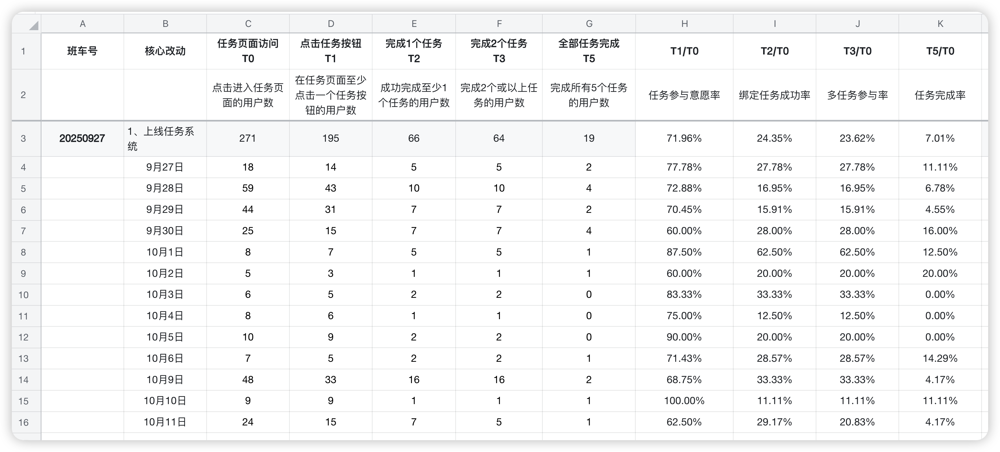
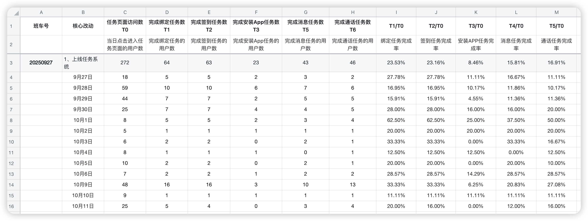
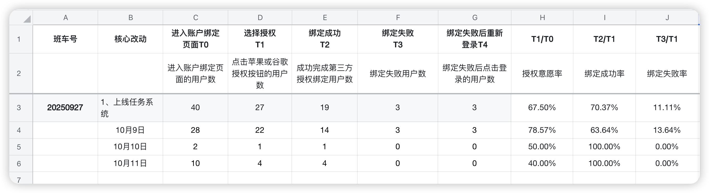

# 第39周周报（10月7日-10月13日）

## 一、本周核心成果

**A、团队动态**

🎉 **团队扩充：** 本周新增2名成员，Web前端开发工程师入职（归前端团队），产品经理入职（负责PWA产品规划）

📋 **新人培养启动：** 已启动新前端工程师考核表制定工作，明确培养目标和考核标准

🤝 **产品协作对接：** 与新产品经理完成初步对接，提供PWA项目资料、数据支持，建立协作机制

⚠️ **投放拒审风险持续：** FB广告投放审核持续收紧，拒审速度加快，ROI承压

---

**B、本周上线项目（10月11日发布）**

| **项目/行动**                | **本周关键进展与状态**                                       | **核心价值 & 衡量指标**                                      | **后续计划**                                                 |
| ---------------------------- | ------------------------------------------------------------ | ------------------------------------------------------------ | ------------------------------------------------------------ |
| Safari引导功能                | 已于10月11日成功上线，新增引导用户使用Safari打开任务         | **目标：**提升iOS用户任务完成稳定性，降低浏览器兼容问题 **衡量指标：**Safari浏览器占比、任务完成率、授权成功率 | 持续跟踪后续3-7天数据，观察授权意愿率和任务完成率变化趋势         |
| 首页顶部引导横幅              | 已于10月11日成功上线，一级页面增加顶部引导横幅（Safari打开） | **目标：**引导FB/IG浏览器用户切换至Safari，提升体验 **衡量指标：**横幅点击率、Safari切换率 | 收集用户反馈，必要时优化引导文案和流程                           |
| 谷歌授权白屏问题修复          | 已于10月11日成功上线，修复谷歌OAuth登录白屏问题              | **目标：**提升新用户注册转化率，降低登录流失 **衡量指标：**谷歌登录成功率、绑定成功率 | 持续监控绑定成功率，10月10-11日已达100%                         |

**C、规划/开发中的项目**

| **项目/行动**                | **本周关键进展与状态**                                       | **核心价值 & 衡量指标**                                      | **后续计划**                                                 |
| ---------------------------- | ------------------------------------------------------------ | ------------------------------------------------------------ | ------------------------------------------------------------ |
| PWA代码同步到H5               | 开发中，按阶段先同步UI层，目前进度20%                        | **目标：**保持多端一致性，扩大用户覆盖面 **衡量指标：**H5版本性能指标、功能一致性 | 预计10月15日完成UI同步，提交测试进行全面测试                     |
| 匹配页UI改版                  | UI设计进行中，预计10月14日完成设计稿                          | **目标：**提升匹配页用户体验和转化率 **衡量指标：**匹配页停留时长、匹配成功率 | UI设计完成后启动开发，待UI同步完成后加速进度                      |
| 女神匹配需求                  | 需求跟进中                                                   | **目标：**优化匹配算法，提升匹配质量 **衡量指标：**匹配成功率、用户满意度 | 待产品需求明确后启动开发                                     |
| VIP订阅需求                   | 需求跟进中                                                   | **目标：**增加订阅付费模式，提升商业化能力 **衡量指标：**订阅转化率、订阅收入占比 | 待商业化策略明确后启动开发                                   |
| 新前端工程师培养计划          | 本周已启动，正在制定考核表和培训计划                         | **目标：**快速融入团队，掌握项目核心技术栈 **衡量指标：**考核完成度、代码质量、任务完成效率 | 完成考核表制定，安排导师辅导，分配初期任务                   |

---

## 二、核心数据

### 1️⃣ 任务参与深度漏斗分析

**整体数据表现（自9月27日上线至10月11日）：**

| 指标 | 数据 | 趋势分析 |
|------|------|----------|
| 任务页面访问量 | 271人 | 累计访问基数 |
| 任务参与意愿率（T1/T0） | 71.96% | 参与意愿较高 |
| 绑定任务成功率（T2/T0） | 24.35% | 转化瓶颈明显 |
| 多任务参与率（T3/T0） | 23.62% | 接近绑定成功率 |
| 任务完成率（T5/T0） | 7.01% | ⚠️ 整体完成率偏低 |

**10月数据波动分析：**
- **10月1日数据波动**：参与率87.5%，绑定完成率62.5%，完成率12.5%（样本量小，仅8人）
- **10月3-5日完成率归零**：连续3天完成率为0%，疑似功能异常或投放量不足
- **10月9日数据回升**：48人访问，参与率68.75%，但完成率仅4.17%
- **10月10日高转化**：9人访问，参与率100%，绑定完成率11.11%，完成率11.11%（样本量小）
- **10月11日（Safari引导上线）**：24人访问，参与率62.5%，完成率4.17%

**核心洞察：**
- ⚠️ **绑定任务成为关键转化瓶颈**：从参与意愿71.96%急剧下降至绑定成功24.35%，流失47.61%用户
- ⚠️ **完成率持续下滑**：从首周11.11%下降至近期0%-4.17%，需紧急排查原因
- 📊 **投放量不足影响数据精准度**：本周投放受阻，样本量较小，部分日期数据波动较大
- 📈 **Safari引导功能效果待观察**：10月11日上线，需持续跟踪后续数据变化

---

### 2️⃣ 任务类型完成漏斗分析

**各类任务完成情况（自上线累计）：**

| 任务类型 | 完成率 | 完成用户数 | 问题分析 |
|---------|--------|-----------|----------|
| 完成绑定任务 | 23.53% | 64人 | 基础门槛任务，完成率相对较高 |
| 完成签到任务 | 23.16% | 63人 | 与绑定任务完成率接近 |
| 完成安装App任务 | 8.46% | 23人 | ⚠️ 安装引导转化最低 |
| 完成消息任务 | 15.81% | 43人 | 中等完成率 |
| 完成通话任务 | 16.91% | 46人 | 中等完成率 |

**10月数据趋势：**
- **10月1日高峰**：绑定62.5%、签到62.5%、安装25%、消息37.5%、通话50%（样本量8人）
- **10月3-5日低谷**：安装任务完成率连续3天为0%，通话任务完成率0%-20%
- **10月9日数据回升**：48人访问，绑定33.33%、签到33.33%、安装6.25%、消息20.83%、通话27.08%
- **10月11日**：25人访问，绑定20%、签到16%、安装0%、消息12%、通话16%

**核心洞察：**
- ⚠️ **安装App任务转化最差**：仅8.46%完成率，跳转商店下载流程存在较大摩擦，10月11日完成率归零
- ⚠️ **通话任务完成率下滑明显**：从首周50%下降至近期12%-27%，可能与用户质量或功能稳定性相关
- 📊 **绑定与签到任务完成率接近**：说明完成绑定的用户基本都会完成签到，流程设计合理
- 📉 **整体完成率受投放影响**：本周投放量不足，样本量较小，数据波动较大

---

### 3️⃣ 账号绑定漏斗分析（10月9-11日）

**绑定流程转化数据（自上线累计）：**

| 环节 | 用户数 | 转化率 | 流失分析 |
|------|--------|--------|----------|
| 进入账户绑定页面（T0） | 40人 | - | 基础访问量 |
| 选择授权（T1） | 27人 | 67.50% | 32.50%用户未点击授权 |
| 绑定成功（T2） | 19人 | 70.37%（对T1） | 29.63%授权后失败 |
| 绑定失败（T3） | 3人 | 11.11%（对T1） | 需排查失败原因 |
| 绑定失败后重新登录（T4） | 3人 | 100%（对T3） | 失败用户愿意重试 |

**分日数据：**
- **10月9日**：28人访问，授权意愿78.57%，绑定成功率63.64%，绑定失败率13.64%
- **10月10日**：2人访问，授权意愿50%，绑定成功率100%，绑定失败率0%
- **10月11日**：10人访问，授权意愿40%，绑定成功率100%，绑定失败率0%

**核心洞察：**
- ⚠️ **10月11日授权意愿率骤降至40%**：Safari引导上线当天，授权意愿率从78.57%下降至40%，需观察是否为新引导流程导致用户犹豫，但样本量较小（仅10人）
- ✅ **绑定成功率显著提升**：10月10-11日绑定成功率达100%，谷歌授权白屏修复效果显著
- ✅ **绑定失败率改善**：整体绑定失败率降至11.11%，且失败用户100%愿意重试，用户粘性良好
- 📊 **数据样本量偏小**：本周投放量不足，10月10-11日样本量分别仅2人和10人，数据精准度有限

---

## 三、反思与改进

| 类别 | 问题 | 反思 | 改进 |
|------|------|------|------|
| **广告投放** | FB广告投放持续受阻，拒审速度加快，停投时间过长（自国庆假期至今），导致新用户获取量骤降，数据样本量不足 | FB目前作为PWA唯一投放渠道，风险过于集中；缺少应急预案和备用渠道 | 1、与运营团队紧密协作优化广告素材和文案，降低拒审率 2、**紧急探索多链接投放策略**：开设多个投放链接分散风险，避免单一链接拒审导致完全停投 3、评估TikTok、Google Ads等其他投放渠道可行性 4、提升产品自然流量获取能力（裂变、SEO、ASO等） |
| **任务系统** | 任务完成率从首周11.11%下降至近期0%-4.17%，10月3-5日连续归零 | 第1个任务（绑定第三方）是主要流失环节；用户完成任务的动力不足；但受投放量不足影响，数据样本量偏小，精准度有限 | 1、待投放恢复后，紧急排查功能稳定性问题 2、可以优化第一个任务的完成引导 3、增加充值用户的绑定成功率来辅助判断系统稳定性 |
| **Safari引导** | 10月11日上线后授权意愿率从78.57%降至40% | 新引导流程可能增加了用户决策成本；但样本量仅10人，数据精准度有限，需持续观察 | 1、持续跟踪后续3-7天数据，扩大样本量后再判断 2、收集用户反馈，了解引导流程是否造成困扰 3、必要时优化引导文案和流程 |
| **安装App任务** | 安装App任务完成率仅8.46%，10月11日完成率归零 | 跳转商店下载流程存在较大摩擦，用户流失严重 | 1、简化安装引导流程 2、增加安装激励（如额外奖励） 3、考虑替代方案（如PWA添加到主屏） |
| **代码同步** | PWA代码同步到H5进度偏慢，目前仅完成20% | UI层同步工作量大于预期，进度略有延后 | 1、密切跟进开发进度 2、提前准备测试用例 3、预留充足测试时间，确保10月15日完成UI同步 |

---

## 四、关注要点与应对策略

### 🔴 关键风险点

**1. 投放拒审风险持续升级 ⚠️⚠️⚠️**
- **现状**：FB广告投放持续受阻，拒审速度加快，ROI承压
- **影响**：新用户获取成本上升，增长受限
- **应对策略**：
  - 短期：配合运营团队优化广告素材，降低拒审率
  - 中期：探索多元化获客渠道（TikTok、Google Ads等）
  - 长期：提升产品自然增长能力（裂变、SEO、ASO等）

**2. 任务系统完成率异常下滑 ⚠️⚠️**
- **现状**：完成率从7.89%下降至0%-4.17%，10月3-5日连续归零
- **影响**：用户留存和活跃度受损
- **应对策略**：
  - 立即排查功能稳定性（是否有bug或服务异常）
  - 分析用户行为数据，定位流失环节
  - 优化任务难度和激励机制

### 🟢 积极信号

**1. 谷歌授权白屏问题修复效果显著 ✅**
- 10月10-11日绑定成功率达100%
- 新用户注册体验提升

**2. Safari引导功能上线 ✅**
- 首页引导横幅已上线
- 预期提升iOS用户任务完成稳定性

### 📋 下周重点工作

1. **持续跟踪Safari引导效果**：观察授权意愿率和任务完成率变化趋势
2. **完成PWA代码同步UI层**：10月15日完成UI同步并提交测试
3. **排查任务完成率下滑原因**：紧急定位并修复问题
4. **推进匹配页改版和VIP订阅需求**：按计划推进核心功能开发
5. **协助优化投放策略**：配合运营团队降低拒审率

---

## 相关链接

- [第38周周报](第38周周报.md)
- [第37周周报](第37周周报.md)
- [第36周周报](第36周周报.md)
