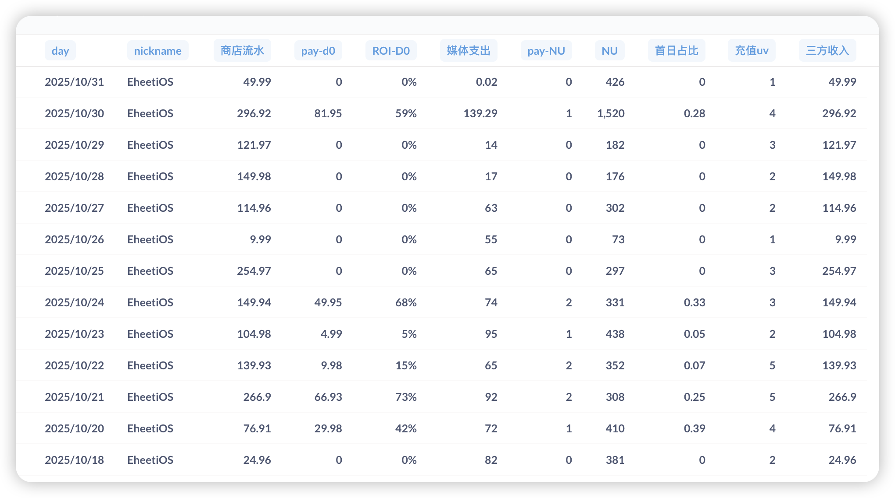
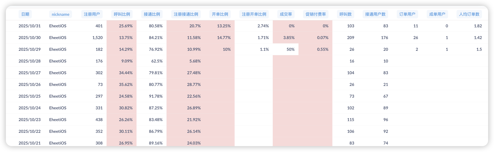

# 第42周周报（10月28日-11月3日）

## 一、核心目标与实现路径

**目标（11月底）：**

| 指标 | 目标值 |
|------|--------|
| 日流水 | 2000 刀 |
| 促销付费率 | 5% |

**实现路径：**

| 路径 | 核心动作 | 本周进展 | 状态 |
|------|----------|----------|------|
| **获客端** | 新包名投放突破FB拒审 | 20个备用域名部署 + 2个团队投放启动 | ✅ 已启动 |
| **转化端** | 女神匹配 → 关注列表 → 送礼倒计时 → 付费率优化 → VIP订阅 | 关注列表改版 + 一键送礼上线 + 付费率优化项开发中 | ✅ 按计划推进 |
| **数据支撑** | 匹配漏斗 + 报表系统恢复 | 持续跟进打点和报表需求 | 🔄 逐步完善 |

---

## 二、核心数据（10/30-11/2）

### 2.1 业务数据总览

**当前现状：**
- 日均流水：144刀（目标的7.2%）
- 促销付费率：1%（剔除机器人后，距目标5倍差距）

**核心矛盾：**
- 转化率不足 + 流量规模不足并存
- 机器人用户污染数据，加剧判断难度

---

### 2.2 转化漏斗详情

**⚠️ 转化端稳定性严重不足**

**成交率波动：**
- 10/30：3.85%
- 10/31：1.1%
- 11/1：1.09%
- 11/2：0%

**11/1异常现象：**
- 新增用户：3,094（最高）
- 呼叫比例：45.26%（最高）
- 流水：41.94刀（最低）
- **结论：高流量低转化，用户质量或产品吸引力不足**

**已采取措施：**
- 11/2测试验证第三方支付正常
- 11/4排查AW后台支付问题

**下周关键验证：**
- 付费率优化项上线（11/5）
- 连续跟踪5天数据验证稳定性

---

### 2.3 投放数据详情

**📈 投放能力已验证，但ROI快速下滑**

**三日数据：**
- 10/30：美国地区ROI约58%，证明包名可投
- 10/31：ROI降至1%（新增沙特/阿联酋/越南/马来西亚）
- 11/1：ROI小幅回升至5%

**原因分析：**
- 新增4个地区付费率几乎为0，拉低整体ROI
- 需验证各地区付费意愿差异

**下一步计划：**
- 验证是否聚焦美国等高付费地区
- 其他地区逐步开放，避免一次性铺开
- 目标稳定ROI在30%+

---

## 三、本周进展与计划

### 本周完成

| 项目 | 价值说明 |
|------|---------|
| 关注列表改版上线 | 增强模特吸引力，提升互动转化 |
| 一键送礼功能上线 | 降低送礼操作门槛，直接提升付费率 |
| 促销价格调整（4.99→1.99刀） | 降低付费门槛，提升促销转化率 |
| 3个安卓白包官网部署上线 | 用于安卓包申诉（独立于PWA投放） |
| 20个备用域名部署 + 2个团队投放启动 | 突破FB拒审瓶颈，恢复获客能力 |

### 开发中项目

| 项目 | 预计完成 | 对目标的作用 | 当前状态 |
|------|----------|-------------|---------|
| 促销付费率改进项 | 下周二 | ⭐ 直接提升付费率至5%目标 | 包含3个核心优化：通话体验升级、付费引导时机优化、呼叫触发机制重构 |
| VIP订阅需求 | 待付费率优化项完成后启动 | 增加付费产品矩阵，扩大付费用户价值 | 需求已明确，等待上一项完成后开发 |
| H5优化 | 持续推进 | 提升H5用户体验 | 当前进度30% |
| 移动端官网 | 待定 | 拓展FB投放场景，支持多社交媒体部署和落地页承接 | 需求评审完成，UI设计中 |

### 下周关键动作

- **11/5（下周二）**：促销付费率改进项发布，连续跟踪5天数据验证稳定性
- **投放端**：加速启用备用域名，目标日投1000刀+，聚焦高付费地区
- **转化端**：分析11/1高呼叫低成交原因，排查AW后台支付问题
- **其他**：地址栏隐藏功能暂缓，持续跟进打点和报表需求

---

## 四、关键判断与风险

**能否达成11月目标，取决于两周内能否做到：**

1. **投放规模扩大10倍**：启用更多备用域名，稳定日均投放在1000刀+
2. **ROI稳定在30%+**：聚焦美国等高付费地区，避免"高量低质"
3. **促销付费率提升至5%**：从当前1%（剔除机器人）提升至5%，连续验证5天

**如果两周后无法达到"日投1000刀 + ROI 30% + 付费率5%"，需立即调整11月目标预期。**

---

**风险应对：**

| 风险等级 | 问题 | 影响 | 应对 |
|---------|------|------|------|
| 🟡 中 | 投放效果待验证 | 能否恢复获客影响目标达成 | 多包名+多团队+多域名策略并行 |
| 🟡 中 | 数据能力仍未完全恢复 | 优化效果评估受限 | 持续跟进打点和报表需求 |
| 🟢 低 | 付费率优化项下周上线 | 能否达成5%目标 | 下周二发布3项核心优化 |

---

## 相关链接

- [第41周工作汇报](第41周工作汇报.md)
