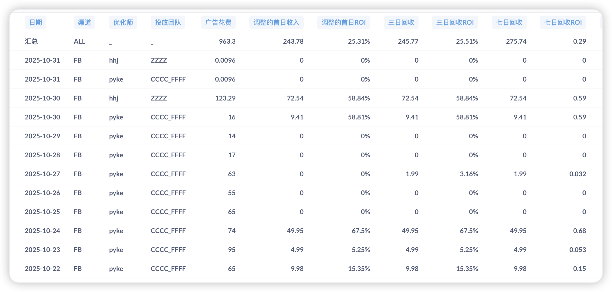

# 第42周周报（10月28日-11月3日）

## 一、核心数据

### 业务数据（10/30-11/2）

---

### 核心发现与洞见

**1. 付费率已达标，但流水差距巨大**

11/1促销付费率达到5.92%，已超5%目标，证明转化端优化方向正确。但周均流水仅144刀，距2000刀目标差距13.8倍。**核心矛盾已从"转化率不足"转向"流量规模不足"**。

**2. 投放能力是唯一瓶颈**

10/30两个团队首日ROI均达58%，证明包名可投、产品可跑。但真实投放链接仅3条，20个备用域名未启用，导致11/1-11/2 ROI暴跌至5%甚至0%。**获客能力恢复速度直接决定11月目标能否达成**。

**3. 11/1数据揭示深层问题**

11/1新增3,093用户（最高），呼叫比例45.26%（最高），但流水仅41.94刀（最低），成交率1.09%。这说明：**用户质量下降或产品吸引力不足，大量流量进来但转化效率低**。需警惕盲目扩量导致ROI持续恶化。

**4. 成交率波动暴露稳定性问题**

成交率从10/30的3.85%骤降至11/1的1.09%，再到11/2的0%。**转化端并未真正稳定**，付费率5.92%可能是偶然波动而非系统性提升。下周付费率优化项上线后需持续观察至少一周数据。

---

### 关键判断

**能否达成11月目标，取决于两周内能否做到：**

1. **投放规模扩大10倍**：启用更多备用域名，稳定日均投放在1000刀+
2. **ROI稳定在30%+**：优化素材和定向，避免11/1式的"高量低质"
3. **付费率稳定在5%+**：下周优化项上线后，连续5天验证数据稳定性

**如果两周后无法达到"日投1000刀+ROI 30%+付费率5%"，需立即调整11月目标预期。**

---

### 下周核心动作

| 优先级 | 动作 | 预期结果 |
|-------|------|---------|
| P0 | 加速启用备用域名，目标日投1000刀+ | 流水突破500刀/天 |
| P0 | 监控投放质量，ROI低于20%立即优化 | 避免11/1式"高量低质" |
| P1 | 付费率优化项上线，连续跟踪5天数据 | 验证5%是否可持续 |
| P1 | 分析11/1高呼叫低成交原因 | 找到转化效率下降的根因 |

---

## 二、核心目标与实现路径

**目标（11月底）：**

| 指标 | 目标值 |
|------|--------|
| 日流水 | 2000 刀 |
| 促销付费率 | 5% |

**实现路径：**

| 路径 | 核心动作 | 本周进展 | 状态 |
|------|----------|----------|------|
| **获客端** | 新包名投放突破FB拒审 | 20个备用域名部署 + 多团队投放启动 | ✅ 已启动 |
| **转化端** | 女神匹配 → 关注列表 → 送礼倒计时 → 付费率优化 → VIP订阅 | 关注列表改版 + 一键送礼上线 + 付费率优化项开发中 | ✅ 按计划推进 |
| **数据支撑** | 匹配漏斗 + 报表系统恢复 | 持续跟进打点和报表需求 | 🔄 逐步完善 |

---

## 三、本周进展

### 本周完成

| 项目 | 价值说明 |
|------|---------|
| 关注列表改版上线 | 增强模特吸引力，提升互动转化 |
| 一键送礼功能上线 | 降低送礼操作门槛，直接提升付费率 |
| 20个备用域名部署 + 多团队投放启动 | 突破FB拒审瓶颈，恢复获客能力 |

### 开发中项目及进展

| 项目 | 预计完成 | 对目标的作用 | 当前状态 |
|------|----------|-------------|---------|
| 促销付费率改进项 | 下周二 | ⭐ 直接提升付费率至5%目标 | 包含3个核心优化：通话体验升级、付费引导时机优化、呼叫触发机制重构 |
| VIP订阅需求 | 待付费率优化项完成后启动 | 增加付费产品矩阵，扩大付费用户价值 | 需求已明确，等待上一项完成后开发 |
| H5优化 | 持续推进 | 提升H5用户体验 | 当前进度30% |

**其他计划调整：**
- ⏸️ 地址栏隐藏功能暂缓（涉及逻辑和改动较多）
- 🔄 持续跟进打点和报表需求

---

## 四、下阶段关键节点

**第43周（11月3日-11月7日）：**
- 11/5（下周二）：促销付费率改进项发布（通话体验升级、付费引导时机优化、呼叫触发机制重构）
- 持续推进H5优化
- 持续推进VIP订阅需求

**11月中下旬：**
- 验证付费率优化效果，冲刺5%目标
- 多团队投放数据监控，优化获客效率
- 达成日流水2000刀目标

---

## 五、当前问题及应对

| 风险等级 | 问题 | 影响 | 应对 | 预期结果 |
|---------|------|------|------|---------|
| 🟡 中 | 投放效果待验证 | 能否恢复获客影响目标达成 | 多包名+多团队+多域名策略并行 | 本周起监控投放数据 |
| 🟡 中 | 数据能力仍未完全恢复 | 优化效果评估受限 | 持续跟进打点和报表需求 | 逐步恢复 |
| 🟢 低 | 付费率优化项下周上线 | 能否达成5%目标 | 下周二发布3项核心优化 | 下周起验证效果 |

**关键判断：** 本周投放策略全面铺开，下周付费率优化上线，两周内将看到明确的数据反馈，决定能否达成11月底目标。

---

## 相关链接

- [第41周工作汇报](第41周工作汇报.md)
