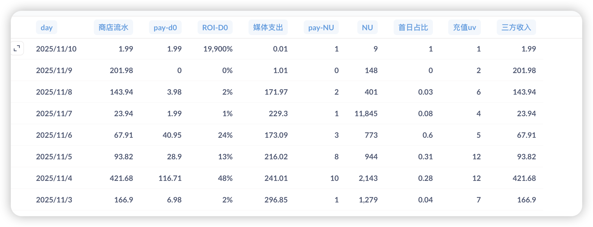

# 第43周周报（11月4日-11月10日）

## 一、核心目标与实现路径

**目标（11月底）：**

| 指标 | 目标值 |
|------|--------|
| 日流水 | $2000 |
| 促销付费率 | 5% |

**实现路径：**

| 路径 | 核心动作 | 本周进展 | 状态 |
|------|----------|----------|------|
| **获客端** | 多域名投放突破FB拒审 | 3个团队投放中 | 已启动 |
| **转化端** | 促销付费率改进项 → VIP订阅 | 促销付费率改进项已上线（11/5） + VIP订阅开发中（50%） | 按计划推进 |
| **数据支撑** | 归因问题修复 + 报表系统恢复 | 归因问题下周一修复并发版 + 持续跟进打点和报表需求 | 逐步完善 |

---

## 二、核心数据（11/3-11/9）

### 2.1 业务数据总览

**数据周期：11/3-11/9（共7天）**

| 指标 | 本周数据 | 对比上周 | 与目标差距 |
|------|----------|----------|-----------|
| 日均流水 | $160.02 | 上周 $144，增长 11.1% | 距目标 $2000 差 92% |
| 周总流水 | $1,120.17 | - | - |
| 促销付费率（剔除机器人） | 0.44% | 上周 1%，下降 56% | 距目标 5% 差 11.4 倍 |
| 日均新增用户 | 2,750 人 | - | - |
| 日均媒体支出 | $189.89 | - | - |
| 平均 ROI | 15% | 波动剧烈（0%-48%） | - |

**详细数据：**

**关键发现：**
1. 11/4 数据异常优秀：流水 $421.68 + ROI 48%，但后续未能保持
2. **数据质量问题**：11/3-11/9 整周数据受脚本用户污染影响，其中11/7是攻击高峰（11,845无效注册），导致转化漏斗数据失真，已通过去除node注册行为修复（11/9发布）
3. **促销付费率优化效果待验证**：11/5上线后促销付费率数据受脚本用户污染，无法准确评估真实效果，需等下周干净数据后重新分析

---

### 2.2 转化漏斗详情

**重要说明：** 11/9之前的数据受脚本用户污染影响，数据准确性存在问题。11/9已发布修复版本（去除node注册行为），需等下周数据沉淀后重新评估真实转化情况。

**转化漏斗数据（11/3-11/9）：**

| 日期 | 注册用户 | 呼叫比例 | 接通比例 | 开单比例 | 成交率 | 促销付费率 | 备注 |
|------|----------|----------|----------|----------|----------|--------|------|
| 11/3 | 1,279 | 27.05% | 73.99% | 20.02% | 4.17% | 0.08% | 受脚本用户污染 |
| 11/4 | 2,143 | 35.04% | 52.86% | 18.53% | 24.39% | 0.47% | 受脚本用户污染 |
| 11/5 | 944 | 26.8% | 63.64% | 17.06% | 38.89% | 0.74% | 受脚本用户污染 |
| 11/6 | 773 | 26% | 61.69% | 16.04% | 16.67% | 0.26% | 受脚本用户污染 |
| 11/7 | 11,845 | 1.64% | 68.04% | 1.11% | 18.18% | 0.02% | 脚本用户攻击高峰 |
| 11/8 | 401 | 24.19% | 80.41% | 19.45% | 28.57% | 0.5% | 受脚本用户污染 |
| 11/9 | 148 | 61.49% | 61.54% | 37.84% | 14.29% | 0.68% | 小样本+修复发布 |

**11/5 促销付费率改进项上线效果：**

**重要提示：** 以下对比数据均受脚本用户污染影响，效果评估需等下周干净数据后重新分析。

| 对比维度 | 上线前（11/3-11/4）| 上线后（11/5-11/9）| 变化 | 数据质量 |
|---------|-------------------|-------------------|------|---------|
| 促销付费率 | 0.44% | 0.44% | 无明显提升 | 受脚本用户污染，待重新评估 |
| 成交率 | 14.28% | 23.32% | 提升 63% | 受脚本用户污染，待重新评估 |
| 呼叫比例 | 31.04% | 27.82% | 下降 10% | 受脚本用户污染，待重新评估 |

**支付异常修复验证：**
- 10/31 和 11/1 成交率归零问题已完全解决
- 本周成交率恢复正常波动（14.29%-38.89%）
- 11/5 成交率峰值 38.89%，证明支付流程已恢复

**数据质量问题及修复：**

1. **脚本用户污染影响范围**：
   - 11/3-11/9 整周数据均受脚本用户污染影响
   - 11/7 是攻击高峰（11,845无效注册），但其他天也存在污染
   - 导致注册用户数、呼叫比例、促销付费率等核心指标失真

2. **修复方案**（11/9发布）：
   - 保留node但去除node注册用户行为
   - 防止脚本用户无限注册大量无效用户
   - 从源头解决数据污染问题

3. **下周验证重点**：
   - 观察脚本用户是否被有效阻止
   - 对比修复前后的真实转化数据
   - 重新评估促销付费率改进项的实际效果
   - 基于干净数据调整优化策略

---

### 2.3 投放数据详情

**投放策略调整：**
- 投放地区：已聚焦美国地区（上周投放沙特/阿联酋/越南/马来西亚导致 ROI 暴跌，本周调整）
- 投放团队：3 个团队并行投放（因归因问题暂无法区分各团队效果）
- 包名策略：A1+A2 两个iOS原生应用包已提审，扩展投放包名分散FB拒审风险

**投放数据（11/3-11/9）：**

| 日期 | 媒体支出 | ROI | 商店流水 | 新增用户 |
|------|----------|-----|----------|----------|
| 11/3 | $296.85 | 2% | $166.9 | 1,279 |
| 11/4 | $241.01 | 48% | $421.68 | 2,143 |
| 11/5 | $216.02 | 13% | $93.82 | 944 |
| 11/6 | $173.09 | 24% | $67.91 | 773 |
| 11/7 | $229.3 | 1% | $23.94 | 11,845 |
| 11/8 | $171.97 | 2% | $143.94 | 401 |
| 11/9 | $1.01 | 0% | $201.98 | 148 |

**日均投放消耗：** $189.89（距目标 $1000+ 差 81%）

**关键发现：**
1. ROI 波动剧烈：11/3-11/4（2%-48%）→ 11/7-11/8（1%-2%），极不稳定
2. 11/4 投放效果最佳：ROI 48% + 流水 $421.68，但后续未能复制
3. 11/7 投放数据失真：新增 11,845 用户但 ROI 仅 1%，经排查确认为脚本用户攻击，已通过去除node注册行为修复
4. 投放规模未达预期：日均 $189.89 vs 目标 $1000+，差距 81%

**归因问题影响：**
- 当前无法区分 3 个投放团队的效果，影响优化决策
- 下周一修复并发版

---

## 三、本周进展与计划

### 本周完成

| 项目 | 价值说明 |
|------|---------|
| 促销付费率改进项上线 | 通话体验升级三项优化发布，包括免费体验+倒计时提示+续费引导，直接提升付费转化率（对应上周计划的11/5上线） |
| 支付异常问题完全解决 | 调整PWA支付方式增加渠道选择弹窗，修复10/31和11/1异常订单率和付费率问题（解决上周成交率归零问题） |
| 机器人用户问题根因修复 | 保留node但去除node注册用户行为，防止无限注册大量无效用户，修复用户注册数据（解决上周数据污染问题） |

### 其他项目

| 项目 | 说明 |
|------|------|
| A1+A2两个iOS包完成并提审 | 额外协助开发iOS原生应用包，扩展投放包名分散FB拒审风险 |

### 开发中项目

| 项目 | 预计完成 | 对目标的作用 | 当前状态 |
|------|----------|-------------|---------|
| PWA归因问题修复 | 下周一（11/11）修复并发版 | 关键：当前无法区分3个投放团队的投放效果，影响优化决策 | 持续跟进中 |
| H5同步PWA优化 | 下周三（11/13） | 提升H5用户体验 | 当前进度70%（上周30%） |
| VIP订阅需求 | 下周二（11/12）争取上线 | 增加付费产品矩阵，扩大付费用户价值 | 当前进度50% |
| PWA官网 | 待定 | 拓展FB投放场景，支持多社交媒体部署和落地页承接 | UI预计下周三开始设计（本周临时插入5图和logo需求） |

### 暂缓项目

| 项目 | 调整说明 |
|------|---------|
| 地址栏隐藏功能 | 涉及逻辑和改动较多，暂缓 |

### 下周关键动作

- **11/11（下周一）**：归因问题修复并发版，恢复投放效果区分能力
- **11/12（下周二）**：VIP订阅争取上线，增加付费产品矩阵
- **11/13（下周三）**：H5优化完成 + PWA官网UI设计启动
- **其他**：持续跟进打点和报表需求

---

## 四、关键判断与应对

**核心问题：目标达成路径面临严峻挑战**

| 维度 | 当前状态 | 核心问题 | 下周动作 |
|------|---------|---------|---------|
| **转化端** | 促销付费率改进项已上线（11/5） VIP订阅开发中（50%） | 付费率0.44% vs 目标5%，差11.4倍 但因脚本用户污染无法准确评估真实效果 | 11/12 VIP订阅上线，增加付费产品矩阵 基于干净数据重新评估优化效果 |
| **获客端** | 3个团队投放中 日均消耗$189.89 | ROI波动剧烈（0%-48%） 投放规模严重不足（需达$2000日流水要求） | 聚焦美国地区+多域名策略 ROI稳定后逐步放量至目标规模 |
| **数据质量** | 11/9已修复脚本用户问题 | 整周数据受污染失真 11/7攻击高峰（11,845无效注册） | 下周一观察修复效果 对比前后真实转化数据 |
| **归因系统** | 11/11修复并发版 | 无法区分3个投放团队效果 影响优化决策 | 下周一发版恢复区分能力 |

**本周成果：**
1. 促销付费率改进项按计划上线（11/5）
2. 支付异常问题完全解决（10/31和11/1成交率归零问题）
3. 找到并修复脚本用户污染根因（11/9发布）

**下周优先级：**
1. 验证脚本用户修复效果，确保数据准确性
2. VIP订阅上线（11/12），扩大付费产品矩阵
3. 归因问题修复（11/11），恢复投放效果区分能力
4. 基于干净数据重新评估促销付费率优化效果并调整策略

---

## 相关链接

- [第42周周报](第42周周报.md) | [第41周周报](第41周周报.md) | [第40周周报](第40周周报.md)
- [PWA版本管理](https://la1a59fdywl.feishu.cn/wiki/HItNw0KUfiJwvNkgkeecAWrsnme?from=from_copylink) | [H5版本管理](https://la1a59fdywl.feishu.cn/wiki/JewOwr2o6i0qo3kCsl4c1ve3nkd?from=from_copylink)
- [H5优化清单](https://la1a59fdywl.feishu.cn/wiki/HugawJAoAiQu2SkUSKPcxx8znQb?from=from_copylink) | [H5需求清单](https://la1a59fdywl.feishu.cn/wiki/DWO1wjWXZimbCLkXCrCchticnZc?from=from_copylink)
- [PWA数据](https://la1a59fdywl.feishu.cn/sheets/BYu9sRmvGh8aE8tncb8chVUTnIg?from=from_copylink&sheet=RN2VYk)
