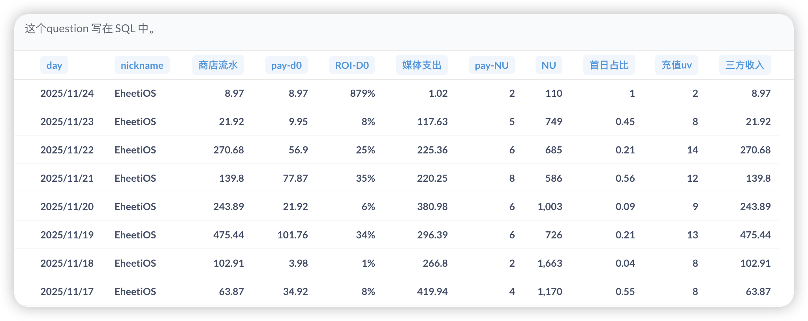
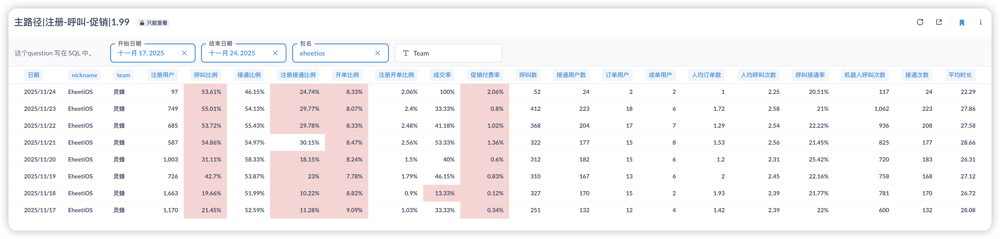
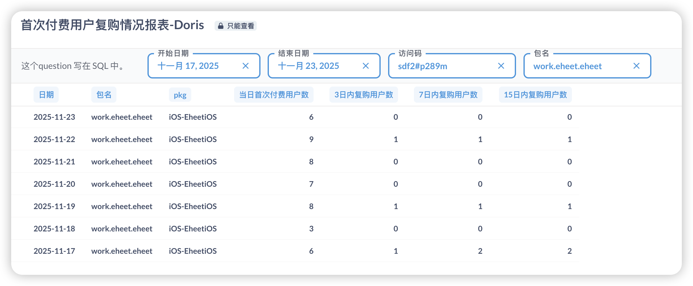
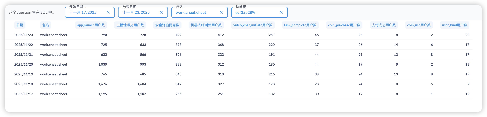
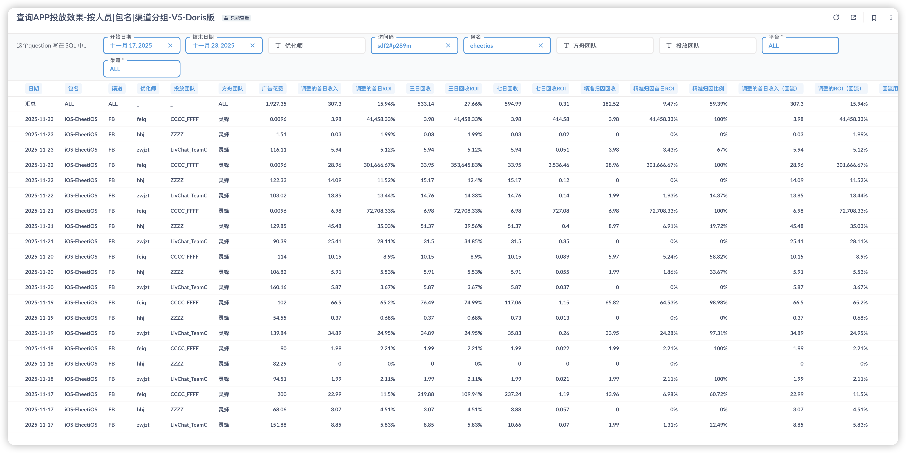

# PWA产品周报（2025第45周 11/17-11/23）

## 一、核心目标与实现路径

**目标（11月底）：**

| 指标 | 目标值 |
|------|--------|
| 日流水 | $2000 |
| 促销付费率 | 5% |

**实现路径：**

| 路径 | 核心动作 | 本周进展 | 状态 |
|------|----------|----------|------|
| **获客端** | 多域名投放突破FB拒审 | 3个团队持续投放并优化策略 + ROIBest技术方案调研（已尝试5种方案） | 已启动 |
| **转化端** | 促销付费率改进项 → VIP订阅 → 漏斗优化 | Bot防护系统上线 + FB→Safari转化追踪上线 + PWAUI弹窗优化设计稿完成 | 按计划推进 |
| **数据支撑** | 归因问题修复 + 报表系统恢复 | Bot防护系统检测2天发现9个高频IP（4000+无效注册）+ FB→Safari转化漏斗报表开发中 | 逐步完善 |

---

## 二、核心数据（11/17-11/23）

### 2.1 业务数据总览

**数据周期：11/17-11/23（共7天）**

**⚠️ 数据质量说明：** 本周数据仍受游客注册问题污染影响。Bot防护系统于11/21上线检测，2天内发现9个高频IP造成4000+无效游客注册，下周一（11/24）封禁功能上线后预期将日均无效注册降至100以下。

| 指标 | 本周数据 | 对比上周 | 与目标差距 |
|------|----------|----------|-----------|
| 日均流水 | $188.36 | 上周 $93.84，增长 100.7% | 距目标 $2000 差 90.6% |
| 周总流水 | $1,318.51 | 上周 $656.90，增长 100.7% | - |
| 促销付费率（支付成功/安全弹窗同意） | 2.92% | 上周 1.06%，增长 175.5% | 距目标 5% 差 2.08% |
| 日均新增用户 | 940 人 | 上周 1,395 人，下降 32.6% | - |
| 日均媒体支出 | $275.34 | 上周 $222.91，增长 23.5% | - |
| 平均 ROI-D0 | 0.168 | 上周 0.185，下降 9.2% | - |

**详细数据：**

**关键发现：**
- **流水大幅增长但质量存疑**：日均流水$188.36（+100.7%），但主要因11/19和11/22两天数据异常（$475.44和$270.68），可能受Bot攻击影响，真实增长待数据清洗后确认
- **数据质量问题根因已定位**：Bot防护系统检测2天发现9个高频IP，累计造成4000+无效游客注册，严重污染核心指标
- **Bot防护系统见效**：11/21上线检测功能，下周一（11/24）封禁功能上线后预期将日均无效注册从3000+降至100以下，数据准确性将大幅提升
- **转化追踪能力增强**：FB→Safari→PWA转化漏斗打点已完成，下周三（11/26）报表上线后可精准定位各环节流失原因

---

### 2.2 转化漏斗详情

**数据质量改善进展：** Bot防护系统已于11/21上线检测功能，发现9个高频IP造成大量无效游客注册，下周一（11/24）封禁功能上线后数据质量将显著改善。

**关键转化漏斗发现：**

1. **呼叫比例从21.45%提升至55.01%**：注册用户从1,663人降至368-749人,呼叫比例反向提升,证实前期大量无效游客注册严重污染数据
2. **促销付费率大幅提升175.5%**（1.06%→2.92%）：已接近目标5%的60%，为本周最大亮点
3. **接通比例52-58%待优化**：低于客户端82%的接通率,存在优化空间

**Bot防护系统检测结果（11/21-11/22，共2天）：**

| 指标 | 数据 | 说明 |
|------|------|------|
| 检测到高频IP数量 | 9个 | 高频恶意IP |
| 累计造成无效游客注册 | 4000+ | 严重污染注册用户数、呼叫比例等核心指标 |
| 预期封禁后效果 | 日均无效注册 < 100 | 下周一（11/24）封禁功能上线后 |

---

**首次付费用户复购情况（11/17-11/23）：**

**复购分析：**
- **复购率大幅下降**：本周47个首次付费用户中仅4人复购,复购率8.5%,远低于上周19.2%,下降55.7%
- **关键问题**：首次付费用户增长81%但复购用户反降20%,需重点关注用户留存和产品体验

---

**用户旅程数据（11/17-11/23）：**

**关键转化瓶颈：**
1. **主播曝光→安全弹窗同意转化率分化严重**：11/17-11/18仅21-24%(游客污染期),11/19-11/23提升至44-58%,证实数据质量问题严重
2. **支付成功率43.5%是最大瓶颈**：超过一半的购买意向用户未能成功支付,需优化支付流程
3. **账号绑定率仅1.6%**：周均16人(vs app_launch 973人),需加强引导

---

**FB→Safari→PWA转化追踪上线（11/21）：**
- **打点已完成**：已实现用户从FB浏览器→Safari→PWA全链路转化追踪
- **报表开发中**：下周三（11/26）完成报表，届时可精准分析各环节转化率和流失原因
- **预期价值**：定位漏斗瓶颈，优化Safari引导流程，提升整体留存

---

### 2.3 投放数据详情

**投放策略：**
- 投放地区：聚焦美国地区
- 投放团队：3个团队并行投放
- 归因状态：3个团队归因已修复

**投放数据（11/17-11/23，按团队统计）：**

| 团队 | 媒体支出 | pay-d0 | ROI-d0 | 新增用户 | 媒体支出占比 |
|------|----------|--------|--------|----------|-------------|
| **felq/CCCC_FFFF** | $911.00 | $171.82 | 18.86% | 2,337 | 39.1% |
| **hhj/ZZZZ** | $565.41 | $52.22 | 9.24% | 2,399 | 24.2% |
| **zwjpt/LiveChat_TeamC** | $855.91 | $83.26 | 9.73% | 1,648 | 36.7% |
| **iOS-EheetiOS汇总** | $2,332.32 | $307.30 | 13.18% | 6,384 | 100% |

**日均投放消耗：** $333.19（vs 上周 $222.91，增长 49.5%）

**关键发现：**

1. **felq团队表现最优**：ROI 18.86%（周环比+19.4%），占投放规模39.1%，人均付费$0.07最高
2. **zwjpt和hhj团队ROI偏低**：分别为9.73%和9.24%，均低于整体平均13.18%，人均付费仅$0.05和$0.02
3. **投放数据存在口径差异**：团队分项合计$2,332.32 vs 业务总览$1,927.35，差异$404.97

---

## 三、本周进展

### 本周完成

| 项目 | 价值说明 |
|------|---------|
| PWA修复FB浏览器和Safari跳转问题 | 11/21上线，解决游客账户不一致问题，提升用户体验和数据准确性 |
| Bot防护管理系统上线检测功能 | 11/21上线，2天检测发现9个高频IP造成4000+无效注册，定位数据污染根因 |
| FB→Safari→PWA转化追踪漏斗 | 11/21完成打点部署，实现全链路转化追踪，为优化Safari引导流程提供数据支撑 |
| PWAUI弹窗优化设计稿 | 11/21完成，提升用户交互体验和视觉一致性 |
| H5同步VIP订阅需求开发 | 进度100%，已完成第一轮测试，发现23项bug（P1阻塞性1个、P2重要1个、P3一般18个、P4优化3个） |
| H5同步PWA优化 | 已完成，提升H5用户体验与PWA一致性 |

### 开发中的项目

| 项目 | 预计完成 | 对目标的作用 | 当前状态 |
|------|----------|-------------|---------|
| Bot防护管理系统封禁功能 | 下周一（11/24） | 关键：将日均无效注册从3000+降至100+以下，大幅提升数据准确性 | 检测功能已上线2天，封禁功能开发中 |
| PWAUI弹窗优化开发 | 下周二（11/25） | 提升用户交互体验和视觉一致性 | 设计稿已完成，开发中 |
| H5 VIP订阅bug修复 | 下周三（11/26） | H5端增加付费产品矩阵，扩大付费用户覆盖 | 23项bug修复中，不影响上线计划 |
| FB→Safari→PWA转化漏斗报表 | 下周三（11/26） | 精准分析各环节转化率，优化Safari引导流程 | 打点已完成，报表开发中 |
| Bot防护管理系统生产环境部署 | 持续优化 | 持续监控和封禁恶意IP，保障数据质量 | 检测功能已部署，持续优化中 |

### 调研项目

| 项目 | 调研进展 | 遇到的问题 | 下一步计划 |
|------|---------|-----------|-----------|
| ROIBest iOS跳转方案 | 已尝试5种技术方案 | 均未成功实现FB浏览器→Safari无缝跳转 | 持续攻坚，寻找新方案 |

**调研价值：** 如果实现FB浏览器→Safari无缝跳转，可大幅减少用户流失环节，显著提升留存率，对标ROIBest的技术优势。

**已尝试的5种方案：** https协议直接打开、ftp协议中转html、x-web-search://协议、iOS intent谷歌浏览器协议、团队内部咨询（柱成、子雄、耀庭等），均未成功突破。

### 其他项目

| 项目 | 状态 | 说明 |
|------|------|------|
| 制作Android官网 | 待启动 | 视PWA/H5进度而定 |
| 地址栏隐藏功能 | 暂缓 | 涉及逻辑和改动较多，将与PWA一期重构一起做 |
| 持续跟进打点和报表需求 | 进行中 | 持续推进 |

### 下周关键动作

**PWA端：**
- **11/24（下周一）**：Bot防护封禁功能上线
- **11/25（下周二）**：PWAUI弹窗优化上线
- **11/26（下周三）**：FB→Safari转化漏斗报表上线

**H5端：**
- **11/26（下周三）**：H5 VIP订阅上线（23项bug修复完成）

**数据驱动优化：**
- 基于干净数据验证三个核心假设：促销付费率真实水平、hhj团队ROI、复购率下降原因
- 评估ROIBest技术方案投入产出比，考虑从产品引导优化切入

---

## 四、关键判断与风险

**核心问题：目标达成路径仍面临挑战**

| 维度 | 当前状态 | 核心问题 | 下周动作 |
|------|---------|---------|---------|
| **数据质量** | Bot防护系统11/21上线检测 2天发现9个高频IP造成4000+无效注册 | 数据污染持续3周影响决策 未建立主动防御机制 | 11/24封禁功能上线 预期将日均无效注册降至100+ 基于干净数据重新评估所有指标 |
| **转化端** | 促销付费率2.92% FB→Safari转化追踪已上线 | 距目标5%仍有差距 复购率暴跌55.7%需验证真实原因 | 11/26转化漏斗报表上线 精准定位流失环节并优化 验证复购率是数据问题还是产品问题 |
| **获客端** | 投放增长49.5%（日均$333.19） felq团队ROI 18.86%，hhj/zwjpt仅9%左右 | 整体ROI 13.18%低于预期 两个团队表现持续低迷 | 基于干净数据重新评估各团队ROI 优化或调整低效团队投放策略 |
| **时间窗口** | 距11月底仅剩1周 | 数据清洗后需快速验证并放量 | 立即验证三个核心假设并调整策略 |

**本周成果：**
1. Bot防护系统上线检测功能（11/21），定位数据污染根因
2. FB→Safari→PWA转化追踪上线，为数据驱动优化奠定基础
3. VIP订阅持续运行，促销付费率提升175.5%（待验证真实性）

**下周优先级：**
1. **11/24 Bot防护封禁上线**，实现数据质量根本性改善
2. **11/26 FB→Safari转化漏斗报表上线**，精准定位流失环节
3. **基于干净数据验证三个核心假设**：促销付费率真实水平、hhj团队ROI、复购率下降原因
4. **快速调整策略**，抓住最后1周冲刺11月目标

---

## 相关链接

- [第44周周报](第44周周报.md) | [第43周周报](第43周周报.md) | [第42周周报](第42周周报.md)
- [PWA版本管理](https://la1a59fdywl.feishu.cn/wiki/HItNw0KUfiJwvNkgkeecAWrsnme?from=from_copylink) | [H5版本管理](https://la1a59fdywl.feishu.cn/wiki/JewOwr2o6i0qo3kCsl4c1ve3nkd?from=from_copylink)
- [H5优化清单](https://la1a59fdywl.feishu.cn/wiki/HugawJAoAiQu2SkUSKPcxx8znQb?from=from_copylink) | [H5需求清单](https://la1a59fdywl.feishu.cn/wiki/DWO1wjWXZimbCLkXCrCchticnZc?from=from_copylink)
- [PWA数据](https://la1a59fdywl.feishu.cn/sheets/BYu9sRmvGh8aE8tncb8chVUTnIg?from=from_copylink&sheet=RN2VYk)
