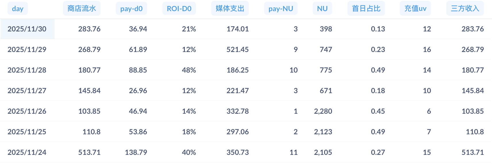
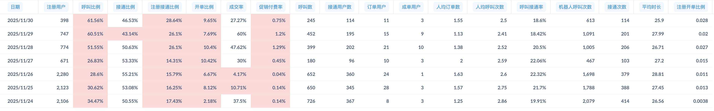
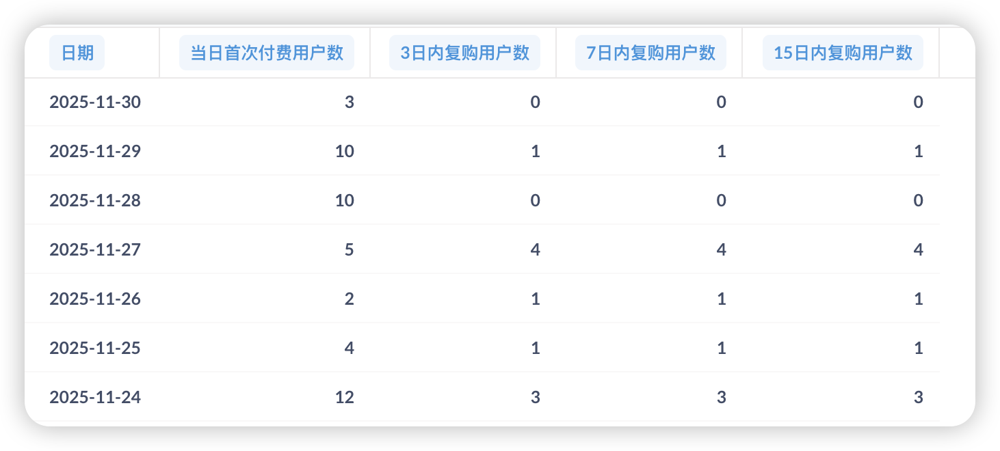
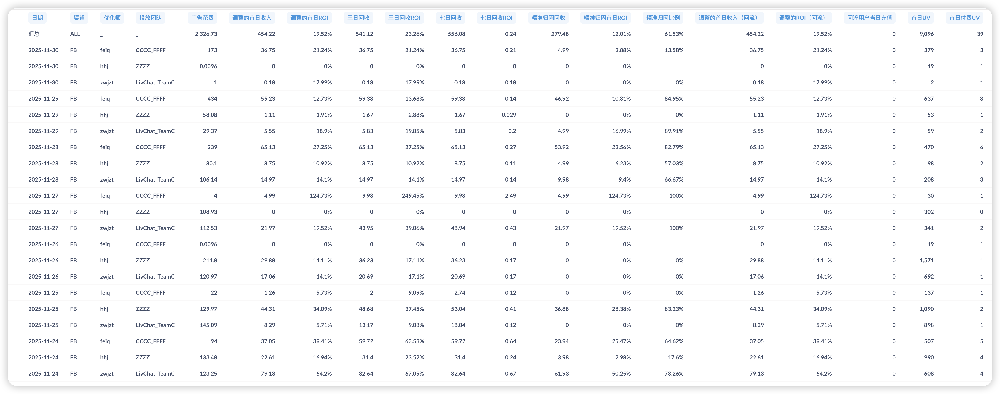

# PWA产品周报（2025第46周 11/24-11/30）

## 一、核心目标与实现路径

**目标（11月底）：**

| 指标 | 目标值 |
|------|--------|
| 日流水 | $2000 |
| 促销付费率 | 5% |
| 整体付费率 | 5% |

**实现路径：**

| 路径 | 核心动作 | 本周进展 | 状态 |
|------|----------|----------|------|
| **获客端** | 多域名投放突破FB拒审 | 3个团队持续投放 + hhj团队试投官网中转页方案（11/27启动） | 已启动 |
| **转化端** | 促销付费率改进项 → VIP订阅 → 漏斗优化 | PWA引导弹窗优化上线（11/26） + PWA三期优化开发中 | 按计划推进 |
| **数据支撑** | 归因问题修复 + 报表系统恢复 | Bot防护系统上线封禁功能（11/25，封禁79个IP） + FB→Safari转化漏斗报表需求已提交 | 逐步完善 |

---

## 二、核心数据（11/24-11/30）

### 2.1 业务数据总览

**数据周期：11/24-11/30（共7天）**

**⚠️ 数据质量说明：** Bot防护管理系统于11/25上线封禁功能，已封禁79个高频恶意IP。封禁前（11/24-25）日均无效用户3000+，封禁后（11/26-30）降至约300人，下降90%，但仍未达预期<100，需持续优化。

| 指标 | 本周数据 | 对比上周 | 与目标差距 |
|------|----------|----------|--------------|
| 日均流水 | $229.65 | 上周 $188.36，增长 21.9% | 距目标 $2000 差 88.5% |
| 周总流水 | $1,607.52 | 上周 $1,318.51，增长 21.9% | - |
| 促销付费率（支付成功/安全弹窗同意） | 0.95% | 上周 1.23%，下降 22.8% | 距目标 5% 差 4.05% |
| 日均媒体支出 | $348.60 | 上周 $333.19，增长 4.6% | - |
| 平均 ROI-D0 | 18.61% | 上周 13.18%，增长 41.2% | - |

**详细数据：**

**关键发现：**
1. **提价策略验证成功**：促销价从$1.99→$4.99（+151%），虽转化率降22.8%，但流水增长21.9%、ROI提升41.2%，**单用户价值显著提升**
2. **投放效率创新高**：ROI 18.61%（+41.2%），投放规模增长4.6%，zwjpt团队ROI 23.04%最优，**证明规模与效率可兼得**
3. **清理Bot后发现真实转化率很低**：真实呼叫比例仅30%、日均新增降至1,698人，**下一步重点是提升用户转化**
4. **复购率改善但不稳定**：本周21.74%（vs 上周8.5%），但11/28-30仅4.35%，**需要稳定复购表现**

---

### 2.2 转化漏斗详情

**数据质量改善进展：** Bot防护系统已于11/25上线封禁功能，封禁79个高频恶意IP。封禁前（11/24-25）日均无效用户3000+，封禁后（11/26-30）降至约300人，下降90%，但仍未达预期<100。

**关键转化漏斗发现：**

1. **清理Bot后暴露真实转化瓶颈**：真实呼叫比例仅30%（vs Bot污染期60%），**FB→Safari引导流程亟需优化**
2. **接通比例50.35%有提升空间**：低于客户端82%，**技术优化可显著提升转化**
3. **提价后付费率0.95%可接受**：虽降22.8%但流水增21.9%，**单用户价值提升验证成功**

---

**Bot防护系统效果（11/25上线后）：**

封禁79个高频恶意IP，封禁前（11/24-25）日均无效用户3000+，封禁后（11/26-30）降至约300人（下降90%），仍未达预期<100，需持续优化。

---

**首次付费用户复购情况（11/24-11/30）：**

**复购分析：**
- **复购率回升至21.74%**（vs 上周8.5%），但11/28-30骤降至4.35%，**波动大需稳定**
- **11/27异常高复购率80%**（5人中4人复购），**值得深挖用户特征复制成功经验**

---

**用户旅程数据（11/24-11/30）：**

**关键转化瓶颈：**
1. **开单比例仅11.94%**：远低于合理值30%，**主播曝光和引导策略亟需优化**
2. **成交率仅47.62%**：超半数下单用户未完成支付，**支付流程存在障碍**

---

**FB→Safari→PWA转化追踪进展：**

已提交报表需求，预计12/1交付，用于精准定位各环节流失瓶颈。

---

### 2.3 投放数据详情

**投放策略：**
- 投放地区：聚焦美国地区
- 投放团队：3个团队并行投放
- 归因状态：3个团队归因已修复
- **新增试投**：11/27 hhj团队启动PWA官网中转页试投方案（日消耗$100，取消原投放链接）

**投放数据（11/24-11/30，按团队统计）：**

| 团队 | 媒体支出 | pay-d0 | ROI-d0 | 新增用户 | 媒体支出占比 |
|------|----------|--------|--------|----------|-------------|
| **felq/CCCC_FFFF** | $966.01 | $187.88 | 19.45% | 1,657 | 40.3% |
| **hhj/ZZZZ** | $835.85 | $119.27 | 14.27% | 2,506 | 34.9% |
| **zwjpt/LiveChat_TeamC** | $638.35 | $147.08 | 23.04% | 3,099 | 26.7% |
| **iOS-EheetiOS汇总** | **$2,440.21** | **$454.23** | **18.61%** | **7,262** | **100%** |

**日均投放消耗：** $348.60（vs 上周 $333.19，增长 4.6%）

**关键发现：**

1. **zwjpt团队表现最优**：ROI 23.04%（周环比+136.8%），人均付费$0.05，投放效率显著提升，为三个团队中表现最佳
2. **felq团队ROI 19.45%**：周环比持平（上周18.86%），本周中途停投3天调整素材，恢复投放后效果稳定，占投放规模40.3%
3. **hhj官网中转页试投验证成功**：11/27上线官网引导安装方案，实现UV定义从"点击数"升级为"实际安装数"，过滤脚本用户的同时未对付费UV造成负面影响，数据质量显著改善，ROI提升至14.27%（上周仅9.24%），**验证了官网中转页方案的有效性**

---

## 三、本周进展

### 本周完成

| 项目 | 上线日期 | 业务价值 |
|------|---------|---------|
| Bot防护封禁功能上线 | 11/25 | 封禁79个恶意IP，日均无效用户从3000+降至300（下降90%），**数据清洗后暴露真实转化瓶颈：真实呼叫比例仅30%** |
| PWA引导弹窗优化 | 11/26 | 优化FB→Safari引导流程，配合清洁数据精准定位转化瓶颈 |
| 官网中转页方案验证成功 | 11/27 | hhj团队ROI从9.24%提升至14.27%（+54%），**UV定义升级为"实际安装数"，可推广至其他团队** |

### 开发中的项目

| 项目 | 预计完成 | 对目标的作用 | 当前状态与风险 |
|------|----------|-------------|---------------|
| H5 2.0.0版本 | 下周三（12/3） | **最优先**：扩大付费用户池，追赶巨风团队 | **风险**：已延期3周，P1/P2关键bug待修复，12/3必须上线 |
| PWA三期优化（全屏促销弹窗、拨号按钮、摄像头收费） | 下周二（12/2） | 提升促销付费率（当前0.95% → 目标5%） | 开发进度80%，按计划上线 |
| PWA安卓版本适配 | 12/9（预计） | 扩大用户覆盖，支持安卓设备投放 | PWA三期完成后启动，预计1周开发周期 |
| PWA业务重构（一期） | 12/16（预计） | 提留用户参与与留存体系，支持地址栏隐藏、社媒社区集成等新功能 | 安卓适配完成后启动 |
| FB→Safari转化漏斗报表 | 下周一（12/1） | 定位真实呼叫比例仅30%的根因，精准优化引导流程 | 已提交中台，交付时间依赖中台排期 |
| Bot防护持续优化 | 持续进行 | 将日均无效注册从300降至<100 | 观察封禁效果，持续调整策略 |

### 调研项目

| 项目 | 调研进展 | 遇到的问题 | 下一步计划 |
|------|---------|-----------|-----------|
| PWA安装体验优化 | 持续进行 | iOS：FB→Safari跳转方案5种技术方案未突破 安卓：FB内置浏览器一键安装调研中 | iOS暂缓，安卓配合12/9适配同步推进 |

### 其他项目

| 项目 | 状态 | 说明 |
|------|------|------|
| 制作Android官网 | 进行中 | 与PWA安卓适配同步推进 |
| 地址栏隐藏功能 | 暂缓至12/16 | 将在PWA业务重构（一期）中实现 |
| 持续跟进打点和报表需求 | 进行中 | 持续跟进中台打点和报表需求，支持数据驱动优化 |

### 下周关键动作

**PWA端：**
- **12/1（下周一）**：FB→Safari转化漏斗报表交付，支持精准优化引导流程
- **12/2（下周二）**：PWA三期优化上线（全屏促销弹窗、拨号按钮、摄像头收费逻辑）
- **12/2后**：启动PWA安卓版本适配开发（预计1周完成，12/9上线）

**H5端：**
- **12/3（下周三）**：H5 2.0.0版本上线（最优先，P1/P2关键bug待修复）

**投放端：**
- 评估官网中转页方案推广至felq/zwjpt团队的可行性
- 持续优化各团队投放策略，提升整体ROI

**数据支撑：**
- 持续优化Bot防护封禁策略，进一步降低无效注册（当前300，目标<100）
- 基于转化漏斗报表数据，优化Safari引导流程

**技术规划：**
- 12月中旬启动PWA业务重构（一期），建设提留用户参与与留存体系，支持地址栏隐藏、社媒社区集成等新功能

---

## 四、12月核心策略与风险

**继续冲刺目标：** 日流水$2000、促销付费率5%

**关键判断：**
1. **H5 2.0.0是12月最优先项**：扩大付费用户池，缩小与巨风团队差距，12/3必须上线
2. **转化率是突破口**：呼叫比例30%和促销付费率0.92%是ROI低的根本原因，12/2 PWA三期优化是提升关键
3. **官网中转页值得推广**：hhj团队ROI提升54%初步验证有效，观察数据后推广至其他团队有望提升整体ROI

**核心风险：**
- H5 2.0.0已延期3周，P1/P2关键bug待修复，12/3必须上线，延期将影响全月目标
- 转化漏斗报表依赖中台交付（12/1），存在延期风险

---

## 五、11月整体表现总结

**本周是11月最后一周，以下是整月表现回顾：**

| 指标 | 11月目标 | 11月实际（4周平均） | 达成率 | 核心发现 |
|------|----------|-------------------|--------|---------|
| 日均流水 | $2,000 | $167.97 | **8.4%** | 呼叫比例30% + 促销付费率0.92% → ROI 16.32%无法支撑放量 |
| 促销付费率 | 5% | 0.92% | **18.4%** | 转化率低是核心瓶颈 |
| ROI-D0 | - | 16.32% | - | 投放规模受限（日均仅$348） |

**三大亮点：**
1. 提价策略成功（$1.99→$4.99，11月流水逐周上涨：$93.84→$188.36→$229.65）
2. 官网中转页初步验证有效（hhj团队ROI +54%，需持续观察一周数据再决策推广）
3. Bot清洗见效（无效用户-90%，真实瓶颈暴露）

**12月改进方向：** PWA三期优化提升促销付费率 → 评估并推广官网中转页方案 → PWA业务重构建设用户留存体系

**[查看完整11月工作总结](2025年11月工作总结.md)** （含4周数据明细、目标分析、关键里程碑）

---

## 相关链接

- [第45周周报](第45周周报.md) | [第44周周报](第44周周报.md) | [第43周周报](第43周周报.md)
- [PWA版本管理](https://la1a59fdywl.feishu.cn/wiki/HItNw0KUfiJwvNkgkeecAWrsnme?from=from_copylink) | [H5版本管理](https://la1a59fdywl.feishu.cn/wiki/JewOwr2o6i0qo3kCsl4c1ve3nkd?from=from_copylink)
- [H5优化清单](https://la1a59fdywl.feishu.cn/wiki/HugawJAoAiQu2SkUSKPcxx8znQb?from=from_copylink) | [H5需求清单](https://la1a59fdywl.feishu.cn/wiki/DWO1wjWXZimbCLkXCrCchticnZc?from=from_copylink)
- [PWA数据](https://la1a59fdywl.feishu.cn/sheets/BYu9sRmvGh8aE8tncb8chVUTnIg?from=from_copylink&sheet=RN2VYk)
