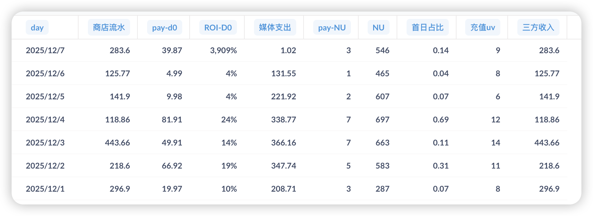
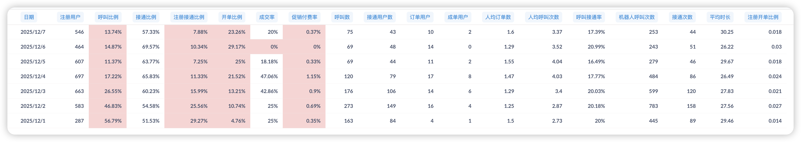
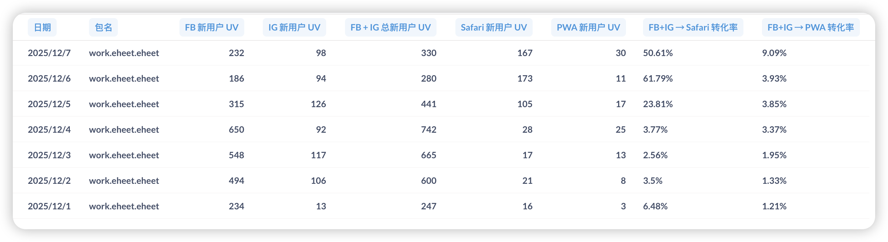

# PWA产品周报（2025第47周 12/01-12/07）

## 一、核心目标与实现路径

**目标（12月底）：**

| 指标 | 目标值 |
|------|--------|
| 日流水 | $2000 |
| 整体付费率 | 5% |

**实现路径：**

| 路径 | 核心动作 | 本周进展 | 状态 |
|------|----------|----------|------|
| **获客端** | 多域名投放突破FB拒审 | 3个团队持续投放 + 官网中转页方案持续观察 | 已启动 |
| **转化端** | iOS/Android一键安装突破 → 全屏促销弹窗优化 → 机器人call策略优化 | iOS一键跳转Safari上线（12/5）+ PWA三期优化上线（12/4）+ 来电弹窗优化开发中 | 进行中 |
| **数据支撑** | 归因问题修复 + 报表系统恢复 | Bot防护系统持续优化 + FB→Safari转化漏斗报表已交付 | 进行中 |

---

## 二、核心数据（12/01-12/07）

### 2.1 业务数据总览

**数据周期：12/01-12/07（共7天）**

**⚠️ 数据质量说明：** Bot防护管理系统持续运行中，日均无效用户已从封禁前的3000+降至约300人。本周数据质量整体稳定，但12/7媒体支出数据异常（仅$1.02），可能存在统计延迟，分析时已排除该异常日。

| 指标 | 本周数据 | 对比上周 | 与目标差距 |
|------|----------|----------|--------------|
| 日均流水 | $232.67 | 上周 $229.65，增长 1.3% | 距目标 $2000 差 88.4% |
| 周总流水 | $1,628.69 | 上周 $1,607.52，增长 1.3% | - |
| 整体付费率（充值UV/NU） | 1.77% | 上周数据待对比 | 距目标 5% 差 3.23% |
| 日均新增用户（NU） | 549.7 人 | 上周 1,698 人，下降 67.6% | - |
| 日均媒体支出 | $269.14（剔除12/7异常） | 上周 $348.60，下降 22.8% | - |
| 平均 ROI-D0 | 14.47%（剔除12/7异常） | 上周 18.61%，下降 22.2% | - |

**详细数据：**

**关键发现：**

1. **felq团队投放逆势上涨**：ROI从19.45%提升至23.82%（+22.5%），是唯一实现ROI上涨的团队，首日付费转化率1.30%远高于其他团队

2. **流水保持稳定**：日均$232.67，较上周增长1.3%，虽新增用户骤降67.6%但单用户价值提升

3. **ROI下降22.2%但仍可控**：从18.61%降至14.47%，投放收缩策略避免进一步恶化

---

### 2.2 转化漏斗详情

**数据质量改善进展：** Bot防护系统持续运行，日均无效用户维持在约300人水平，数据质量整体稳定。

**核心问题**：呼叫比例骤降至26.88%（因高荷视频流程导致用户需看完3个视频才能呼叫），接通比例改善至60.41%（+20%），开单比例先降后升（12/5触底7.25%后回升至12/7的23.26%）

---

### 2.3 投放数据详情

**投放策略：**
- 投放地区：美国
- 投放团队：3个团队并行投放
- 归因状态：3个团队归因已修复
- **官网中转页方案**：hhj团队持续运行中，继续观察数据效果

**投放数据（12/01-12/07，按团队统计）：**

| 团队 | 媒体支出 | pay-d0 | ROI-d0 | 新增用户 | 媒体支出占比 |
|------|----------|--------|--------|----------|-------------|
| **felq/CCCC_FFFF** | $649.03 | $154.57 | 23.82% | 1,233 | 35.7% |
| **hhj/ZZZZ** | $321.64 | $20.62 | 6.41% | 805 | 17.7% |
| **zwjpt/LiveChat_TeamC** | $847.02 | $98.35 | 11.61% | 1,810 | 46.6% |
| **iOS-EheetiOS汇总** | **$1,817.69** | **$273.54** | **15.05%** | **3,848** | **100%** |

**日均投放消耗：** $259.67（vs 上周 $348.60，下降 25.5%）

**关键发现：**

1. **felq团队表现最优**：ROI 23.82%（周环比+22.5%），是唯一实现ROI上涨的团队
2. **hhj团队ROI下降**：ROI 6.41%（周环比-55.1%），占投放规模17.7%，效率下滑需优化
3. **zwjpt团队ROI下降**：ROI 11.61%（周环比-49.6%），占投放规模46.6%，整体投放收缩25.5%控制风险

---

## 三、本周进展

### 本周完成

| 项目 | 上线日期 | 业务价值 |
|------|---------|---------|
| **PWA三期优化（阶段一）** | 12/4 | 上线全屏促销弹窗 + 匹配页摄像头收费逻辑，优化付费转化流程 |
| **iOS一键跳转Safari** | 12/5 | 实现从FB浏览器一键跳转至Safari，攻克技术难题，但短期转化率未达预期（呼叫比例下降至26.88%） |
| **Android一键安装PWA技术方案** | 本周 | 完成Android一键安装技术方案验证，用于安卓版本适配（详见[技术文档](【待补充：技术文档链接】)） |

### 开发中的项目

| 项目 | 预计完成 | 对目标的作用 | 当前状态与风险 |
|------|----------|-------------|---------------|
| PWA三期优化（阶段二）：来电弹窗优化 | 下周一（12/9） | 优化首通机器人来电样式和体验，继续改善接通比例（当前60.41%） | 开发进度正常，按计划上线 |
| PWA安卓版本适配 | 下周一（12/9） | 支持安卓设备投放，扩大用户覆盖 | 基于Android一键安装技术方案，按计划推进 |
| 机器人call策略优化 | 12/12（下周四） | 改造主播详情页逻辑、聊天页面、通话页面、主播墙等，优化机器人call转化流程 | 下周重点开发项目 |
| PWA一期重构 | 12/12后启动 | 开发用户留存与参与功能，支持地址栏隐藏、社媒社区集成等新功能 | 等待机器人call策略优化完成后启动 |
| Bot防护持续优化 | 持续进行 | 降低日均无效注册（当前300） | 持续监控和优化封禁策略 |

### 其他项目

| 项目 | 状态 | 说明 |
|------|------|------|
| 制作Android官网 | 进行中 | 额外项目，用于原生安卓白包过审 |
| 持续跟进打点和报表需求 | 进行中 | 跟进中台打点和报表需求 |

### 暂停项目

| 项目 | 暂停原因 | 应对策略 |
|------|---------|---------|
| H5 2.0.0版本开发 | 子健离职（12/5），团队人手不足 | **短期**：暂停H5开发，资源用于PWA优化 **中期**：启动招聘，补充人力后恢复开发 |

### 下周关键动作

- **12/9（下周一）**：PWA来电弹窗优化 + PWA安卓版本适配上线
- **12/12（下周四）**：机器人call策略优化上线
- **投放端最高优先级**：分析felq团队成功经验，复制至hhj/zwjpt团队
- **人力规划**：启动招聘流程，补充H5开发人力

---

## 四、关键判断与风险

| 维度 | 本周数据表现 | 核心判断 | 下周动作 |
|------|------------|---------|---------|
| **转化端** | ✅ 接通比例60.41%（+20%） 🔴 呼叫比例26.88%（-10.4%） 🔴 整体转化率0.55%（-42.1%） | iOS一键跳转未达预期，需紧急优化引导流程；PWA三期优化见效，接通比例改善明显 | 1. **紧急**：优化iOS一键跳转后的引导流程，提升呼叫比例 2. 12/9来电弹窗上线，继续改善接通比例 3. 12/12机器人call策略优化，改善开单比例 |
| **获客端** | 🟢 felq团队ROI逆势上涨22.5%（23.82%） 🔴 hhj团队ROI下降55.1%（6.41%） 🔴 zwjpt团队ROI下降49.6%（11.61%） ✅ 汇总ROI 15.05%（vs上周18.61%，下降19.1%） | felq团队表现最优，需复制成功经验至其他团队；整体ROI可控，投放收缩策略正确 | 1. **最高优先级**：分析felq团队成功经验，复制至hhj/zwjpt团队 2. 优化hhj团队落地页和转化流程 3. 优化zwjpt团队投放精准度 |
| **技术能力** | ✅ iOS一键跳转上线（12/5） ✅ PWA三期优化上线（12/4） ✅ Android方案完成 | 技术突破完成，但短期业务转化存疑，需观察中长期效果并快速优化 | 1. 观察iOS一键跳转转化率变化趋势 2. 12/9安卓版本上线，验证市场潜力 3. 优化iOS一键跳转体验 |
| **数据支撑** | ⚠️ 转化漏斗数据严重缺失 ❓ FB→Safari报表未体现 | 关键转化率数据缺失，无法精准定位瓶颈和验证iOS一键跳转效果 | 1. 补充完整转化漏斗数据 2. 确认FB→Safari报表交付状态 3. 建立iOS一键跳转前后对比分析 |
| **目标达成** | 日均流水$232.67 距目标$2000差88.4% | 距12月底仅剩3周，目标差距巨大，需ROI回升至18%+并扩大投放至$500+/天 | 1. 快速验证技术方案效果 2. 基于数据决定是否调整策略 3. 评估目标可行性 |

---

## 相关链接

- [第46周周报](第46周周报.md) | [第45周周报](第45周周报.md) | [第44周周报](第44周周报.md)
- [iOS/Android一键安装技术文档](【待补充：技术文档链接】)
- [PWA版本管理](https://la1a59fdywl.feishu.cn/wiki/HItNw0KUfiJwvNkgkeecAWrsnme?from=from_copylink) | [H5版本管理](https://la1a59fdywl.feishu.cn/wiki/JewOwr2o6i0qo3kCsl4c1ve3nkd?from=from_copylink)
- [H5优化清单](https://la1a59fdywl.feishu.cn/wiki/HugawJAoAiQu2SkUSKPcxx8znQb?from=from_copylink) | [H5需求清单](https://la1a59fdywl.feishu.cn/wiki/DWO1wjWXZimbCLkXCrCchticnZc?from=from_copylink)
- [PWA数据](https://la1a59fdywl.feishu.cn/sheets/BYu9sRmvGh8aE8tncb8chVUTnIg?from=from_copylink&sheet=RN2VYk)
