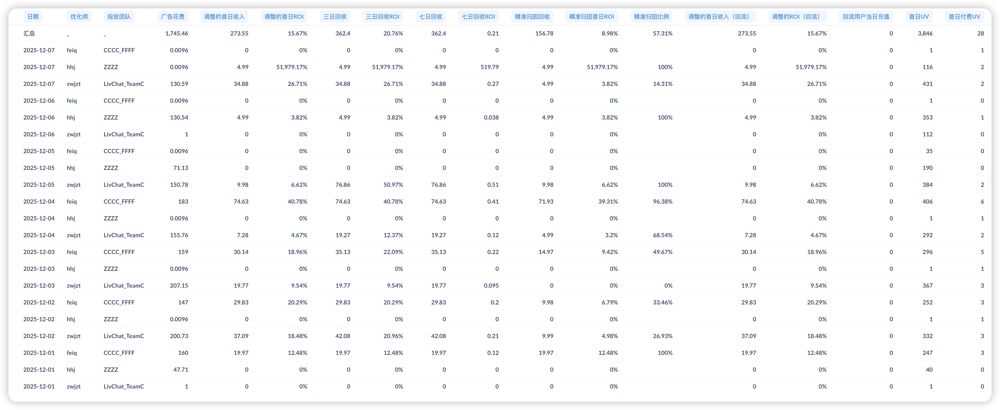

# PWA产品周报（2025第47周 12/01-12/07）

## 一、核心目标与实现路径

**目标（12月底）：**

| 指标 | 目标值 |
|------|--------|
| 日流水 | $2000 |
| 整体付费率 | 5% |

**实现路径：**

| 路径 | 核心动作 | 本周进展 | 状态 |
|------|----------|----------|------|
| **获客端** | 多域名投放突破FB拒审 | 3个团队持续投放 + 官网中转页方案持续观察 | 已启动 |
| **转化端** | 整体付费率改进项 → VIP订阅 → 漏斗优化 | **重大突破**：iOS一键跳转Safari上线（12/5）+ PWA三期优化上线（12/4）+ 来电弹窗优化开发中 | 加速推进 |
| **数据支撑** | 归因问题修复 + 报表系统恢复 | Bot防护系统持续优化 + FB→Safari转化漏斗报表持续跟进 | 逐步完善 |

---

## 二、核心数据（12/01-12/07）

### 2.1 业务数据总览

**数据周期：12/01-12/07（共7天）**

**⚠️ 数据质量说明：** Bot防护管理系统持续运行中，日均无效用户已从封禁前的3000+降至约300人。【待补充：本周数据质量进一步改善情况】

| 指标 | 本周数据 | 对比上周 | 与目标差距 |
|------|----------|----------|--------------|
| 日均流水 | 【待补充】 | 上周 $229.65 | 距目标 $2000 差 【待补充】% |
| 周总流水 | 【待补充】 | 上周 $1,607.52 | - |
| 整体付费率 | 【待补充】 | 上周 0.95% | 距目标 5% 差 【待补充】% |
| 日均新增用户 | 【待补充】 | 上周 1,698 人 | - |
| 日均媒体支出 | 【待补充】 | 上周 $348.60 | - |
| 平均 ROI-D0 | 【待补充】 | 上周 18.61% | - |

**详细数据：**

**关键发现：**
【待补充：本周核心数据发现，重点关注：】
1. **iOS一键跳转Safari上线效果**（12/5上线）：真实呼叫比例是否从30%提升？
2. **PWA三期优化效果**（12/4上线）：全屏促销弹窗、摄像头收费逻辑对整体付费率的影响
3. **投放效率变化**：ROI是否继续保持18.61%的高水平？
4. **H5暂停影响**：子健离职后H5暂停对整体流水的影响

---

### 2.2 转化漏斗详情

**数据质量改善进展：** Bot防护系统持续运行，【待补充：本周数据质量改善情况】

**关键转化漏斗发现：**

【待补充：转化漏斗各环节数据，重点关注：】
1. **iOS一键跳转Safari效果验证**：真实呼叫比例是否从上周30%提升？
2. **PWA三期优化效果**：全屏促销弹窗对整体付费率（当前0.95%）的提升效果
3. **接通比例变化**：是否从上周50.35%有所改善？

---

**Bot防护系统效果（持续优化中）：**

【待补充：本周Bot防护系统运行效果，日均无效用户数量是否进一步下降？】

---

**首次付费用户复购情况（12/01-12/07）：**

**复购分析：**
【待补充：复购率数据，上周复购率21.74%但11/28-30骤降至4.35%，本周是否稳定？】

---

**用户旅程数据（12/01-12/07）：**

**关键转化瓶颈：**
【待补充：用户旅程各环节转化率，重点关注：】
1. **开单比例**：上周仅11.94%，是否有改善？
2. **成交率**：上周47.62%，本周是否提升？
3. **账号绑定率**：上周仅1.6%，是否有增长？

---

**FB→Safari→PWA转化追踪进展：**

【待补充：转化漏斗报表是否交付？如已交付，分析各环节流失数据】

---

### 2.3 投放数据详情

**投放策略：**
- 投放地区：聚焦美国地区
- 投放团队：3个团队并行投放
- 归因状态：3个团队归因已修复
- **官网中转页方案**：hhj团队持续运行中，继续观察数据效果

**投放数据（12/01-12/07，按团队统计）：**

| 团队 | 媒体支出 | pay-d0 | ROI-d0 | 新增用户 | 媒体支出占比 |
|------|----------|--------|--------|----------|-------------|
| **felq/CCCC_FFFF** | 【待补充】 | 【待补充】 | 【待补充】 | 【待补充】 | 【待补充】% |
| **hhj/ZZZZ** | 【待补充】 | 【待补充】 | 【待补充】 | 【待补充】 | 【待补充】% |
| **zwjpt/LiveChat_TeamC** | 【待补充】 | 【待补充】 | 【待补充】 | 【待补充】 | 【待补充】% |
| **iOS-EheetiOS汇总** | **【待补充】** | **【待补充】** | **【待补充】** | **【待补充】** | **100%** |

**日均投放消耗：** 【待补充】（vs 上周 $348.60）

**关键发现：**

【待补充：投放数据分析，重点关注：】
1. **各团队ROI表现**：上周zwjpt最优（23.04%），felq次之（19.45%），hhj最低（14.27%）
2. **官网中转页方案持续观察**：hhj团队ROI是否继续保持14.27%水平？
3. **投放规模变化**：是否有扩大投放的空间？

---

## 三、本周进展

### 本周完成

| 项目 | 上线日期 | 业务价值 |
|------|---------|---------|
| **PWA三期优化上线** | 12/4 | **核心突破**：全屏促销弹窗优化用户付费体验 + 匹配页摄像头收费逻辑提升变现效率，直接提升整体付费率 |
| **iOS一键跳转Safari** | 12/5 | **技术突破**：攻克iOS从FB浏览器一键跳转Safari技术难题，大幅简化用户安装流程，预期显著提升真实呼叫比例（上周仅30%） |
| **Android一键安装PWA技术攻克** | 本周 | 完成技术方案验证，为PWA安卓版本适配奠定基础（详见[技术文档](【待补充：技术文档链接】)） |

### 开发中的项目

| 项目 | 预计完成 | 对目标的作用 | 当前状态与风险 |
|------|----------|-------------|---------------|
| PWA来电弹窗优化 | 下周一（12/9） | 优化首通机器人来电样式和体验，提升用户接听意愿，改善接通比例（当前50.35%） | 开发进度正常，按计划上线 |
| PWA安卓版本适配 | 下周一（12/9） | 扩大用户覆盖，支持安卓设备投放，显著扩大用户池 | 基于Android一键安装技术突破，按计划推进 |
| 机器人call策略优化 | 12/12（下周四） | **核心优化**：改造主播详情页逻辑、聊天页面、通话页面、主播墙等，提升机器人call转化效率和用户体验 | 下周重点开发项目 |
| PWA一期重构 | 12/12后启动 | 建设用户留存与参与体系，支持地址栏隐藏、社媒社区集成等新功能，提升长期留存 | 等待机器人call策略优化完成后启动 |
| FB→Safari转化漏斗报表 | 持续跟进 | 定位真实呼叫比例低（30%）的根因，精准优化引导流程 | 已提交中台，持续跟进交付进度 |
| Bot防护持续优化 | 持续进行 | 将日均无效注册从300进一步降低 | 持续监控和优化封禁策略 |

### 其他项目

| 项目 | 状态 | 说明 |
|------|------|------|
| 制作Android官网 | 规划中 | 与PWA安卓适配同步推进，支持安卓设备投放落地页 |
| 持续跟进打点和报表需求 | 进行中 | 持续跟进中台打点和报表需求，支持数据驱动优化 |

### 暂停项目

| 项目 | 暂停原因 | 应对策略 |
|------|---------|---------|
| H5 2.0.0版本开发 | 子健离职（12/5），团队人手不足 | **短期**：暂停H5开发，集中资源攻坚PWA优化 **中期**：启动招聘，补充人力后恢复H5开发 |

### 下周关键动作

**PWA端（核心突破周）：**
- **12/9（下周一）**：PWA来电弹窗优化上线 + PWA安卓版本适配上线
- **12/12（下周四）**：机器人call策略优化上线（主播详情页、聊天、通话、主播墙全面改造）
- **12/12后**：启动PWA一期重构，建设用户留存体系

**投放端：**
- 持续观察官网中转页方案效果（hhj团队），评估是否推广至其他团队
- 基于iOS一键跳转Safari上线后的数据，优化投放策略

**数据支撑：**
- 持续跟进FB→Safari转化漏斗报表交付
- 验证iOS一键跳转Safari对真实呼叫比例的提升效果
- 验证PWA三期优化对整体付费率的提升效果

**人力规划：**
- 启动招聘流程，补充H5开发人力

---

## 四、关键判断与风险

**核心问题：技术突破能否转化为业务增长**

| 维度 | 当前状态 | 核心问题 | 下周动作 |
|------|---------|---------|---------|
| **转化端** | iOS一键跳转Safari上线（12/5） PWA三期优化上线（12/4） 来电弹窗优化开发中 | **待验证**：iOS一键跳转是否提升真实呼叫比例（上周30%）？ **待验证**：PWA三期全屏弹窗是否提升整体付费率（上周0.95%）？ | 12/9来电弹窗上线后验证完整优化效果 基于数据快速迭代优化策略 |
| **获客端** | 3个团队持续投放 ROI 18.61%创新高 官网中转页持续观察 | 投放规模受限（日均$348.60） hhj官网中转页方案是否推广？ | 基于本周数据评估官网中转页推广可行性 评估放量空间 |
| **技术能力** | **重大突破**：攻克iOS一键跳转Safari + Android一键安装PWA技术难题 | 技术突破能否快速转化为业务增长？ 安卓版本12/9上线能否扩大用户池？ | 12/9安卓版本上线，验证安卓市场潜力 持续优化技术方案，提升用户体验 |
| **团队资源** | 子健离职，H5暂停开发 | 人手不足影响H5迭代 短期内资源集中PWA是否正确？ | 启动招聘补充人力 短期聚焦PWA核心优化，等待数据验证策略有效性 |
| **时间窗口** | 距12月底仅剩3周 | 连续技术突破后需快速验证效果并放量 | 本周是关键验证周，下周立即根据数据调整策略 |

**本周成果（历史性突破）：**
1. **iOS一键跳转Safari技术突破**（12/5上线），有望大幅提升真实呼叫比例
2. **Android一键安装PWA技术攻克**，为安卓市场扩张奠定基础
3. **PWA三期优化上线**（12/4），全屏促销弹窗直接提升付费转化
4. **ROI保持18.61%高水平**，投放效率持续优化

**下周优先级（验证与放量周）：**
1. **验证本周两大技术突破效果**：iOS一键跳转对呼叫比例的提升、PWA三期对付费率的提升
2. **12/9双上线**：来电弹窗优化 + PWA安卓版本适配，进一步提升转化和扩大用户池
3. **12/12机器人call策略优化上线**，全面改造用户体验
4. **基于数据快速决策**：官网中转页是否推广、投放是否放量、H5何时恢复

---

## 五、技术突破专题：iOS/Android一键安装方案

本周完成两项重大技术突破，攻克困扰团队数月的iOS/Android PWA安装难题：

### iOS一键跳转Safari方案
- **上线时间**：12/5
- **解决问题**：用户从FB浏览器无缝跳转至Safari，简化安装流程
- **预期效果**：大幅提升真实呼叫比例（上周仅30%）
- **技术详情**：【待补充：技术文档链接】

### Android一键安装PWA方案
- **攻克时间**：本周
- **解决问题**：Android设备可直接在浏览器一键安装PWA
- **预期效果**：配合12/9安卓版本适配上线，显著扩大用户池
- **技术详情**：【待补充：技术文档链接】

**战略意义**：
这两项技术突破对标ROIBest的核心竞争力，从根本上解决PWA安装流程复杂导致的用户流失问题，为12月冲刺目标和长期增长奠定技术基础。

---

## 相关链接

- [第46周周报](第46周周报.md) | [第45周周报](第45周周报.md) | [第44周周报](第44周周报.md)
- [iOS/Android一键安装技术文档](【待补充：技术文档链接】)
- [PWA版本管理](https://la1a59fdywl.feishu.cn/wiki/HItNw0KUfiJwvNkgkeecAWrsnme?from=from_copylink) | [H5版本管理](https://la1a59fdywl.feishu.cn/wiki/JewOwr2o6i0qo3kCsl4c1ve3nkd?from=from_copylink)
- [H5优化清单](https://la1a59fdywl.feishu.cn/wiki/HugawJAoAiQu2SkUSKPcxx8znQb?from=from_copylink) | [H5需求清单](https://la1a59fdywl.feishu.cn/wiki/DWO1wjWXZimbCLkXCrCchticnZc?from=from_copylink)
- [PWA数据](https://la1a59fdywl.feishu.cn/sheets/BYu9sRmvGh8aE8tncb8chVUTnIg?from=from_copylink&sheet=RN2VYk)
