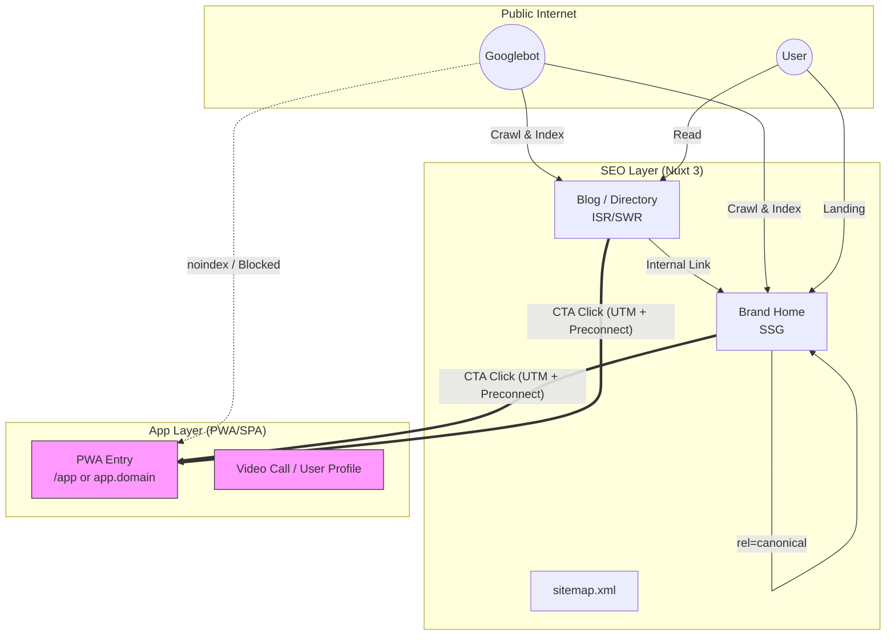
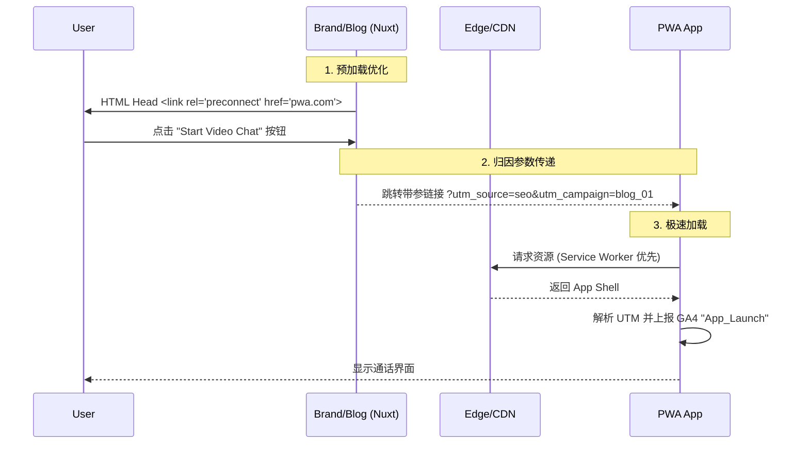
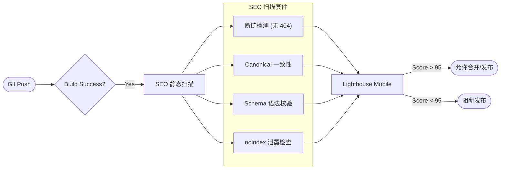

# 官网 Google SEO 技术方案（V2.2 可视化版）

**适用范围**：海外官网（品牌站/博客）+ PWA 业务站  
**核心目标**：工程化交付可索引流量池，建立 Web 到 PWA 的高效转化通道。

---

## 1. 总体架构设计

### 1.1 系统分层架构图
品牌站负责“获客”，PWA 负责“变现”。技术上通过路由和索引策略严格隔离。

### 1.2 技术策略对比表

| 维度 | **SEO 流量层** (Brand/Blog) | **PWA 业务层** (App) |
| :--- | :--- | :--- |
| **技术栈** | **Nuxt 3** | React / Vue SPA |
| **渲染模式** | **Hybrid (SSG + ISR)** | CSR (Client-Side Rendering) |
| **索引策略** | **全量索引** (`index, follow`) | **屏蔽** (`noindex` / `robots.txt` Disallow) |
| **核心指标** | LCP (首屏加载), CWV | Retention, Call Duration |
| **多语言** | 子目录 (`/en/`, `/es/`) | App 内部切换 / 自动匹配 |
| **数据归因** | 流量源头 (Source/Medium) | 转化终点 (Goal Completion) |

---

## 2. 关键技术交付物 (DoD)

### 2.1 基础设施清单

| 类别 | 交付物 | 关键配置 / 验收标准 |
| :--- | :--- | :--- |
| **爬虫控制** | `robots.txt` | `Allow: /` `Disallow: /app/` (或 PWA 路径) 包含 Sitemap 地址 |
| **索引指引** | `sitemap-index.xml` | 自动生成，**剔除** PWA 路由、测试页、404 页 |
| **App 联动** | `.well-known` | iOS: `apple-app-site-association` Android: `assetlinks.json` *(用于原生 App 唤起)* |
| **规范化** | `Canonical` | 所有页面（含 UTM 参数页）必须指向不带参数的规范 URL |

### 2.2 结构化数据 (JSON-LD)

| Schema 类型 | 应用页面 | 核心字段说明 (以此提升 CTR) |
| :--- | :--- | :--- |
| **`SoftwareApplication`** | 首页 / 下载页 | `applicationCategory`: SocialNetworking `aggregateRating`: ⭐ 4.8 `offers`: Price 0 (Free) |
| **`WebSite`** | 首页 | 搜索框配置 (`potentialAction`) |
| **`Article`** | 博客详情页 | `headline`, `image`, `datePublished`, `author` |
| **`BreadcrumbList`** | 全站 | 展现层级结构 |

---

## 3. 流量转化与链路优化

### 3.1 用户转化时序图
展示从 SEO 落地页到 PWA 激活的技术关键动作。

### 3.2 边缘规则 (Edge Rules)

*   **Geo-IP 放行**：
    *   `if (User-Agent contains "Googlebot")` -> **PASS** (不重定向)
    *   `else if (IP is US)` -> Redirect to `/en/`
*   **Vary 响应头**：
    *   所有多语言页面响应头必须包含：`Vary: Accept-Language, User-Agent`

---

## 4. CI/CD 自动化门禁

每次代码提交 (PR) 必须通过以下自动化流水线：

---

## 5. 风险预案

| 风险场景 | 监控信号 (Trigger) | 自动化/人工预案 (Action) |
| :--- | :--- | :--- |
| **PWA 泄漏** | GSC 显示 PWA 路由被索引 | 1. PWA Header 强插 `X-Robots-Tag: noindex` 2. GSC 使用 "Removals" 紧急移除 |
| **蜘蛛误伤** | GSC 抓取异常/403 激增 | 1. 检查 WAF/CDN 日志 2. **立即回滚** Geo-IP 重定向规则 |
| **转化断层** | GA4 流量有 source 但无 medium | 1. 检查品牌站 CTA 链接生成逻辑 2. 确保 UTM 参数未在重定向中丢失 |

---

## 6. 里程碑规划

| 阶段 | 周期 | 核心交付内容 | 负责人 |
| :--- | :--- | :--- | :--- |
| **M1: 骨架搭建** | Week 1 | Nuxt 3 初始化, ISR 配置, Robots/Sitemap, 架构隔离 | Tech Lead |
| **M2: 内容与连接** | Week 2 | Meta 模板, Schema 组件, UTM 埋点, 多语言路由 | Frontend |
| **M3: 门禁与验收** | Week 3 | CI 脚本上线, Lighthouse 调优, GSC 配置与验证 | DevOps/QA |

---

## 7. 附录：技术依据与参考标准

| 模块 | 官方依据 | 技术决策点 |
| :--- | :--- | :--- |
| **结构化数据** | [Software App (Google)](https://developers.google.com/search/docs/appearance/structured-data/software-app) | 必须使用 `SoftwareApplication` 才能展示评分和价格。 |
| **爬虫控制** | [Googlebot IP (Google)](https://developers.google.com/search/docs/crawling-indexing/verifying-googlebot) | 必须基于 Reverse DNS 或 IP 段放行爬虫，不能只看 User-Agent。 |
| **国际化** | [Locale-adaptive pages (Google)](https://developers.google.com/search/docs/specialty/international/locale-adaptive-pages) | 严禁强制 IP 重定向（除放行爬虫外），推荐使用 `x-default` 和语言选择器。 |
| **PWA 索引** | [Web-based Apps (Google)](https://developers.google.com/search/docs/crawling-indexing/javascript/javascript-seo-basics) | PWA 是普通网页，若不加 `noindex` 会导致内容与品牌页竞争。 |