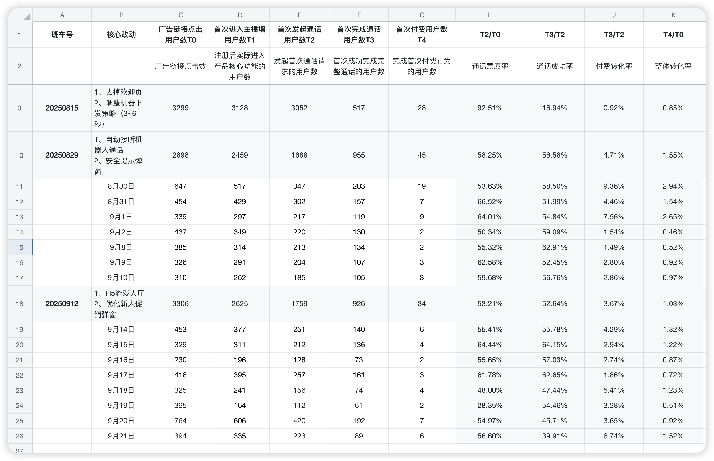
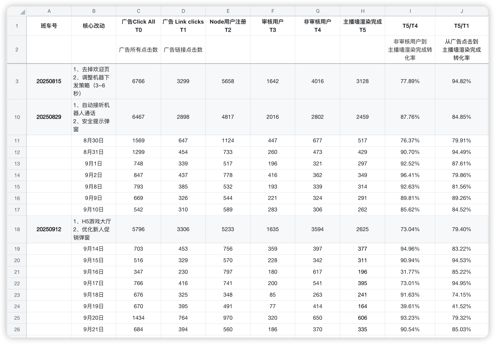
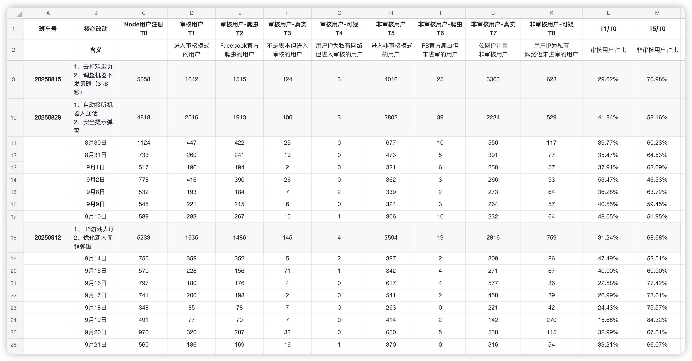
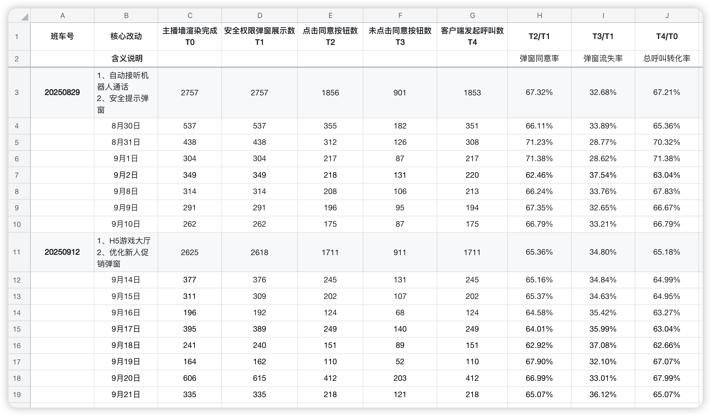
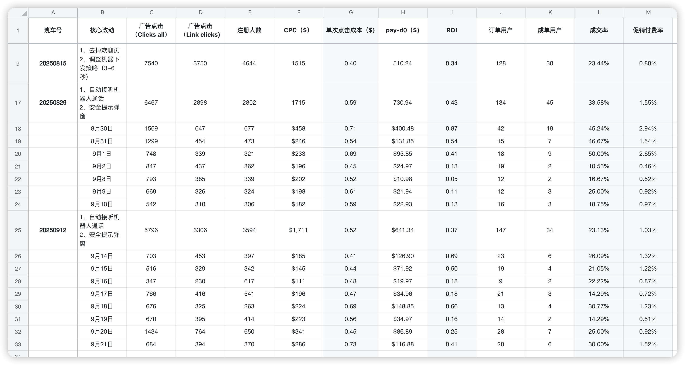
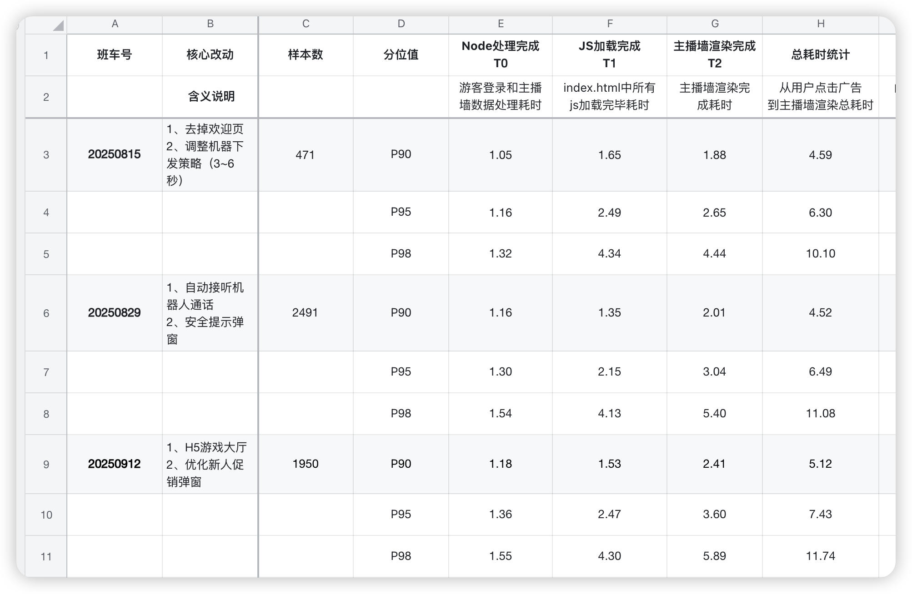

# 第37周业务数据汇报模板

## 一、核心业务表现总览

### 📊 关键数据速览
- **付费转化率：** 0.85% → 1.55% → 1.03%（相比基线提升21%）
- **ROI表现：** 0.34 → 0.43 → 0.37（相比基线提升9%）
- **通话成功率：** 16.94% → 56.58% → 52.64%（提升210%）
- **用户质量：** 非审核用户占比提升10.5个百分点至68.68%

---

## 二、关键漏斗数据详解

### 2.1 核心业务转化漏斗

**数据对比（815→829→912版本）：**
- **通话意愿率：** 92.51% → 58.25% → 53.21%
- **通话成功率：** 16.94% → 56.58% → 52.64%
- **付费转化率：** 0.85% → 1.55% → 1.03%

**关键洞察：**
- 虽然通话意愿率下降，但通话成功率提升3倍
- 付费转化率相比基线仍有21%提升
- 整体转化质量在优化中

### 2.2 Node渲染漏斗与用户质量

**渲染转化率：** 84.85% → 78.40%
**用户结构优化：**
- **非审核用户占比：** 58.16% → 68.68%（↑10.5%）
- **审核用户占比：** 41.84% → 31.32%（↓10.5%）

**价值说明：** 用户质量大幅提升，真实用户转化更稳定

### 2.3 主播墙安全机制

**安全提示弹窗效果：**
- **20250829版本：** 同意率67.32%，机器人过滤32.68%
- **20250912版本：** 同意率65.36%，机器人过滤34.80%

**策略验证：** 约1/3机器人流量被有效识别和过滤

### 2.4 呼叫接听链路

**各环节转化率：**
- **呼叫请求成功率：** ~91%
- **呼叫送达率：** 接近100%
- **用户接听率：** ~94%

**状态：** 自动接听策略效果稳定，技术链路无障碍

### 2.5 通话体验漏斗

**关键数据变化：**
- **视频流建立：** 99.52% → 98.50%（稳定）
- **权限拒绝率：** 34.81% → 33.47%（改善）
- **异常流失率：** 33.91% → 36.23%（↑2.3%）
- **完整转化率：** 66.09% → 63.77%（↓2.3%）

**关注点：** 异常流失率上升需优化

### 2.6 商业化核心指标

**ROI & 成交率对比：**
- **ROI：** 0.34 → 0.43 → 0.37（仍优于基线9%）
- **成交率：** 23.44% → 33.58% → 23.13%
- **促销付费率：** 0.80% → 1.55% → 1.03%（比基线提升29%）

**积极信号：** 用户付费意愿有根本性改善

### 2.7 用户停留分析

**现状确认：**
- 前6秒内约30%用户流失（主要为机器人流量）
- 停留<6秒用户与未点击同意用户高度重合
- 真实用户停留表现稳定

### 2.8 性能数据

**首启P90时间：**
- **20250815：** 4.59秒
- **20250829：** 4.52秒  
- **20250912：** 5.12秒（劣化13%）

**瓶颈分析：**
- **主播墙渲染：** 1.88s → 2.41s（+0.4秒）
- **JS加载：** 1.35s → 1.53s

### 2.9 用户浏览器分布

**浏览器使用分布：**
- 主要浏览器使用情况统计
- 为技术优化提供基础数据支撑

---

## 三、业务影响与价值

### ✅ 积极成果
1. **用户质量显著提升** - 非审核用户占比增至68.68%
2. **通话成功率大幅改善** - 从16.94%提升至52.64%
3. **付费转化基础夯实** - 相比基线仍有21%提升
4. **机器人过滤有效** - 约1/3无效流量被成功识别

### ⚠️ 需要关注的风险
1. **性能劣化** - 首启时间增加13%，影响用户体验
2. **异常流失上升** - 通话完整转化率下降2.3%
3. **转化率波动** - 需要稳定在829版本的优秀水平

---

## 四、即将上线项目价值

### 📋 任务系统（下周三发布）
**预期价值：**
- 提升用户日活和参与度
- 促进付费转化率进一步提升
- 建立完整的数据监控体系

**支撑条件：**
- 谷歌OAuth限制已解除（7天10000次额度）
- 主题色和主播墙优化完成
- 前端开发进度80%

---

## 五、下阶段行动计划

### 🎯 优先级1：任务系统发布
- **时间节点：** 下周三上线
- **关键指标：** DAU、任务完成率、付费转化率

### 🎯 优先级2：性能优化
- **目标：** 首启时间恢复到4.5秒以内
- **重点：** 主播墙渲染优化

### 🎯 优先级3：转化率稳定
- **目标：** 付费转化率稳定在1.2%以上
- **策略：** 结合任务系统优化用户引导

---

## 六、需要决策的问题

1. **性能vs功能平衡：** 是否需要调整新功能发布节奏？
2. **资源投入：** 性能优化需要多少开发资源？
3. **监控机制：** 任务系统上线后的关键监控指标确认？

---

## 七、关键数据记忆要点

### 📋 必须记住的核心数字
- **付费转化率提升21%**（0.85% → 1.03%）
- **ROI提升9%**（0.34 → 0.37）
- **通话成功率提升210%**（16.94% → 52.64%）
- **用户质量提升10.5%**（非审核用户占比68.68%）
- **性能劣化13%**（首启时间4.52s → 5.12s）
- **机器人过滤率34.8%**

### 🎯 向老板强调的三个要点
1. **整体趋势积极** - 核心转化指标均优于基线
2. **用户质量提升** - 真实用户占比大幅增加
3. **任务系统即将上线** - 预期进一步提升业务表现