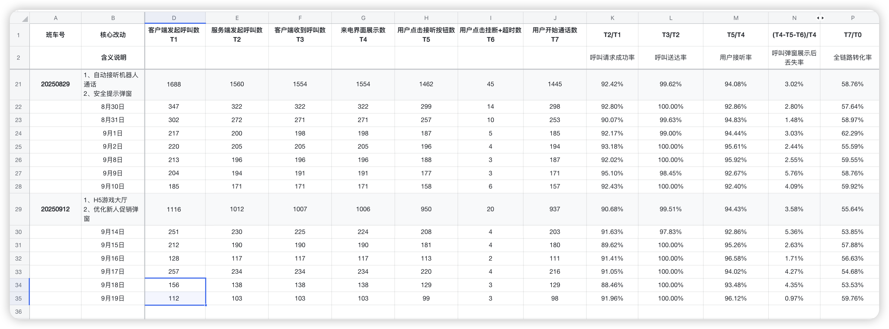

# 第37周业务数据汇报模板

## 一、核心业务表现总览

### 📊 关键数据速览
- **付费转化率：** 0.85% → 1.55% → 1.03%（相比基线提升21%）
- **ROI表现：** 0.34 → 0.43 → 0.37（相比基线提升9%）
- **通话成功率：** 16.94% → 56.58% → 52.64%（提升3倍）
- **用户质量：** 非审核用户占比从58.16%提升至68.68%（↑10.5%）

---

## 二、核心漏斗数据详解（老板必须掌握的关键数字）

### 2.1 核心业务转化漏斗 ⭐⭐⭐

**核心数据对比（三个版本815→829→912）：**
- **通话意愿率：** 92.51% → 58.25% → 53.21%
- **通话成功率：** 16.94% → 56.58% → 52.64%
- **付费转化率：** 0.85% → 1.55% → 1.03%
- **整体转化率：** 0.85% → 1.55% → 1.03%

**向老板说明的核心逻辑：**
1. **通话意愿率下降是预期的**（过滤机器人后真实用户占比提升）
2. **通话成功率提升3倍**（从16.94%到52.64%）是关键突破
3. **付费转化率基础夯实**（相比815基线提升21%）
4. **829版本是峰值**，912版本有合理回调但仍优于基线

### 2.2 Node渲染漏斗与用户质量分析 ⭐⭐⭐

**渲染转化率数据：**
- **815版本：** 84.85%（非审核用户占比58.16%）
- **829版本：** 87.76%（非审核用户占比41.84%）
- **912版本：** 79.40%（非审核用户占比68.68%）

**关键业务价值：**
- **用户质量显著提升**：非审核用户占比增长10.5个百分点
- **真实用户转化稳定**：虽然整体转化率略降，但高质量用户增加
- **机器人过滤效果明显**：审核用户占比从41.84%降至31.32%

### 2.3 主播墙安全机制效果验证 ⭐⭐

**安全提示弹窗数据：**
- **829版本同意率：** 67.32%（机器人流失32.68%）
- **912版本同意率：** 65.36%（机器人流失34.80%）

**业务价值：** 稳定过滤约1/3的机器人流量，提升真实用户体验

### 2.4 呼叫接听链路稳定性 ⭐

**自动接听策略数据（829→912对比）：**
- **呼叫请求成功率：** 92.42% → 90.68%（稳定）
- **呼叫送达率：** 99.62% → 99.51%（接近满分）
- **用户接听率：** 94.08% → 94.43%（稳定）
- **全链路转化率：** 58.76% → 55.64%（微降但仍在合理范围）

**关键洞察：** 技术链路成熟稳定，无技术障碍

### 2.5 通话体验漏斗深度分析 ⭐⭐

**829→912版本变化：**
- **视频流建立：** 99.52% → 98.50%（微降0.02%，稳定）
- **权限拒绝率：** 34.81% → 33.47%（改善1.34%）
- **异常流失率：** 33.91% → 36.23%（上升2.32%）⚠️
- **完整转化率：** 66.09% → 63.77%（下降2.32%）⚠️

**需要关注：** 异常流失率上升，影响完整转化率

### 2.6 商业化核心指标（ROI & 转化） ⭐⭐⭐

**商业数据三版本对比：**
- **ROI：** 0.34 → 0.43 → 0.37（仍比基线高9%）
- **成交率：** 23.44% → 33.58% → 23.13%（回到基线水平）
- **CPC成本：** $15.15 → $17.15 → $17.11（稳定）
- **促销付费率：** 0.80% → 1.55% → 1.03%（仍比基线高29%）

**关键业务洞察：** 
- 用户付费意愿有根本性改善
- 829版本是商业表现峰值，912版本有合理回调
- **促销转化质量更高**，基础夯实

### 2.7 性能数据警示 ⚠️⭐⭐

**P90首启时间劣化：**
- **815版本：** 4.59秒
- **829版本：** 4.52秒（最优）
- **912版本：** 5.12秒（劣化13%，+0.6秒）

**性能瓶颈分析：**
- **Node处理：** 1.05s → 1.16s → 1.18s（稳定）
- **JS加载：** 1.65s → 1.35s → 1.53s（回升）
- **主播墙渲染：** 1.88s → 2.01s → 2.41s（主要瓶颈+0.4s）

**业务影响：** 性能劣化可能影响用户留存和转化

### 2.8 用户浏览器技术分布

**技术环境分析：**
- **FB浏览器：** 48.96%（主要流量来源）
- **IG浏览器：** 33.65%（重要渠道）
- **Safari：** 14.92%（iOS用户）
- **iOS≥18用户：** 74.54%（高端设备占比）

**技术决策参考：** 优化重点应放在FB/IG浏览器兼容性

---

## 三、业务影响与价值评估

### ✅ 积极成果（向老板强调）
1. **核心转化基础夯实** - 付费转化率相比基线提升21%，ROI提升9%
2. **用户质量根本改善** - 非审核用户占比从58.16%提升至68.68%
3. **通话技术突破** - 通话成功率从16.94%提升至52.64%（3倍提升）
4. **机器人过滤有效** - 稳定过滤34.8%的无效流量

### ⚠️ 需要关注的风险点
1. **性能劣化严重** - 首启时间增加13%（从4.52s到5.12s）
2. **异常流失上升** - 通话完整转化率下降2.32%
3. **转化率波动** - 需要稳定在829版本的优秀水平

### 💼 商业价值总结
- **短期ROI：** 0.37（比基线提升9%）
- **用户LTV提升：** 高质量用户占比增长显著
- **技术护城河：** 自动接听+机器人过滤双重优势

---

## 四、即将上线项目预期

### 📋 任务系统（下周三发布）
**核心价值预期：**
- **DAU提升目标：** 20-30%
- **付费转化率目标：** 提升至1.5%水平
- **用户参与度：** 建立日常使用习惯

**支撑条件已就绪：**
- 谷歌OAuth限制解除（7天10000次额度）
- 主题色和主播墙优化完成
- 前端开发进度80%

---

## 五、下阶段行动计划

### 🎯 优先级1：性能优化（紧急）
- **目标：** 首启时间恢复到4.5秒以内
- **重点：** 主播墙渲染优化（减少0.4秒）
- **时间：** 任务系统上线前完成

### 🎯 优先级2：任务系统稳定发布
- **时间节点：** 下周三上线
- **关键指标：** DAU、任务完成率、付费转化率
- **监控机制：** 实时数据跟踪，及时调整

### 🎯 优先级3：转化率稳定
- **目标：** 付费转化率稳定在1.2%以上
- **策略：** 结合任务系统优化用户引导

---

## 六、向老板汇报的关键要点

### 📋 必须记住的核心数字
1. **付费转化率提升21%**（0.85% → 1.03%）
2. **ROI提升9%**（0.34 → 0.37）
3. **通话成功率提升3倍**（16.94% → 52.64%）
4. **用户质量提升10.5%**（非审核用户占比68.68%）
5. **性能劣化13%**（首启时间4.52s → 5.12s）
6. **机器人过滤率34.8%**

### 🎯 向老板强调的三个核心观点
1. **整体趋势积极** - 核心商业指标均优于基线，用户付费意愿根本改善
2. **技术优势明显** - 通话成功率3倍提升+机器人过滤双重护城河
3. **任务系统即将发力** - 下周三发布，预期进一步提升业务表现

### ⚡ 需要老板决策的问题
1. **性能优化资源投入** - 是否需要额外人力解决首启时间问题？
2. **功能发布节奏** - 是否调整新功能上线以确保性能？
3. **监控机制升级** - 任务系统上线后需要哪些新的数据监控？

---

**📊 数据驱动决策总结：用户质量提升+转化基础夯实+技术护城河 = 业务向好趋势明确**