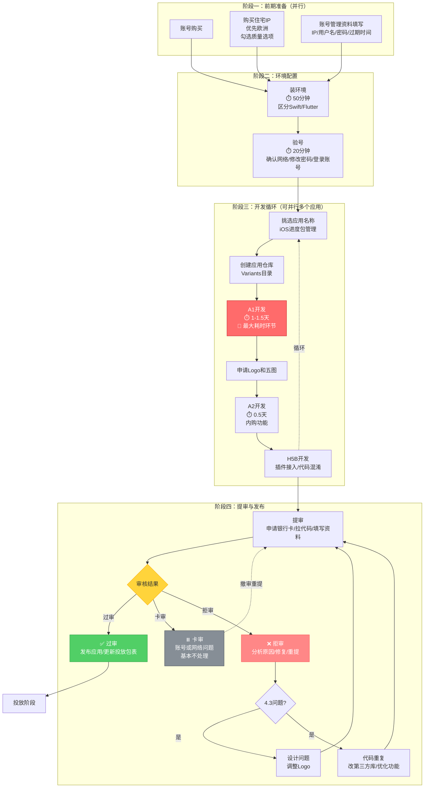

# iOS马甲包一页简报

> 数据基线：2025 年 Q4（2 名 iOS），面向 2026 年 30 包/月目标

---

## 0. 流程图（泳道概览）

---

## 1. 关键数据（速览）

| 指标 | 数值 |
|------|------|
| 理论产能（3人） | 31 包/月 |
| 实际产能（Q4，两人） | 41 提 / 34 过 = **13.7 包/月** |
| 人均月产 | 开发A 6.0 包 / 开发B 7.7 包 |
| 过审率 | 82.9% |
| 目标 | 30 包/月（3人），扩编后希望 ≥35 |
| 当前差距 | 16.3 包/月（完成率 46%） |

---

## 2. 流程 & 瓶颈（一句话版）

1. **前期准备**：购账号/IP → 验号。风险：账号质量无评级，30%+ 卡审。
2. **开发循环**：A1 1~1.5 天、A2 0.5 天、H5B 1-3h。痛点集中在“A 面”链路：① A1 输出依赖个人经验；② AI 生成方案完成率仅 ~30%；③ 找素材/脚本拼装耗时，合计 2 天以上。
3. **资产依赖**：Logo/五图 1~2 天，多数提前申请；偶尔延迟主要影响发布时间，不会阻塞提审。
4. **提审**：流程本身 1h，但卡审等待 3~5 天、拒审返工 0.5~1 天。

> 结果：两人理论 20.7 包/月，却只交付 13.7 包/月，损失 34%。

---

## 3. Top 3 痛点 & 快速对策

| 痛点 | 影响 | 立即动作（Owner） |
|------|------|--------------------|
| 卡审等待 3~5 天 | 每月浪费 ~18 人天 | 账号质量评分 + “新号优先”策略：启用美国新供应商账号、禁用养号池（Week1，Owner：账号负责人） |
| “A 面”产出链路低效（A1 人均差异 28% + A2 0.5 天 + H5B 1-3h，AI 方案仅 ~30% 完成率；H5 还依赖多年未维护的 Flutter SDK） | 整个 A 面从需求到 H5 接入需 2+ 天，且质量高度依赖个人/旧 SDK | 年后 Day1 并行启动“A 面智能体 + Flutter H5 SDK 重构”：Week1 完成能力拆解与架构方案，Week2~Week3 开发（覆盖 A1+A2，数据自动化、开发自动化），Owner：A 面专项负责人 + SDK 负责人 |
| 普通包 ↔ 定制包互转缺能力 | 定制包池水位不稳，普通包无法及时补位 | 与 Flutter H5 SDK 重构合并推进：Week1 立项+资源确认，Week2 锁定互转规则，Week3 用新 SDK 模块启动开发（Owner：产品 + 定制/SDK 负责人） |

---

## 4. 行动计划（4 周）

| 周期 | 核心目标（SDK≤2周，A 面持续交付） | 并行交付（按方向拆分） |
|------|----------|---------------------------|
| **Week 1** | 账号策略闭环 + SDK 重构启动 | ① 上线“美国号优先/跨国分配”策略，输出账号评分报告；② Flutter H5 SDK 重构开工：完成架构拆解、资源到位、迁移清单；③ 明确普通包↔定制包互转需求与接口 |
| **Week 2** | SDK 重构交付 + A 面智能体首版 | ① 交付 Flutter H5 SDK 重构结果（上线或可直接接入互转能力），完成互转规则定稿；② 发布 A 面智能体首版（Prompt/组件库/数据自动化落地），支持 A1+A2 的半自动产出；③ 启动普通包↔定制包互转开发（基于新 SDK） |
| **Week 3** | 4.3 策略库 + A 面持续迭代 | ① 输出 4.3 策略库、A2 模板化、内购配置清单；② A 面智能体进入迭代版开发，扩展素材推荐/数据自动化；③ 互转功能进入联调并连通定制池 |
| **Week 4** | A 面/互转扩展 + 自动化脚本 | ① 交付 A 面智能体第二版和互转能力 Beta，确认接入标准；② 提供装环境脚本与自动化方案；③ 汇报账号/产能指标，冻结下一阶段里程碑 |

> 说明：Flutter H5 SDK 重构在 Week1~Week2 完成（含互转接口），后续周次只做扩展接入；A 面智能体是长期工程，但 2 周内必须交付首版可用能力。

> 预期：两名 iOS 完成 P0/P1 后可把月产量提升到约 18~22 包；再引入第三人并保持同等效率时，可稳定在 30+ 包/月。同期落地“定制包互转能力 + Flutter H5 SDK 重构”，与上级新增方向保持一致。

---
