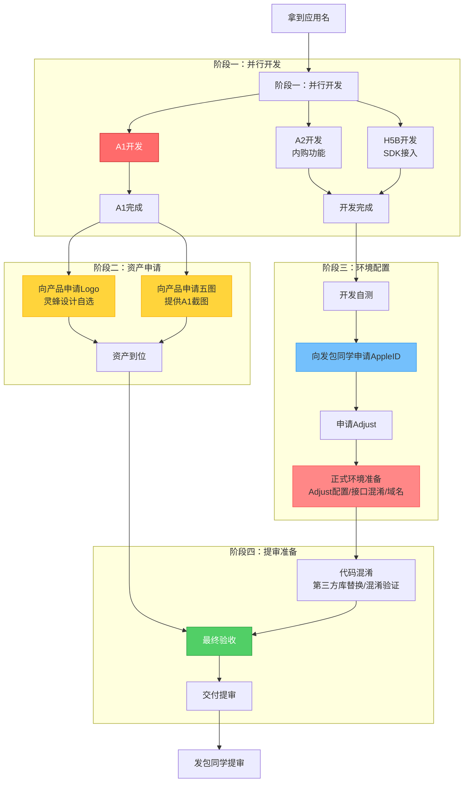

# 产包研发工作流

> 版本：v1.0 | 2026年4月17日
> 适用范围：iOS 马甲包研发侧完整工作流程
> 并行度：单个研发同时推进 2-3 个包

---

## 一、整体流程概览

### 1.1 核心阶段划分

产包研发工作流分为 **4 个核心阶段**，单包完整周期约 **2~3 天**（不含等待时间）：

| 阶段 | 核心工作 | 关键产出 | 参考耗时 |
|------|---------|---------|---------|
| **阶段一：并行开发** | A1+A2+H5 三面同时开发 | 完成基础功能实现 | 1.5~2 天 |
| **阶段二：资产申请** | 申请 Logo 和五图 | 获得设计资产 | 1~2 天（等待） |
| **阶段三：环境配置** | AppleID、Adjust、正式环境 | 完成生产环境准备 | 0.5~1 天 |
| **阶段四：提审准备** | 代码混淆、最终验收 | 交付可提审的包 | 1~2 小时 |

### 1.2 详细流程图



### 1.3 关键路径说明

**串行路径**（必须按顺序）：
1. 拿到应用名 → A1 开发 → 申请 Logo/五图
2. 开发自测 → 申请 AppleID → 申请 Adjust → 正式环境准备 → 代码混淆 → 提审

**并行路径**（可同时进行）：
1. A1、A2、H5 三面同时开发
2. Logo 和五图同时申请
3. 等待 Logo/五图期间，继续推进环境配置

**关键瓶颈**：
- **A1 开发**：1~1.5 天，占总开发时间的 60%+
- **Logo/五图等待**：1~2 天，但不阻塞开发
- **AppleID 等待**：0.5~2 小时，取决于发包同学工作量

### 1.4 并行工作策略

单个研发同时推进 **2-3 个包**，充分利用等待时间：

```
包 A：A1 开发中（主要精力）
包 B：等待 Logo/五图，同时进行 A2+H5 开发
包 C：等待 AppleID 或进行环境配置
```

**时间分配建议**：
- 上午：集中精力推进包 A 的 A1 开发（最耗时环节）
- 下午：处理包 B 的 A2+H5 开发，或包 C 的环境配置和混淆

---

## 二、详细流程步骤

### 2.1 前置准备：拿到应用名

**输入**：
- 应用名称（从包进度管理表或产品需求获取）
- 目标市场/地区

**输出**：
- 确认应用名称无重复
- 在包进度管理表中记录开发状态

**耗时**：5 分钟

---

### 2.2 并行开发：A1 + A2 + H5

**开发顺序**：
- A1、A2、H5 三个面同时启动开发
- A1 完成后立即触发 Logo 和五图申请
- A2 和 H5 继续并行开发

**A1 开发**：
- 参考设计稿或竞品，完成 UI 实现
- 确保无明显抄袭特征，避免 4.3 风险
- 完成后进行自测

**A2 开发**：
- 内购功能实现
- 内购路径验证（确保主路径完整）
- 内购配置正确性检查

**H5B 开发**：
- Flutter H5 SDK 接入
- 插件集成
- 基础功能验证

**耗时**：
- A1：1~1.5 天（最大耗时环节）
- A2：0.5 天
- H5B：1~3 小时

---

### 2.3 申请 Logo 和五图

**触发时机**：A1 开发完成后立即申请

**申请方式**：
- 向产品同学申请 Logo 和五图
- 提供应用名称和 A1 界面截图

**Logo 申请流程**：
- 产品同学在灵蜂设计平台自选 Logo
- 按照标准流程提交申请
- 等待 Logo 交付（1~2 天）

**五图申请流程**：
- 研发对 A1 界面进行截图，提供给产品同学
- 产品同学提交给设计师
- 设计师根据截图生成五图
- 等待五图交付（1~2 天）

**注意事项**：
- Logo 和五图可以并行申请
- 提前申请可避免后续提审时等待
- 如果延迟，不会阻塞开发，但会影响提审时间

**耗时**：1~2 天（等待时间，不阻塞开发）

---

### 2.4 开发自测

**自测 Checklist**：

**A1 验收**：
- [ ] UI 还原度达标
- [ ] 无明显抄袭特征
- [ ] 主要功能路径可用
- [ ] 无明显 bug

**A2 验收**：
- [ ] 内购功能配置正确
- [ ] 内购主路径验证通过
- [ ] 价格显示正确

**H5B 验收**：
- [ ] Flutter H5 SDK 接入成功
- [ ] 插件功能正常
- [ ] 基础交互可用

**耗时**：0.5~1 小时

---

### 2.5 向发包同学申请 AppleID

**前置条件**：
- A1 + A2 + H5 开发自测完成
- Logo 和五图已申请（可以还在等待中）

**申请方式**：
- 在包进度管理表中标记"待申请 AppleID"
- 通知发包同学（群消息或直接沟通）
- 提供应用名称和包名

**发包同学操作**：
- 从账号池中分配一个可用账号
- 在对应虚拟机上创建 App
- 生成 AppleID 和证书
- 将 AppleID 填入包进度管理表

**耗时**：
- 研发等待时间：视发包同学当前工作量，通常 0.5~2 小时
- 发包同学操作时间：约 30 分钟

---

### 2.6 申请 Adjust

**前置条件**：
- 已拿到 AppleID

**申请流程**：
- 研发自己在 Adjust 平台申请
- 填写应用信息（应用名、Bundle ID）
- 获取 Adjust App Token

**耗时**：约 10 分钟

---

### 2.7 正式环境准备

**需要配置的内容**：

1. **Adjust 配置**：
   - 将 Adjust App Token 填入代码
   - 验证 Adjust 事件上报

2. **接口混淆**：
   - 配置接口域名
   - 确认接口调用正常

3. **域名配置**：
   - 配置正式环境域名
   - 验证网络请求

**耗时**：30 分钟~1 小时

---

### 2.8 代码混淆

**混淆内容**：
- 第三方库替换/封装（避免代码重复问题）
- 代码混淆脚本执行
- 混淆后功能验证

**注意事项**：
- 混淆后必须进行功能回归测试
- 确保核心路径不受影响

**耗时**：1~2 小时

---

### 2.9 提审

**前置条件**：
- Logo 和五图已到位
- 代码混淆完成
- 正式环境配置完成
- 所有功能自测通过

**提审前 Checklist**：
- [ ] A1 UI 还原度达标，无明显抄袭特征
- [ ] A2 内购功能配置正确，内购主路径验证通过
- [ ] H5B 功能正常
- [ ] 代码混淆已执行
- [ ] 第三方库已替换/优化
- [ ] Logo 已到位
- [ ] 五图内容与 App 功能匹配
- [ ] Adjust 配置正确
- [ ] 正式环境域名配置正确

**交付物**：
- 将代码/包交给发包同学
- 在包进度管理表中更新状态为"待提审"

**后续流程**：
- 发包同学负责打包上传提审
- 提审后跟进过审/拒审/卡审结果
- （提审后的细节不在本文档讨论范围）

---

## 三、并行工作策略

### 3.1 单个研发并行度：2-3 个包

**推荐策略**：
- 包 A：A1 开发中
- 包 B：等待 Logo/五图，同时进行 A2+H5 开发
- 包 C：等待 AppleID 或正式环境准备

**时间分配**：
- 上午：主要推进包 A 的 A1 开发（最耗时环节）
- 下午：处理包 B 的 A2+H5 开发，或包 C 的环境配置

### 3.2 等待时间利用

**等待 Logo/五图时**：
- 继续推进 A2 和 H5 开发
- 或启动下一个包的 A1 开发

**等待 AppleID 时**：
- 推进其他包的开发
- 或进行代码优化、技术调研

**等待 Adjust 审批时**（极少发生）：
- 继续其他包的开发

---

## 四、关键数据记录

### 4.1 包进度管理表更新节点

| 节点 | 需更新字段 |
|------|----------|
| 拿到应用名 | 应用名称、开发人、开始时间、状态（开发中） |
| A1 完成 | A1 完成时间、Logo 申请时间、五图申请时间 |
| 申请 AppleID | 状态（待申请 AppleID） |
| 拿到 AppleID | AppleID、Bundle ID、状态（环境配置中） |
| 申请 Adjust | Adjust App Token |
| 提审前 | 状态（待提审）、Logo 到位时间、五图到位时间 |

### 4.2 沟通记录

**与发包同学沟通**：
- 申请 AppleID 时：提供应用名称和包名
- 提审时：提供代码/包，确认提审时间

**与产品同学沟通**：
- 申请 Logo 和五图时：提供应用名称和 A1 界面截图
- 确认 Logo 和五图交付时间

---

## 五、常见问题与处理

### 5.1 Logo/五图延迟

**问题**：Logo 或五图未按时交付

**处理**：
- 不阻塞开发，继续推进 A2+H5 和环境配置
- 提前与产品同学沟通，确认交付时间
- 如果严重延迟，考虑启动下一个包的开发

### 5.2 AppleID 申请延迟

**问题**：发包同学当前工作量大，AppleID 申请延迟

**处理**：
- 提前沟通，预估等待时间
- 利用等待时间推进其他包的开发
- 如果严重延迟，升级给主管协调

### 5.3 Adjust 申请失败

**问题**：Adjust 平台审批失败或延迟

**处理**：
- 检查应用信息填写是否正确
- 联系 Adjust 客服或技术支持
- 如果无法解决，升级给主管

### 5.4 代码混淆后功能异常

**问题**：代码混淆后出现功能 bug

**处理**：
- 回滚混淆，定位问题代码
- 调整混淆策略，排除问题模块
- 重新混淆并验证

---

## 六、效率优化建议

### 6.1 提前申请 Logo 和五图

**当前问题**：A1 完成后才申请，导致后续等待

**优化方案**：
- 在拿到应用名时，就提前向产品同学申请 Logo（基于应用名称）
- A1 开发到 50% 时，提前准备五图截图并提交给产品同学

**预期收益**：减少 1~2 天等待时间

### 6.2 标准化 A1 开发

**当前问题**：A1 开发耗时 1~1.5 天，高度依赖个人经验

**优化方案**：
- 建立 A1 组件库和模板
- 使用 A 面智能体辅助生成
- 沉淀常用 UI 模式和代码片段

**预期收益**：A1 开发时间缩短至 0.5~1 天

### 6.3 自动化环境配置

**当前问题**：正式环境准备需要手动配置多个环节

**优化方案**：
- 编写环境配置脚本
- 一键完成 Adjust、域名、接口混淆配置
- 自动化验证配置正确性

**预期收益**：环境配置时间从 1 小时缩短至 10 分钟

---

## 七、附录：相关文档

- [iOS马甲包制作流程图.md](iOS马甲包制作流程图.md) — 完整流程图（宏观视角）
- [发包全流程手册.md](发包全流程手册.md) — 发包侧操作细节
- [发包作战体系/02_全流程SOP.md](发包作战体系/02_全流程SOP.md) — 标准操作流程
- [马甲包家族管理/00_README.md](马甲包家族管理/00_README.md) — 马甲包家族树状管理

---

🤖 Generated with Claude Code

Co-Authored-By: Claude Sonnet 4.6 <noreply@anthropic.com>
